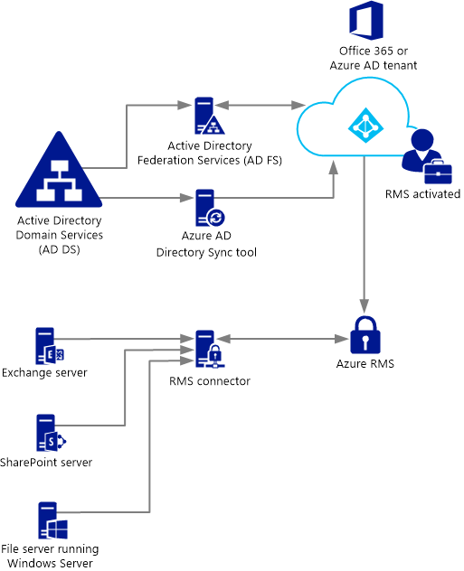
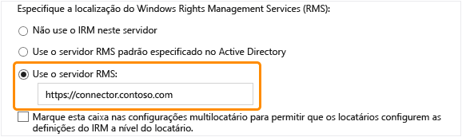

# Implantando o conector do Azure Rights Management
Use essas informações para saber mais sobre o conector RMS (Microsoft Rights Management) e como você pode usá-lo para fornecer proteção de informações com atuais implantações locais que usam o Microsoft Exchange Server, o Microsoft SharePoint Server ou servidores de arquivos que executam o Windows Server e usar a capacidade FCI (Infraestrutura de Classificação de Arquivos) do Gerenciador de Recursos de Servidor de Arquivos.

> [!TIP]
> Para obter um exemplo de cenário de alto nível com capturas de tela, consulte a seção [Protege arquivos automaticamente em servidores de arquivos que executam o Windows Server e a Infraestrutura de Classificação de Arquivos](../Topic/What_is_Azure_Rights_Management_.md#BKMK_Example_FCI) do tópico [O que é o Azure Rights Management?](../Topic/What_is_Azure_Rights_Management_.md).

## <a name="OverviewConnector"></a>Visão geral do conector do Microsoft Rights Management
O conector Microsoft Rights Management (RMS) permite que você ative rapidamente servidores locais existentes para usar a funcionalidade Information Rights Management (IRM) com o Microsoft Rights Management Service (Azure RMS) baseado em nuvem. Com essa funcionalidade, o departamento de TI e os usuários podem facilmente proteger documentos e imagens, tanto dentro quanto fora da organização, sem ter que instalar infraestrutura adicional ou estabelecer relações de confiança com outras organizações. Você pode usar este conector em um cenário híbrido, mesmo se alguns dos seus usuários estiverem se conectando a serviços online. Por exemplo, caixas de correio de alguns usuários usam o Exchange Online e caixas de correio de outros usuários usam o Exchange Server. Depois de instalar o conector RMS, todos os usuários podem proteger e consumir emails e anexos usando o Azure RMS e a proteção de informações funciona perfeitamente entre as duas configurações de implantação.

O conector RMS é um serviço de superfície pequena que você instala no local, em servidores que executam o Windows Server 2012 R2, o Windows Server 2012 ou o Windows Server 2008 R2. Além de executar o conector em computadores físicos, você também pode executá-lo em máquinas virtuais, incluindo as VMs de IaaS do Azure. Depois de instalar e configurar o conector, ele atua como uma interface de comunicação (um relê) entre os servidores locais e o serviço de nuvem.

Se você gerenciar sua própria chave de locatário para o Azure RMS (traga própria chave ou cenário BYOK), o conector do RMS e os servidores locais que o utilizam não acessam o módulo de segurança de hardware (HSM) que contém sua chave de locatário. Isso ocorre porque todas as operações criptográficas que usam a chave de locatário são executadas no Azure RMS e não no local.



O conector do RMS suporta os seguintes servidores locais: Exchange Server, SharePoint Server e servidores de arquivos que executam o Windows Server e usam a infraestrutura de classificação de arquivos para classificar e aplicar políticas a documentos do Office em uma pasta. Se você deseja proteger todos os tipos de arquivos usando a classificação de arquivos, não use o conector RMS, mas, em vez disso, use os [cmdlets do RMS Protection](https://msdn.microsoft.com/library/azure/mt433195.aspx).

> [!NOTE]
> Para obter as versões com suporte desses servidores locais, consulte "Servidores locais que oferecem suporte ao Azure RMS" na seção [Aplicativos que suportam o Azure RMS](../Topic/Requirements_for_Azure_Rights_Management.md#BKMK_SupportedApplications) do tópico [Requisitos para o Azure Rights Management](../Topic/Requirements_for_Azure_Rights_Management.md).

Use as seções a seguir para lhe ajudar a planejar, instalar e configurar o conector RMS. Depois, será necessário fazer algumas configurações pós-instalação para que os servidores possam usar o conector.

-   [Pré-requisitos para o conector RMS](../Topic/Deploying_the_Azure_Rights_Management_Connector.md#BKMK_Prereqs)

-   **Etapa 1:**  [Instalando o conector RMS](../Topic/Deploying_the_Azure_Rights_Management_Connector.md#BKMK_InstallingConnector)

-   **Etapa 2:**  [Digitando credenciais](../Topic/Deploying_the_Azure_Rights_Management_Connector.md#EnteringCredentials)

-   **Etapa 3:**  [Autorizando servidores para usar o conector RMS](../Topic/Deploying_the_Azure_Rights_Management_Connector.md#AuthorizingServers)

-   **Etapa 4:**  [Configurar o balanceamento de carga e alta disponibilidade](../Topic/Deploying_the_Azure_Rights_Management_Connector.md#ConfiguringConnector)

-   Opcional: [Configurando o conector RMS para usar HTTPS](../Topic/Deploying_the_Azure_Rights_Management_Connector.md#BKMK_ConfiguringHTTPS)

-   Opcional: [Configurando o conector RMS para um servidor proxy da Web](../Topic/Deploying_the_Azure_Rights_Management_Connector.md#BKMK_ConfiguringWebProxy)

-   Opcional: [Instalando a ferramenta de administração do conector RMS em computadores administrativos](../Topic/Deploying_the_Azure_Rights_Management_Connector.md#BKMK_InstallingStandaloneTool)

-   **Etapa 5:**  [Configurando servidores para usar o conector RMS](../Topic/Deploying_the_Azure_Rights_Management_Connector.md#ConfiguringServers)

    -   [Configurando um servidor Exchange para usar o conector](../Topic/Deploying_the_Azure_Rights_Management_Connector.md#BKMK_ExchangeServer)

    -   [Configurando um servidor SharePoint para usar o conector](../Topic/Deploying_the_Azure_Rights_Management_Connector.md#BKMK_ConfiguringSharePoint)

    -   [Configurando um servidor de arquivos para a Infraestrutura de Classificação de Arquivos usar o conector](../Topic/Deploying_the_Azure_Rights_Management_Connector.md#BKMK_FileServer)

-   [Próximas etapas](../Topic/Deploying_the_Azure_Rights_Management_Connector.md#BKMK_NextSteps)

## <a name="BKMK_Prereqs"></a>Pré-requisitos para o conector RMS
Antes de instalar o conector do RMS, verifique se os requisitos a seguir estão sendo seguidos.

|Requisito|Mais informações|
|-------------|--------------------|
|O serviço do Rights Management (RMS) está ativado|[Ativando o Azure Rights Management](../Topic/Activating_Azure_Rights_Management.md)|
|A sincronização de diretórios entre as florestas do Active Directory e do Azure Active Directory|Após ativar o RMS, o Azure Active Directory deverá ser configurado para funcionar com os usuários e grupos no seu banco de dados do Active Directory. **Important:** É necessário executar esta etapa de sincronização de diretório para que o conector RMS funcione, mesmo para uma rede de teste. Embora você possa usar o Office 365 e o Azure Active Directory usando as contas criadas manualmente no Active Directory do Azure, este conector requer que as contas no Active Directory do Azure sejam sincronizadas com os Serviços de Domínio do Active Directory.<br />Para obter mais informações, consulte os seguintes recursos:<br /><br />-   [Instruções para configurar seu locatário do Azure AD](http://technet.microsoft.com/library/hh967611.aspx)<br />-   [Instruções para ativar a sincronização de diretórios com o AAD usando o DirSync](http://technet.microsoft.com/library/hh967642.aspx)|
|Opcional, mas recomendado:<br /><br />-   Ativar federação entre o Active Directory e o Azure Active Directory no local|É possível ativar a federação de identidade entre o diretório local e o Azure Active Directory. Essa configuração proporciona ao usuário uma melhor experiência usando o logon único para o serviço RMS. Sem o logon único, os usuários serão solicitados a fornecer suas credenciais antes que possam usar o conteúdo protegido por direitos.<br /><br />Para obter instruções para configurar a federação usando os Serviços de federação do Active Directory (AD FS) entre os Serviços de domínio do Active Directory e o Active Directory do Azure, consulte a [Lista de verificação: Use os AD FS para implementar e gerenciar o logon único](http://technet.microsoft.com/library/jj205462.aspx) na biblioteca do Windows Server.|
|Um mínimo de dois computadores membros nos quais instalar o conector RMS:<br /><br /><ul><li>Um computador físico ou virtual de 64 bits que execute um dos seguintes sistemas operacionais:<br /><br /><ul><li>Windows Server 2012 R2</li><li>Windows Server 2012</li><li>Windows Server 2008 R2</li></ul></li><li>Pelo menos 1 GB de RAM</li><li>Um mínimo de 64 GB de espaço em disco</li><li>Pelo menos uma interface de rede</li><li>Acesso à Internet através de um firewall (ou proxy web) que não requer autenticação</li><li>Deve estar em uma floresta ou um domínio com base em outras florestas da organização que contenham instalações dos servidores Exchange ou SharePoint que você deseja usar com o conector RMS</li></ul>|Para a tolerância a falhas e alta disponibilidade, você deve instalar o conector RMS em um mínimo de dois computadores. **Tip:** Se você estiver usando o Outlook Web Access ou dispositivos móveis que utilizam o Exchange ActiveSync IRM e for muito importante que você mantenha o acesso a emails e anexos que são protegidos pelo Azure RMS, recomendamos que você implante um grupo de balanceamento de carga dos servidores de conector para garantir a alta disponibilidade.<br />Você não precisa de servidores dedicados para executar o conector, mas é necessário instalá-lo em um computador separado dos servidores que utilizarão o conector. **Important:** Não instale o conector em um computador que execute o Exchange Server, o SharePoint Server ou um servidor de arquivos configurado para infraestrutura de classificação de arquivos se quiser usar a funcionalidade desses serviços com o Azure RMS. Além disso, não instale esse conector em um controlador de domínio.|

## <a name="BKMK_InstallingConnector"></a>Instalando o conector RMS
Após confirmar os pré-requisitos na seção anterior, use as seguintes instruções para instalar o conector RMS:

1.  Identifique os computadores (mínimo de dois) que executarão o conector do RMS. Eles devem atender as especificações mínimas listadas na seção anterior.

    > [!NOTE]
    > Você terá que instalar um único conector do RMS (consistindo de vários servidores para alta disponibilidade) por locatário (locatário do Office 365 ou locatário do AD do Azure). Ao contrário do RMS do Active Directory, não é necessário instalar um conector RMS em cada floresta.

2.  Baixe os arquivos de origem para o conector do RMS do [Centro de Download da Microsoft](http://go.microsoft.com/fwlink/?LinkId=314106).

    Para instalar o conector RMS, baixe o RMSConnectorSetup.exe.

    Além disso:

    -   Se mais tarde quiser configurar o conector de um computador de 32 bits, baixe também o RMSConnectorAdminToolSetup_x86.exe.

    -   Se quiser usar a ferramenta de configuração do servidor para o conector RMS, para automatizar a configuração de configurações de registro nos servidores locais, baixe também o GenConnectorConfig.ps1.

3.  No computador no qual deseja instalar o conector RMS, execute o **RMSConnectorSetup.exe** com privilégios de administrador.

4.  Na página de boas-vindas da página de Configuração do Conector do Microsoft Rights Management, selecione **Instalar o conector do Microsoft Rights Management no computador** e clique em **Avançar**.

5.  Leia e aceite os termos de licença do conector do RMS e clique em **Avançar**.

Para continuar, digite uma conta e senha para configurar o conector RMS.

## <a name="EnteringCredentials"></a>Digitando credenciais
Antes de configurar o conector RMS, é necessário digitar as credenciais de uma conta que tenha privilégios suficientes para configurar o conector RMS.

Além disso, se você tiver implementado [controles de integração](https://technet.microsoft.com/library/jj658941.aspx), certifique-se de que a conta especificada seja capaz de proteger o conteúdo. Por exemplo, se você restringiu a capacidade de proteção de conteúdo para o grupo "Departamento de TI", a conta que você especificar aqui deverá ser um membro desse grupo. Caso contrário, você verá a mensagem de erro: **Falha na tentativa de descobrir o local do serviço de administração e organização. Verifique se o Microsoft Rights Management Service está habilitado para sua organização.**

Você pode usar uma conta que tenha um dos seguintes privilégios:

-   **Administrador de locatários do Office 365**: uma conta que seja um administrador global para seu locatário do Office 365.

-   **Administrador global do Azure Rights Management**: Uma conta com privilégios de administrador para o locatário do Azure RMS.

-   **Administrador do conector Microsoft RMS**: Uma conta no Active Directory do Azure com direitos para instalar e administrar o conector RMS de sua organização.

    > [!NOTE]
    > Se quiser usar a conta de administrador do conector Microsoft RMS, primeiro será preciso fazer o seguinte para atribuir a função de administrador de conector RMS:
    > 
    > 1.  No mesmo computador, baixe e instale o Windows PowerShell para Rights Management. Para obter mais informações, consulte [Instalando o Windows PowerShell para Azure Rights Management](../Topic/Installing_Windows_PowerShell_for_Azure_Rights_Management.md).
    > 
    >     Inicie o Windows PowerShell com o comando **Executar como administrador** e conecte-se ao serviço do Azure RMS usando o comando [Connect-AadrmService](https://msdn.microsoft.com/library/azure/dn629415.aspx):
    > 
    >     ```
    >     Connect-AadrmService                   //provide Office 365 tenant administrator or Azure RMS global administrator credentials
    >     ```
    > 2.  Em seguida, execute o comando [Add-AadrmRoleBasedAdministrator](https://msdn.microsoft.com/library/azure/dn629417.aspx), usando apenas um dos seguintes parâmetros:
    > 
    >     ```
    >     Add-AadrmRoleBasedAdministrator -EmailAddress <email address> -Role "ConnectorAdministrator"
    >     ```
    > 
    >     ```
    >     Add-AadrmRoleBasedAdministrator -ObjectId <object id> -Role "ConnectorAdministrator"
    >     ```
    > 
    >     ```
    >     Add-AadrmRoleBasedAdministrator -SecurityGroupDisplayName <group Name> -Role "ConnectorAdministrator"
    >     ```
    >     Por exemplo, digite: **Add-AadrmRoleBasedAdministrator -EmailAddress melisa@contoso.com -Role " ConnectorAdministrator "**
    > 
    >     Embora esses comandos usam a função ConnectorAdministrator, você também pode usar a função GlobalAdministrator aqui.

Durante o processo de instalação do conector RMS, todo o software de pré-requisitos é validado e instalado, os Serviços de Informações da Internet (IIS) são instalados, se ainda não estiverem presentes, e o software do conector é instalado e configurado. Além disso, o Azure RMS está preparado para a configuração criando o seguinte:

-   Uma tabela vazia de servidores que estão autorizados a usar o conector para se comunicarem com o Azure RMS. Você adicionará servidores a essa tabela mais tarde.

-   Um conjunto de tokens de segurança para o conector que autoriza operações com o Azure RMS. Esses tokens são baixados do Azure RMS e instalados no computador local no registro. Eles são protegidos usando a interface de programação do aplicativo de proteção de dados (DPAPI) e as credenciais da conta do Sistema Local.

Na página final do assistente, faça o seguinte e clique em **Concluir**:

-   Se este for o primeiro conector que você instalou, não selecione **Iniciar console do administrador do conector para autorizar servidores** neste momento. Você selecionará essa opção após instalar o seu segundo conector RMS (ou último). Em vez disso, execute o assistente novamente em pelo menos um computador diferente. É necessário instalar no mínimo dois conectores.

-   Se você tiver instalado o seu segundo (ou último) conector, selecione **Iniciar console do administrador do conector para autorizar servidores**.

> [!TIP]
> Neste ponto, há um teste de verificação que você pode executar para testar se os serviços da Web para o conector RMS estão funcionando:
> 
> -   Em um navegador da Web, conecte-se a **http://&lt;connectoraddress&gt;/_wmcs/certification/servercertification.asmx**, substituindo *&lt;connectoraddress&gt;* pelo endereço do servidor ou nome que tem o conector RMS instalado. Uma conexão bem-sucedida exibe uma página **ServerCertificationWebService**.

Se precisar desinstalar o conector RMS, execute o assistente novamente e selecione a opção de desinstalação.

## <a name="AuthorizingServers"></a>Autorizando servidores para usar o conector RMS
Após instalar o conector RMS em pelo menos dois computadores, você estará pronto para autorizar os servidores que deseja que usam o conector RMS. Por exemplo, os servidores que executam o Exchange Server 2013 ou o SharePoint Server 2013.

Para definir esses servidores, execute a ferramenta de administração do conector RMS e adicione entradas à lista de servidores permitidos. Você pode executar essa ferramenta ao selecionar **Iniciar console do administrador do conector para autorizar servidores** no final do assistente de Configuração do conector do Microsoft Rights Management ou você pode executá-lo separadamente do assistente.

Ao autorizar esses servidores, lembre-se das seguintes considerações:

-   Os servidores adicionados terão privilégios especiais concedidos. Todas as contas que você especificar para a função do Exchange Server na configuração do conector serão concedidas à [função de superusuário](https://technet.microsoft.com/library/mt147272.aspx) no Azure RMS, o que oferece acesso a todo o conteúdo para este locatário do RMS. O recurso de superusuário é habilitado automaticamente neste ponto, se necessário. Para evitar o risco de elevação de privilégios de segurança, tenha cuidado para especificar apenas as contas que são usadas pelos servidores do Exchange da sua organização. Todos os servidores configurados como servidores SharePoint ou servidores de arquivos que usam FCI terão privilégios de usuários regulares concedidos.

-   É possível adicionar vários servidores como uma única entrada, especificando uma segurança do Active Directory ou um grupo de distribuição ou uma conta de serviço que seja usada por mais de um servidor. Ao usar essa configuração, o grupo de servidores compartilhará os mesmos certificados RMS e todos serão considerados proprietários do conteúdo que qualquer um deles tiver protegido. Para minimizar custos administrativos, recomendamos o uso desta configuração de um único grupo, em vez de servidores individuais para autorizar servidores Exchange da sua empresa ou um farm de servidores do SharePoint.

Na página **Servidores que têm permissão para utilizar o conector**, clique em **Adicionar**.

### <a name="BKMK_AddServer"></a>Adicionar um servidor à lista de servidores permitidos
Na página **Permitir que um servidor utilize o conector**, digite o nome do objeto ou procure identificar o objeto a autorizar.

É importante que você autorize o objeto correto. Para um servidor usar o conector, a conta que executa o serviço no local (por exemplo, Exchange ou SharePoint) deve ser selecionada para autorização. Por exemplo, se o serviço estiver sendo executado como uma conta de serviço configurado, adicione o nome dessa conta de serviço à lista. Se o serviço estiver sendo executado como Sistema Local, adicione o nome do objeto do computador (por exemplo, SERVERNAME$). Como uma prática recomendada, crie um grupo que contenha essas contas e especifique o grupo, em vez de nomes de servidores individuais.

Para obter mais informações sobre as diferentes funções de servidor:

-   Para servidores que executam o Exchange: Você deve especificar um grupo de segurança e pode usar o grupo padrão (**Servidores Exchange**) que o Exchange cria e mantém automaticamente de todos os servidores Exchange da floresta.

-   Para servidores que executam o SharePoint:

    -   Se um servidor do SharePoint 2010 for configurado para ser executado como Sistema Local (não estiver usando uma conta de serviço), crie manualmente um grupo de segurança nos Serviços de Domínio do Active Directory e adicione o objeto de nome do computador do servidor nesta configuração a esse grupo.

    -   Se um servidor do SharePoint for configurado para usar uma conta de serviço (a prática recomendada para o SharePoint 2010 e a única opção para o SharePoint 2013), faça o seguinte:

        1.  Adicione a conta de serviço que executa o serviço da Administração Central do SharePoint para permitir que o SharePoint seja configurado em seu console do administrador.

        2.  Adicione a conta que está configurada para o pool do aplicativo SharePoint.

        > [!TIP]
        > Se estas duas contas forem diferentes, considere criar um único grupo que contenha as duas contas para minimizar as despesas administrativas gerais.

-   Para servidores de arquivos que usam Infraestrutura de Classificação de Arquivos, os serviços associados são executados como a conta do Sistema Local, por isso é necessário autorizar a conta de computador para os servidores de arquivos (por exemplo, SERVERNAME$) ou um grupo que contém as contas de computador.

Quando terminar de adicionar servidores à lista, clique em **Fechar**.

Se você ainda não tiver feito isso, agora será preciso configurar o balanceamento de carga para os servidores que possuem o conector RMS instalado, e considerar a possibilidade de usar HTTPS para as conexões entre esses servidores e os servidores autorizados recentemente.

## <a name="ConfiguringConnector"></a>Configurar o balanceamento de carga e alta disponibilidade
Após instalar a segunda ou a última instância do conector RMS, defina um nome de servidor da URL do conector e configure um sistema de balanceamento de carga.

O nome do servidor da URL do conector pode ser qualquer nome em um namespace que você controle. Por exemplo, você pode criar uma entrada no seu sistema DNS para **rmsconnector.contoso.com** e configurar essa entrada para utilizar um endereço IP em seu sistema de balanceamento de carga. Não existem requisitos especiais para este nome e ele não precisa ser configurado nos servidores do conector em si. A menos que os servidores Exchange e SharePoint estejam se comunicando com o conector pela Internet, esse nome não precisa ser resolvido na Internet.

> [!IMPORTANT]
> Recomendamos que você não altere esse nome após configurar os servidores Exchange ou SharePoint para usar o conector, porque, depois, será preciso limpar esses servidores de todas as configurações de IRM e reconfigurá-los.

Depois de criar o nome no DNS e configurá-lo para um endereço IP, configure o balanceamento de carga para esse endereço, que direciona o tráfego para os servidores de conector. Você pode usar qualquer balanceador de carga com base em IP para essa finalidade, o que inclui o recurso NLB (Balanceamento de Carga de Rede) no Windows Server. Para obter mais informações, consulte [Guia de Implantação de Balanceamento de Carga](http://technet.microsoft.com/library/cc754833%28v=WS.10%29.aspx).

Use as seguintes configurações para configurar o cluster NLB:

-   Portas: 80 (para HTTP) ou 443 (para HTTPS)

    Para obter mais informações sobre o uso de HTTP ou HTTPS, consulte a próxima seção.

-   Afinidade: Nenhum

-   Método de distribuição: Igual

Esse nome que você define para o sistema de balanceamento de carga (para os servidores que executam o serviço do conector RMS) é o nome do conector RMS da sua organização que você usará mais tarde, quando você configura os servidores no local para usar o Azure RMS.

## <a name="BKMK_ConfiguringHTTPS"></a>Configurando o conector RMS para usar HTTPS
> [!NOTE]
> Essa etapa de configuração é opcional, mas é recomendada para proporcionar mais segurança.

Embora o uso de TLS ou SSL seja opcional para o conector RMS, recomendamos para qualquer serviço sensível à segurança com base em HTTP. Esta configuração autentica os servidores que executam o conector para seus servidores Exchange e SharePoint que usam o conector. Além disso, todos os dados que são enviados a partir destes servidores para o conector são criptografados.

Para ativar o conector RMS para usar o TLS, em cada servidor que executa o conector RMS, instale um certificado de autenticação do servidor que contenha o nome que você usará para o conector. Por exemplo, se o nome do conector RMS que você definiu no DNS for **rmsconnector.contoso.com**, implante um certificado de autenticação de servidor que contenha **rmsconnector.contoso.com** no assunto do certificado como o nome comum. Ou especifique **rmsconnector.contoso.com** no nome alternativo do certificado como o valor de DNS. O certificado não precisa incluir o nome do servidor. Em seguida, no IIS, vincule esse certificado ao site padrão.

Se você usar a opção HTTPS, certifique-se de que todos os servidores que executam o conector tenham um certificado de autenticação de servidor válido que se conecte a um CA raiz usado pelos servidores Exchange e SharePoint. Além disso, se a CA (Autoridade de Certificação) que emitiu os certificados para os servidores de conector publicar uma CRL (Lista de Certificados Revogados), os servidores Exchange e SharePoint poderão baixar essa CRL.

> [!TIP]
> Você pode usar as seguintes informações e recursos para lhe ajudar a solicitar e instalar um certificado de autenticação do servidor, e para vincular esse certificado ao site padrão no IIS:
> 
> -   Se você usar os Serviços de Certificados do Active Directory (AD CS) e uma autoridade de certificação corporativa (CA) para implantar esses certificados de autenticação do servidor, você pode duplicar e, em seguida, usar o modelo de certificado de servidor web. Este modelo de certificado usa **Fornecido na solicitação** para o nome do assunto do certificado, o que significa que você pode fornecer o FQDN do nome do conector RMS para o nome do assunto do certificado ou nome alternativo do assunto quando solicitar o certificado.
> -   Se você usa uma CA autônoma ou adquirir este certificado de outra empresa, consulte [Configurando Certificados de Servidor da Internet (IIS 7)](http://technet.microsoft.com/library/cc731977%28v=ws.10%29.aspx) no [ervidor Web (IIS)](http://technet.microsoft.com/library/cc753433%28v=ws.10%29.aspx) da biblioteca de documentação no TechNet.
> -   Para configurar o IIS para usar o certificado, consulte [Adicionar uma associação a um Site (IIS 7)](http://technet.microsoft.com/library/cc731692.aspx) no [servidor Web (IIS)](http://technet.microsoft.com/library/cc753433%28v=ws.10%29.aspx) da biblioteca de documentação no TechNet.

## <a name="BKMK_ConfiguringWebProxy"></a>Configurando o conector RMS para um servidor proxy da Web
Se os seus servidores de conector estiverem instalados em uma rede que não tem conectividade direta com a Internet e exigirem a configuração manual de um servidor proxy da Web para acesso à Internet de saída, será preciso configurar o registro nos servidores para o conector do RMS.

#### Para configurar o conector RMS para usar um servidor proxy da Web

1.  Em cada servidor que executa o conector do RMS, abra um editor de registro, como o Regedit.

2.  Navegue até **HKEY_LOCAL_MACHINE\SOFTWARE\Microsoft\AADRM\Connector**

3.  Adicione o valor de cadeia de caracteres de **ProxyAddress** e, em seguida, defina os dados para que esse valor seja **http://&lt;MyProxyDomainOrIPaddress&gt;:&lt;MyProxyPort&gt;**

    Por exemplo: **http://proxyserver.contoso.com:8080**

4.  Feche o editor do Registro e reinicie o servidor ou execute um comando IISReset para reiniciar o IIS.

## <a name="BKMK_InstallingStandaloneTool"></a>Instalando a ferramenta de administração do conector RMS em computadores administrativos
É possível executar a ferramenta de administração de conector do RMS a partir de um computador que não tenha o conector do RMS se cumprir com os seguintes requisitos:

-   Um computador físico ou virtual com o Windows Server 2012 ou Windows Server 2012 R2 (todas as edições), Windows Server 2008 R2 ou Windows Server 2008 R2 Service Pack 1 (todas as edições), Windows 8.1, Windows 8 ou Windows 7.

-   Pelo menos 1 GB de RAM.

-   Um mínimo de 64 GB de espaço em disco.

-   Pelo menos uma interface de rede.

-   Acesso à Internet através de um firewall (ou proxy da Web).

Para instalar a ferramenta de administração do conector RMS, execute os seguintes arquivos:

-   Para um computador de 32 bits: RMSConnectorAdminToolSetup_x86.exe

-   Para um computador de 64 bits: RMSConnectorSetup.exe

Se você ainda não tiver baixado esses arquivos, você pode fazer isso da [Central de Download da Microsoft](http://go.microsoft.com/fwlink/?LinkId=314106).

## <a name="ConfiguringServers"></a>Configurando servidores para usar o conector RMS
Após você ter instalado e configurado o conector do RMS, você está pronto para configurar os servidores locais que usam o Gerenciamento de Direitos e se conectam ao Azure RMS usando o conector. Isso significa configurando os servidores a seguir:

-   Para o Exchange 2013: Servidores de acesso para cliente e servidores de caixa de correio

-   Para o Exchange 2010: Servidores de acesso para clientes e servidores de transporte de hub

-   Para o SharePoint: Servidores Web de front-end do SharePoint, incluindo aqueles hospedados no servidor de Administração Central

-   Para a infraestrutura de classificação de arquivos: Computadores com Windows Server que tem instalado o Gerenciador de Recursos de Arquivos

Esta configuração requer configurações de registro. Para fazer isso, você tem duas opções:

|Opção de configuração|Vantagens|Desvantagens|
|-------------------------|-------------|----------------|
|Automaticamente usando a ferramenta de configuração do servidor para o conector Microsoft RMS|Sem edição direta do registro. Esse método é automatizado para você usando um script.<br /><br />Não é necessário executar um cmdlet do Windows PowerShell para obter sua URL do Microsoft RMS.<br /><br />Os pré-requisitos são verificados automaticamente (mas não corrigidos automaticamente) se você executá-los localmente.|Ao executar a ferramenta, é necessário fazer uma conexão a um servidor que já esteja em execução no conector RMS.|
|Manualmente editando o registro|Não é necessária uma conectividade a um servidor que execute o conector RMS.|Mais despesas administrativas que são propensas a erros.<br /><br />É necessário obter a URL do Microsoft RMS, o que exige que um comando do Windows PowerShell seja executado.<br /><br />É necessário fazer sempre todas as verificações de pré-requisitos.|
> [!IMPORTANT]
> Em ambos os casos, você deve manualmente instalar todos os pré-requisitos e configurar o Exchange, o SharePoint e a infraestrutura de classificação de arquivos para usar o Gerenciamento de Direitos.

Para a maioria das organizações, a configuração automática com a ferramenta de configuração do servidor para o conector do Microsoft RMS será a melhor opção, pois proporciona mais eficiência e confiabilidade do que a configuração manual.

Depois de fazer as alterações de configuração nos servidores, você deve reiniciá-los se eles estiverem executando o Exchange ou o SharePoint e previamente configurados para usar o AD RMS. Não é necessário reiniciar esses servidores, se você estiver configurando-os para o Gerenciamento de Direitos pela primeira vez. Você sempre deve reiniciar o servidor de arquivos que estiver configurado para usar a infraestrutura de classificação de arquivos depois de fazer essas alterações de configuração.

#### Como usar a ferramenta de configuração do servidor para o conector Microsoft RMS

1.  Se você ainda não tiver baixado o script para a ferramenta de configuração do servidor do conector Microsoft RMS (GenConnectorConfig.ps1), baixe-o da [Central de Download da Microsoft](http://go.microsoft.com/fwlink/?LinkId=314106).

2.  Salve o arquivo GenConnectorConfig.ps1 no computador em que a ferramenta será executada. Se você executar a ferramenta localmente, ela deve ser o servidor que você deseja configurar para se comunicar com o conector do RMS. Caso contrário, você poderá salvá-la em qualquer computador.

3.  Decida como executar a ferramenta:

    -   **Localmente**: Você pode executar a ferramenta interativamente, do servidor a ser configurado para se comunicar com o conector do RMS. Isso é útil para uma configuração única, como um ambiente de teste.

    -   **Implantação de Software**: Você pode executar a ferramenta para produzir arquivos de registro que você implanta em um ou mais servidores relevantes usando um aplicativo de gerenciamento de sistemas que oferece suporte à implantação de software, como o System Center Configuration Manager.

    -   **Política de Grupo**: você pode executar a ferramenta para produzir um script que será dada a um administrador que pode criar objetos de Política de Grupo para os servidores a serem configurados. Este script cria um objeto de Política de Grupo para cada tipo de servidor a ser configurado, que o administrador pode atribuir aos servidores relevantes.

    > [!NOTE]
    > Essa ferramenta configura os servidores que se comunicarão com o conector do RMS e que estão listados no começo desta seção. Não execute essa ferramenta em servidores que executam o conector do RMS.

4.  Inicie o Windows PowerShell com a opção **Executar como administrador** e use o comando Get-help para ler as instruções sobre como usar a ferramenta para seu método de configuração escolhido:

    ```
    Get-help .\GenConnectorConfig.ps1 -detailed
    ```

Para executar o script, você deve inserir a URL do conector RMS de sua organização. Digite o prefixo de protocolo (HTTP:// ou HTTPS://) e o nome do conector que você definiu no DNS para o endereço de balanceamento de carga do seu conector. Por exemplo, https://connector.contoso.com. A ferramenta, então, usa essa URL em contato com os servidores que executam o conector RMS e obtém outros parâmetros que são usados ​​para criar as configurações necessárias.

> [!IMPORTANT]
> Quando você executar essa ferramenta, certifique-se de especificar o nome do conector do RMS com o balanceamento de carga para sua organização e não o nome de um único servidor que executa o serviço de conector do RMS.

Use as seguintes seções para obter informações específicas para cada tipo de serviço:

-   [Configurando um servidor Exchange para usar o conector](../Topic/Deploying_the_Azure_Rights_Management_Connector.md#BKMK_ExchangeServer)

-   [Configurando um servidor SharePoint para usar o conector](../Topic/Deploying_the_Azure_Rights_Management_Connector.md#BKMK_ConfiguringSharePoint)

-   [Configurando um servidor de arquivos para a Infraestrutura de Classificação de Arquivos usar o conector](../Topic/Deploying_the_Azure_Rights_Management_Connector.md#BKMK_FileServer)

> [!NOTE]
> Depois que um servidor for configurado para usar o conector, os aplicativos clientes que estiverem instalados localmente no servidor poderão não funcionar com o RMS. Isso acontece porque os aplicativos tentam usar o conector em vez de usar o RMS diretamente, o que não tem suporte.
> 
> Além disso, se o Office 2010 for instalado localmente em um servidor Exchange, os recursos do IRM do aplicativo cliente poderão funcionar nesse computador depois que o servidor estiver configurado para usar o conector, mas isso não tem suporte.
> 
> Nos dois casos, é preciso instalar os aplicativos cliente em computadores separados que não estejam configurados para usar o conector. Assim, eles usarão corretamente o RMS de maneira direta.

### <a name="BKMK_ExchangeServer"></a>Configurando um servidor Exchange para usar o conector
As seguintes funções do Exchange se comunicam com o conector do RMS:

-   Para o Exchange 2013: Servidor de acesso para cliente e servidor de caixa de correio

-   Para o Exchange 2010: Servidor de acesso para clientes e servidor de transporte de hub

Para usar o conector do RMS, esses servidores que executam o Exchange devem estar executando uma das seguintes versões do software:

-   Exchange Server 2013 com o Exchange 2013 Atualização Cumulativa 3

-   Exchange Server 2010 com o Exchange 2010 Service Pack 3 Atualização Cumulativa 6

Você também precisará instalar nestes servidores uma versão do cliente RMS que inclui suporte para o Modo Criptográfico do RMS 2. A versão mínima com suporte no Windows Server 2008 está incluída no hotfix que você pode baixar do [comprimento da chave RSA é aumentado para 2048 bits para AD RMS no Windows Server 2008 R2 e no Windows Server 2008](http://support.microsoft.com/kb/2627272). A versão mínima do Windows Server 2008 R2 pode ser baixada de [comprimento da chave RSA é aumentado para 2048 bits para AD RMS no Windows 7 ou no Windows Server 2008 R2](http://support.microsoft.com/kb/2627273). O Windows Server 2012 e o Windows Server 2012 R2 suportam nativamente o Modo crptográfico 2.

> [!IMPORTANT]
> Se essas versões ou versões posteriores do Exchange e o cliente RMS não estiverem instalados, não será possível configurar o Exchange para usar o conector. Verifique se essas versões estão instaladas antes de continuar.

##### Para configurar servidores Exchange para usar o conector

1.  Sobre as funções de servidor do Exchange que se comunicam com o conector do RMS, siga um destes procedimentos:

    -   Execute a ferramenta de configuração do servidor para o conector Microsoft RMS. Para obter mais informações, consulte [Como usar a ferramenta de configuração do servidor para o conector Microsoft RMS](../Topic/Deploying_the_Azure_Rights_Management_Connector.md#BKMK_HowToRunTheTool) neste tópico.

        Por exemplo, para executar a ferramenta localmente para configurar um servidor executando o Exchange 2013:

        ```
        .\GenConnectorConfig.ps1 -ConnectorUri https://rmsconnector.contoso.com -SetExchange2013
        ```

    -   Faça edições de registro manualmente, usando as tabelas das seções a seguir para adicionar manualmente as configurações do registro nos servidores.

2.  Habilite a funcionalidade do IRM no Exchange. Para obter mais informações, consulte [Procedimentos de Gerenciamento de Direitos de Informação](https://technet.microsoft.com/library/dd351212%28v=exchg.150%29.aspx) na biblioteca do Exchange.

Use as tabelas das seções a seguir apenas se quiser adicionar ou verificar manualmente as configurações do registro nesses servidores, que configuram os servidores para usar o conector do RMS. Instruções para quando você usar essas tabelas:

-   *MicrosoftRMSURL* é a URL de serviço do Microsoft RMS da sua organização. Para encontrar esse valor:

    1.  Execute o cmdlet [Get-AadrmConfiguration](http://msdn.microsoft.com/library/windowsazure/dn629410.aspx) para o Azure RMS. Se você ainda não instalou o módulo do Windows PowerShell para Azure RMS, consulte [Instalando o Windows PowerShell para Azure Rights Management](../Topic/Installing_Windows_PowerShell_for_Azure_Rights_Management.md).

    2.  A partir da saída, identifique o valor **LicensingIntranetDistributionPointUrl**

        Por exemplo: **LicensingIntranetDistributionPointUrl   : https://5c6bb73b-1038-4eec-863d-49bded473437.rms.na.aadrm.com/_wmcs/licensing**

    3.  A partir do valor, remova **/_wmcs/licensing** desta cadeia de caracteres. A cadeia de caracteres restante é sua URL do Microsoft RMS. No nosso exemplo, a URL do Microsoft RMS teria o seguinte valor:

        **https://5c6bb73b-1038-4eec-863d-49bded473437.rms.na.aadrm.com**

-   *ConnectorFQDN* é o nome de balanceamento de carga que você definiu no DNS para o conector. Por exemplo, **rmsconnector.contoso.com**.

-   Use o prefixo HTTPS para a URL de conector se você tiver configurado o conector para usar HTTPS para se comunicar com os servidores locais. Para obter mais informações, consulte a seção [Configurando o conector RMS para usar HTTPS](../Topic/Deploying_the_Azure_Rights_Management_Connector.md#BKMK_ConfiguringHTTPS) neste tópico. As URLs do Microsoft RMS sempre usam HTTPS.

#### Tabela para configurações de registro do Exchange 2013

|Registrar caminho|Tipo|Valor|Dados|
|---------------------|--------|---------|---------|
|HKEY_LOCAL_MACHINE\Software\Microsoft\MSDRM\ServiceLocation\Activation|Reg_SZ|Padrão|https://*MicrosoftRMSURL/_wmcs/certification*|
|HKEY_LOCAL_MACHINE\Software\Microsoft\MSDRM\ServiceLocation\EnterprisePublishing|Reg_SZ|Padrão|https://MicrosoftRMSURL/_wmcs/Licensing|
|HKEY_LOCAL_MACHINE\SOFTWARE\Microsoft\ExchangeServer\v15\IRM\CertificationServerRedirection|Reg_SZ|https://*MicrosoftRMSURL*|Um dos seguintes, dependendo se você estiver usando HTTP ou HTTPS do servidor Exchange para o conector RMS:<br /><br />-   http://*ConnectorFQDN*<br />-   https://*ConnectorFQDN*|
|HKEY_LOCAL_MACHINE\SOFTWARE\Microsoft\ExchangeServer\v15\IRM\LicenseServerRedirection|Reg_SZ|https://*MicrosoftRMSURL*|Um dos seguintes, dependendo se você estiver usando HTTP ou HTTPS do servidor Exchange para o conector RMS:<br /><br />-   http://*ConnectorFQDN*<br />-   https://*ConnectorFQDN*|

#### Tabela de configurações de registro do Exchange 2010

|Registrar caminho|Tipo|Valor|Dados|
|---------------------|--------|---------|---------|
|HKEY_LOCAL_MACHINE\Software\Microsoft\MSDRM\ServiceLocation\Activation|Reg_SZ|Padrão|https://*MicrosoftRMSURL*/_wmcs/certification|
|HKEY_LOCAL_MACHINE\Software\Microsoft\MSDRM\ServiceLocation\EnterprisePublishing|Reg_SZ|Padrão|https://*MicrosoftRMSURL*/_wmcs/Licensing|
|HKEY_LOCAL_MACHINE\SOFTWARE\Microsoft\ExchangeServer\v14\IRM\CertificationServerRedirection|Reg_SZ|https://*MicrosoftRMSURL*|Um dos seguintes, dependendo se você estiver usando HTTP ou HTTPS do servidor Exchange para o conector RMS:<br /><br />-   http://*ConnectorFQDN*<br />-   https://*ConnectorFQDN*|
|HKEY_LOCAL_MACHINE\SOFTWARE\Microsoft\ExchangeServer\v14\IRM\LicenseServerRedirection|Reg_SZ|https://*MicrosoftRMSURL*|Um dos seguintes, dependendo se você estiver usando HTTP ou HTTPS do servidor Exchange para o conector RMS:<br /><br />-   http://*ConnectorFQDN*<br />-   https://*ConnectorFQDN*|

### <a name="BKMK_ConfiguringSharePoint"></a>Configurando um servidor SharePoint para usar o conector
As seguintes funções do SharePoint se comunicam com o conector do RMS:

-   Servidores Web de front-end do SharePoint, incluindo aqueles hospedados no servidor de Administração Central

Para usar o conector do RMS, esses servidores que executam o SharePoint devem estar executando uma das seguintes versões do software:

-   SharePoint Server 2013

-   SharePoint Server 2010

Um servidor SharePoint 2013 também deve executar uma versão do cliente MSIPC 2.1 de 1.0.622.34 a 1.0.10907.0.

> [!WARNING]
> Existem várias versões do cliente MSIPC 2.1; por isso, lembre-se de instalar uma versão mencionada neste artigo.
> 
> Você pode verificar a versão do cliente conferindo o número de versão de MSIPC.dll, que está localizado em **\Program Files\Active Directory Rights Management Services Client 2.1**. A caixa de diálogo de propriedades mostra o número de versão do cliente MSIPC 2.1.

Estes servidores executando o SharePoint 2010 devem ter instalada uma versão do cliente MSDRM que inclui suporte para o modo de criptografia RMS 2. A versão mínima com suporte no Windows Server 2008 está incluída no hotfix que você pode baixar do [comprimento da chave RSA é aumentado para 2048 bits para AD RMS no Windows Server 2008 R2 e no Windows Server 2008](http://support.microsoft.com/kb/2627272) e a versão mínima do Windows Server 2008 R2 pode ser baixada em [comprimento da chave RSA é aumentado para 2048 bits para AD RMS no Windows 7 ou no Windows Server 2008 R2](http://support.microsoft.com/kb/2627273). O Windows Server 2012 e o Windows Server 2012 R2 suportam nativamente o modo criptográfico 2.

##### Para configurar servidores SharePoint para usar o conector

1.  Nos servidores do SharePoint que se comunicam com o conector do RMS, siga um destes procedimentos:

    -   Execute a ferramenta de configuração do servidor para o conector Microsoft RMS. Para obter mais informações, consulte [Como usar a ferramenta de configuração do servidor para o conector Microsoft RMS](../Topic/Deploying_the_Azure_Rights_Management_Connector.md#BKMK_HowToRunTheTool) neste tópico.

        Por exemplo, para executar a ferramenta localmente para configurar um servidor executando o SharePoint 2013:

        ```
        .\GenConnectorConfig.ps1 -ConnectorUri https://rmsconnector.contoso.com -SetSharePoint2013
        ```

    -   Se você estiver usando o SharePoint 2013, faça edições de registro manuais utilizando a tabela na seção a seguir para adicionar manualmente as configurações do registro nos servidores.

2.  Habilite o IRM no SharePoint. Para obter mais informações, consulte [Configurar o Gerenciamento dos Direitos de Informação (SharePoint Server 2010)](https://technet.microsoft.com/library/hh545607%28v=office.14%29.aspx) na biblioteca do SharePoint.

    Quando seguir estas instruções, você deverá configurar o SharePoint para usar o conector especificando **Usar este servidor RMS** e, em seguida, digite a URL do conector de balanceamento de carga que você configurou. Digite o prefixo de protocolo (HTTP:// ou HTTPS://) e o nome do conector que você definiu no DNS para o endereço de balanceamento de carga do seu conector. Por exemplo, se o nome do conector for https://connector.contoso.com, sua configuração ficará como a imagem a seguir:

    

    Depois que o IRM é habilitado em um farm do SharePoint, você pode habilitar o IRM em bibliotecas individuais usando a opção **Gerenciamento de Direitos de Informação** na página **Definições da Biblioteca** para cada uma das bibliotecas.

    > [!IMPORTANT]
    > Para o SharePoint acessar o RMS usando o conector, é necessário autorizar as contas correspondentes na ferramenta de administração do conector RMS. Se você ainda não tiver feito isso, consulte [Autorizando servidores para usar o conector RMS](../Topic/Deploying_the_Azure_Rights_Management_Connector.md#AuthorizingServers) neste tópico.

Somente use a tabela na seção seguinte se quiser adicionar manualmente ou verificar as configurações do registro em um servidor que execute o SharePoint 2013.

#### Tabela para configurações de registro do SharePoint 2013
Instruções para quando você usar essa tabela:

-   *MicrosoftRMSURL* é a URL de serviço do Microsoft RMS da sua organização. Para encontrar esse valor:

    1.  Execute o cmdlet [Get-AadrmConfiguration](http://msdn.microsoft.com/library/windowsazure/dn629410.aspx) para o Azure RMS. Se você ainda não instalou o módulo do Windows PowerShell para Azure RMS, consulte [Instalando o Windows PowerShell para Azure Rights Management](../Topic/Installing_Windows_PowerShell_for_Azure_Rights_Management.md).

    2.  A partir da saída, identifique o valor **LicensingIntranetDistributionPointUrl**

        Por exemplo: **LicensingIntranetDistributionPointUrl   : https://5c6bb73b-1038-4eec-863d-49bded473437.rms.na.aadrm.com/_wmcs/licensing**

    3.  A partir do valor, remova **/_wmcs/licensing** desta cadeia de caracteres. A cadeia de caracteres restante é sua URL do Microsoft RMS. No nosso exemplo, a URL do Microsoft RMS teria o seguinte valor:

        **https://5c6bb73b-1038-4eec-863d-49bded473437.rms.na.aadrm.com**

-   *ConnectorFQDN* é o nome de balanceamento de carga que você definiu no DNS para o conector. Por exemplo, **rmsconnector.contoso.com**.

-   Use o prefixo HTTPS para a URL de conector se você tiver configurado o conector para usar HTTPS para se comunicar com os servidores locais. Para obter mais informações, consulte a seção [Configurando o conector RMS para usar HTTPS](../Topic/Deploying_the_Azure_Rights_Management_Connector.md#BKMK_ConfiguringHTTPS) neste tópico. As URLs do Microsoft RMS sempre usam HTTPS.

|Registrar caminho|Tipo|Valor|Dados|
|---------------------|--------|---------|---------|
|HKEY_LOCAL_MACHINE\SOFTWARE\Microsoft\MSIPC\ServiceLocation\LicensingRedirection|Reg_SZ|https://*MicrosoftRMSURL*/_wmcs/licensing|Uma das seguintes opções, dependendo da utilização de HTTP ou HTTPS do servidor do SharePoint para o conector RMS:<br /><br />-   http://*ConnectorFQDN*/_wmcs/licensing<br />-   https://*ConnectorFQDN*/_wmcs/licensing|
|HKEY_LOCAL_MACHINE\SOFTWARE\Microsoft\MSIPC\ServiceLocation\EnterpriseCertification|Reg_SZ|Padrão|Uma das seguintes opções, dependendo da utilização de HTTP ou HTTPS do servidor do SharePoint para o conector RMS:<br /><br />-   http://*ConnectorFQDN*/_wmcs/certification<br />-   https://*ConnectorFQDN*/_wmcs/certification|
|HKEY_LOCAL_MACHINE\SOFTWARE\Microsoft\MSIPC\ServiceLocation\EnterprisePublishing|Reg_SZ|Padrão|Uma das seguintes opções, dependendo da utilização de HTTP ou HTTPS do servidor do SharePoint para o conector RMS:<br /><br />-   http://*ConnectorFQDN*/_wmcs/licensing<br />-   https://*ConnectorFQDN*/_wmcs/licensing|

### <a name="BKMK_FileServer"></a>Configurando um servidor de arquivos para a Infraestrutura de Classificação de Arquivos usar o conector
Para usar o conector RMS e a infraestrutura de classificação de arquivos para proteger documentos do Office, o servidor de arquivos deve estar executando um dos seguintes sistemas operacionais:

-   Windows Server 2012 R2

-   Windows Server 2012

##### Para configurar servidores de arquivo para usar o conector

1.  Nos servidores de arquivos configurados para a infraestrutura de classificação de arquivos e que se comunicarão com o conector do RMS, siga um destes procedimentos:

    -   Execute a ferramenta de configuração do servidor para o conector Microsoft RMS. Para obter mais informações, consulte [Como usar a ferramenta de configuração do servidor para o conector Microsoft RMS](../Topic/Deploying_the_Azure_Rights_Management_Connector.md#BKMK_HowToRunTheTool) neste tópico.

        Por exemplo, para executar a ferramenta localmente para configurar um servidor executando o FCI:

        ```
        .\GenConnectorConfig.ps1 -ConnectorUri https://rmsconnector.contoso.com -SetFCI2012
        ```

    -   Faça edições de registro manualmente, usando a tabelas da seção a seguir para adicionar manualmente as configurações do registro nos servidores.

2.  Criar regras de classificação e tarefas de gerenciamento de arquivos para proteger documentos com a criptografia do RMS e, em seguida, especificar um modelo de RMS para aplicar automaticamente as políticas do RMS. Para obter mais informações, consulte [Visão Geral do Gerenciador de Recursos do Servidor de Arquivos](http://technet.microsoft.com/library/hh831701.aspx) na biblioteca de documentação do Windows Server.

Somente use a tabela na seção seguinte se quiser adicionar manualmente ou verificar as configurações do registro em um servidor de arquivos que execute a Infraestrutura de Classificação de Arquivos para proteger documentos.

#### Tabela para servidor de arquivos e configurações de registro da Infraestrutura de Classificação de Arquivos
Instruções para quando você usar essa tabela:

-   *ConnectorFQDN* é o nome de balanceamento de carga que você definiu no DNS para o conector. Por exemplo, **rmsconnector.contoso.com**.

-   Use o prefixo HTTPS para a URL de conector se você tiver configurado o conector para usar HTTPS para se comunicar com os servidores locais. Para obter mais informações, consulte a seção [Configurando o conector RMS para usar HTTPS](../Topic/Deploying_the_Azure_Rights_Management_Connector.md#BKMK_ConfiguringHTTPS) neste tópico. As URLs do Microsoft RMS sempre usam HTTPS.

|Registrar caminho|Tipo|Valor|Dados|
|---------------------|--------|---------|---------|
|HKEY_LOCAL_MACHINE\SOFTWARE\Microsoft\MSDRM\ServiceLocation\EnterprisePublishing|Reg_SZ|Padrão|http://*ConnectorFQDN*/_wmcs/licensing|
|HKEY_LOCAL_MACHINE\SOFTWARE\Microsoft\MSDRM\ServiceLocation\Activation|Reg_SZ|Padrão|http://*ConnectorFQDN*/_wmcs/certification|

## <a name="BKMK_NextSteps"></a>Próximas etapas
Agora que o conector do RMS está instalado e configurado e seus servidores estão configurados para usá-lo, os administradores de TI e os usuários podem proteger e consumir mensagens de email e documentos usando o Azure RMS. Para facilitar isso para os usuários, implante o aplicativo de compartilhamento do RMS, que instala um complemento do Office e adiciona novas opções de atalho para o Explorador de Arquivos. Para obter mais informações, consulte o [Guia do Administrador do aplicativo de compartilhamento do Gerenciamento de Direitos](http://technet.microsoft.com/library/%20dn339003%28v=ws.10%29.aspx).

Além disso, você pode considerar o seguinte para ajudar a monitorar o conector RMS e o uso do Azure RMS da sua organização:

-   Os contadores de desempenho integrados do **conector do Microsoft Rights Management**.

-   A [ferramenta Analisador RMS](https://www.microsoft.com/en-us/download/details.aspx?id=46437), usando a opção Conector de RMS para ajudá-lo a monitorar a integridade do conector e identificar qualquer problema de configuração.

-   [Registrando em log e analisando o uso do Azure Rights Management](../Topic/Logging_and_Analyzing_Azure_Rights_Management_Usage.md)

Você pode usar o [Roteiro de implantação do Azure Rights Management](../Topic/Azure_Rights_Management_Deployment_Roadmap.md) para verificar se existem outras etapas de configuração que você possa querer executar antes de implementar o [!INCLUDE[aad_rightsmanagement_1](../Token/aad_rightsmanagement_1_md.md)] para os usuários e administradores. Se não houver outras etapas de configuração que você precise executar, consulte [Usando o Azure Rights Management](../Topic/Using_Azure_Rights_Management.md) para obter diretrizes operacionais de suporte a uma implantação bem-sucedida em sua organização.

## Consulte também
[Configurando o Azure Rights Management](../Topic/Configuring_Azure_Rights_Management.md)

