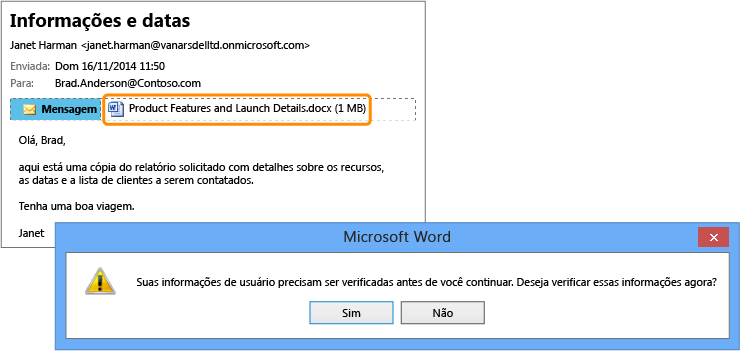

# Imagem em tela cheia: Relat&#243;rios confidenciais acidentalmente enviados para a pessoa errada

Voltar para o [Azure RMS em ação: Protege arquivos automaticamente em servidores de arquivos que executam o Windows Server e a Infraestrutura de classificação de arquivos](http://technet.microsoft.com/library/jj585026.aspx).

