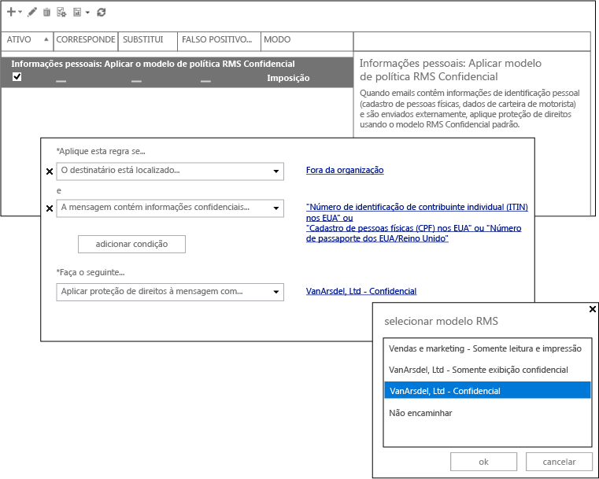

# Imagem em tela cheia: Configurando DLP para Azure RMS

Voltar para o [Azure RMS em ação: Protege automaticamente emails com o Exchange Online e políticas de prevenção de perda de dados](http://technet.microsoft.com/library/jj585026.aspx)

