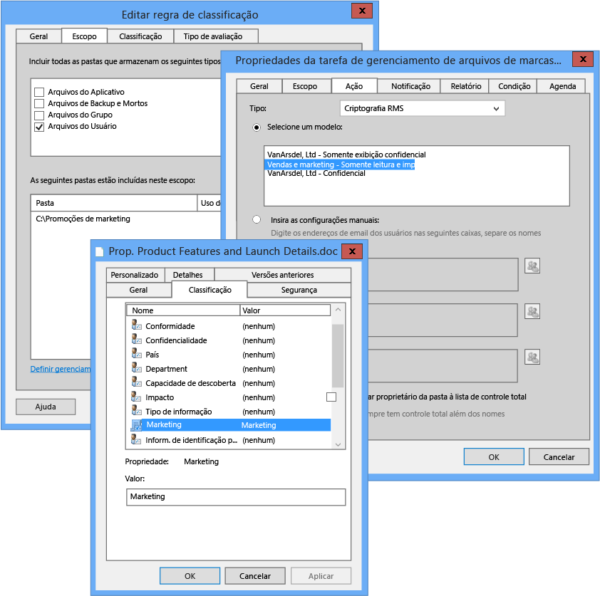

# Imagem em tela cheia: Configurando FCI para a classifica&#231;&#227;o de Marketing

Voltar para o [Azure RMS em ação: Protege arquivos automaticamente em servidores de arquivos que executam o Windows Server e a Infraestrutura de classificação de arquivos](http://technet.microsoft.com/library/jj585026.aspx).

