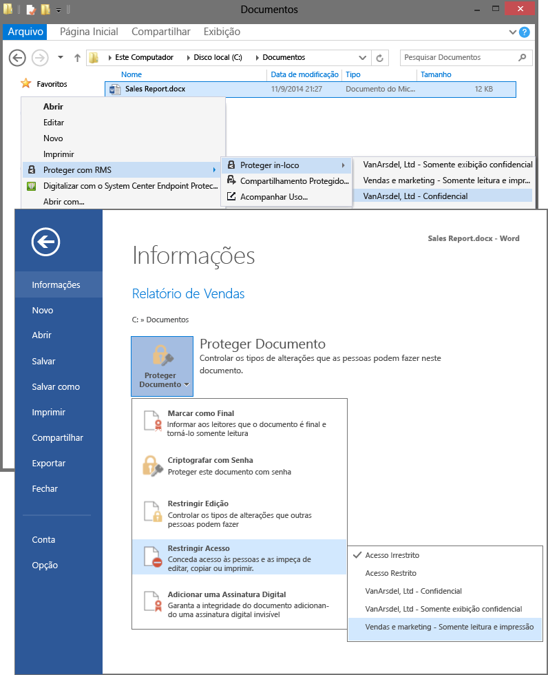

# Imagem em tela cheia: Selecione modelos de RMS em aplicativos, como o Explorador de arquivos e o Word

Voltar para o [Azure RMS em ação: Ativando e configurando o Rights Management](http://technet.microsoft.com/library/jj585026.aspx)

