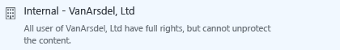

# Como compartilhar com seguran&#231;a um documento por email

## &lt;Instruções para administradores – exclua esta seção antes de fornecer aos usuários&gt;
Use este documento como um ponto de partida para suas próprias instruções para o usuário final para ajudar os usuários a compartilharem documentos com segurança por email.Faça as modificações deseja para as instruções na próxima seção e exclua a primeira seção e forneça este documento aos usuários.

As instruções aqui são para uma empresa fictícia, **VanArsdel, Ltd**.Antes de fornecer essas instruções aos usuários ou substituir as capturas de tela e instruções para que elas mostrem o nome da sua própria organização ou modificar as instruções para que os usuários saibam que as instruções se referem à VanArsdel, Ltd, eles verão o nome da sua própria empresa.Outras personalizações que talvez você queira fazer:

-   Na etapa 2, sugerimos apenas duas das opções disponíveis no caso do envio para pessoas de fora da organização.Você talvez queira alterar essas sugestões.

-   Na etapa 2, sugerimos as descrições para ajudar os usuários a identificar o modelo para selecionar.Você talvez queira alterar essas descrições para ser mais específico ou significativo para sua empresa e usuários.

-   Na etapa 3, sugerimos **Permitir que eu revogue o acesso a esses documentos imediatamente** para a opção **Viewer – View Only**, como um exemplo para quando você quiser incluir essa opção de configuração para os usuários.No entanto, você pode decidir que os usuários sempre devem selecionar essa opção ao enviarem o documento para alguém de fora da organização ou nunca selecione essa opção.

-   Na etapa 4, sugerimos a opção **Envie-me um email quando alguém tentar abrir este documento**.Se os usuários controlarem seus documentos usando o portal de controle de documento, você pode decidir que a notificação por email não é necessária e excluir esta etapa.

> [!NOTE]
> Para obter mais informações sobre cada uma das opções que os usuários podem selecionar, consulte [Opções da caixa de diálogo para o aplicativo Rights Management sharing](https://technet.microsoft.com/library/dn574738.aspx)

Para ver as instruções de usuário funcionarem, os seguintes requisitos devem estar em vigor:

|Verificar|Requisito|Se você precisar de mais informações|
|-------------|-------------|----------------------------------------|
||Você preparou contas e grupos do Office 365 ou o Azure Active Directory|[Preparando o Azure Rights Management](https://technet.microsoft.com/library/jj585029.aspx)|
||O Azure Rights Management está ativado|[Ativando o Azure Rights Management](https://technet.microsoft.com/library/jj658941.aspx)|
||O aplicativo Rights Management sharing é implantado nos computadores dos usuários que executam o Windows|[Implantação automática para o aplicativo de compartilhamento Microsoft Rights Management](https://technet.microsoft.com/library/dn339003%28v=ws.10%29.aspx)|
||Se você estiver usando o Exchange Server em vez do Exchange Online:  -   O conector RMS é implantado e as funções do servidor do Exchange são configuradas para usá-lo|[Implantando o conector do Azure Rights Management](https://technet.microsoft.com/library/dn375964.aspx)|
||Os usuários têm o Outlook do Office 2010|Se os usuários têm o Office 2013, substitua as capturas de tela por versões equivalentes para que elas correspondam ao que os usuários veem.|
||Você configurou os modelos personalizados conforme descrito a seguir|[Configurando modelos personalizados do Azure Rights Management](https://technet.microsoft.com/library/dn642472.aspx)|

#### Para configurar os modelos personalizados:

1.  Arquive os 2 modelos padrão.

2.  Crie 3 novos modelos, copiando os modelos padrão e fazendo as seguintes alterações:

    |Modelo a ser copiado|Novo nome|Nova descrição|Conceder esses direitos personalizados|Outras configurações|
    |------------------------|-------------|------------------|------------------------------------------|------------------------|
    |**&lt;nome da organização&gt; - Somente exibição confidencial**|**Altamente confidencial - &lt;nome da organização&gt;**|Todos os usuários da &lt;nome da organização&gt; têm direitos de exibição e edição.Sem acesso offline|**Exibir Conteúdo**  **Salvar arquivo**  **Editar conteúdo**|Atualize o nome e descrição para os idiomas usados pelos usuários.  Para **expiração de conteúdo**: Mantenha o padrão **Conteúdo nunca expira**  Para **acesso offline**: Selecione **Conteúdo está disponível apenas com uma conexão à Internet**|
    |**&lt;nome da organização&gt; - Somente exibição confidencial**|**Confidencial - &lt;nome da organização&gt;**|Todos os usuários da &lt;nome da organização&gt; têm direitos de exibição e edição.|**Exibir Conteúdo**  **Salvar arquivo**  **Editar conteúdo**|Atualize o nome e descrição para os idiomas usados pelos usuários.  Para **expiração de conteúdo**: Mantenha o padrão **Conteúdo nunca expira**  Para **acesso offline**: Selecione o **Número de dias que o conteúdo está disponível sem uma conexão à Internet** e digite **1**|
    |**&lt;nome da organização&gt; - Confidencial**|**Interno - &lt;nome da organização&gt;**|Todos os usuários da &lt;nome da organização&gt; tem direitos completos, mas não é possível desproteger o conteúdo.|**Exibir Conteúdo**  **Salvar arquivo**  **Editar conteúdo**  **Copiar e extrair conteúdo**  **Imprimir**|Atualize o nome e descrição para os idiomas usados pelos usuários.  Para **expiração de conteúdo**: Mantenha o padrão **Conteúdo nunca expira**  Para **acesso offline**: Selecione o **Número de dias que o conteúdo está disponível sem uma conexão à Internet** e mantenha o valor padrão **7**|

3.  Publique os 3 novos modelos.

## &lt;As instruções para o usuário iniciam aqui, exclua esse título&gt;
De agora em diante, sempre que você enviar um documento importante para alguém por email, use estas instruções para ajudar a impedir que o documento seja lido por pessoas que não deveriam vê-lo.

1.  Crie a mensagem de email, especificando o endereço ou endereços de email, digite sua mensagem e anexe o arquivo que você deseja compartilhar com segurança.Depois, na guia **Mensagem** no grupo do **RMS**, clique em **Compartilhamento Protegido**, e então clique em **Compartilhamento Protegido** novamente:

    

2.  Na caixa de diálogo **compartilhamento protegido**, especifique o seguinte:

    Quando você envia um documento para pelo menos uma pessoa que trabalha em outra organização:

    |Se isso se aplica ...|Faça isto:|
    |-------------------------|--------------|
    |**Proteção genérica** é selecionada automaticamente para você →|Mantenha essa seleção:  |
    |As informações do documento não devem ser alteradas →|Selecione **Viewer – View Only**.  |
    |As informações do documento podem ser alteradas →|Selecione **Co-Author – View, Edit, Copy and Print**:  |
    Quando você envia um documento para as pessoas dentro da sua organização:

    |Se isso se aplica ...|Faça isto:|
    |-------------------------|--------------|
    |**Proteção genérica** é selecionada automaticamente para você →|Mantenha essa seleção:  |
    |As informações do documento são muito sensíveis e poderiam causar danos excepcionalmente altos para a organização ou para seus funcionários se forem tornadas disponíveis publicamente →|Selecione **Altamente Confidencial - VanArsdel, Ltd**:  |
    |As informações do documento são confidenciais e poderiam causar danos à organização ou para seus funcionários se forem tornadas disponíveis publicamente →|Selecione **Confidencial - VanArsdel, Ltd**:  |
    |As informações do documento não devem ser compartilhadas com pessoas de fora da sua organização, mas não contém informações importantes sobre a organização ou seus funcionários →|Selecione **Interno – VanArsdel, Ltd**:  |

3.  Se você selecionou **Viewer – View Only**: Selecione **Permitir que eu revogue o acesso a esses documentos imediatamente**.

    

4.  Selecione **Enviar-me um email quando alguém tentar abrir esses documentos**:

    

5.  Clique em **Enviar Agora**:

    

Quando alguém para quem você enviou um documento protegido receber o email, eles veem uma mensagem que fornecem instruções sobre como ler o documento.Eles podem ler o documento em vários dispositivos, incluindo iPads, iPhones, tablets Android e telefones, computadores Mac e computadores com Windows.

Para controlar se as pessoas para quem você enviou documentos protegidos os acessaram, use o [site de acompanhamento de documento](https://track.azurerms.com/).

**Precisa de ajuda?**

-   Para obter informações adicionais:

    -   [Proteger um arquivo que você compartilha por email](https://technet.microsoft.com/library/dn574735%28v=ws.10%29.aspx)

    -   [Rastrear e revogar seus documentos](https://technet.microsoft.com/library/dn986611.aspx)

-   Entre em contato com o suporte técnico:

    -   &lt;detalhes do contato&gt;

