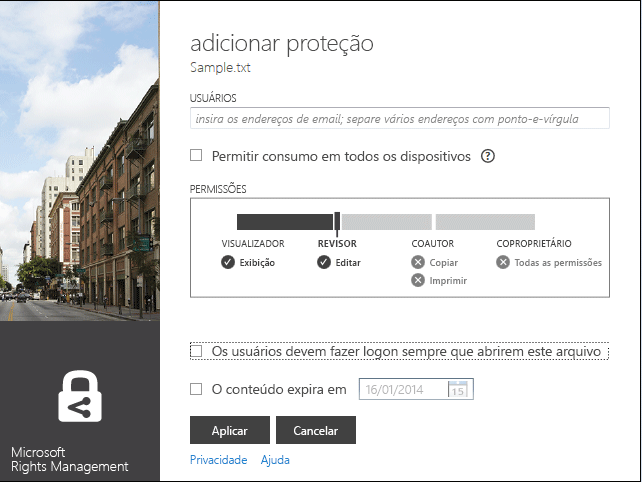
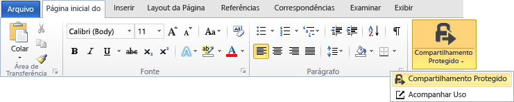

# Guia do usu&#225;rio do aplicativo de compartilhamento Microsoft Rights Management - publica&#231;&#227;o original
Este guia do usuário para o aplicativo de compartilhamento Microsoft Rights Management para Windows inclui as seguintes seções:

-   [Avaliando e instalando o aplicativo de compartilhamento Microsoft Rights Management](../Topic/Microsoft_Rights_Management_sharing_application_user_guide_-_original_publication.md#BKMK_Eval)

-   [Usando o aplicativo de compartilhamento Microsoft Rights Management](../Topic/Microsoft_Rights_Management_sharing_application_user_guide_-_original_publication.md#BKMK_UsingMSRMSApp)

-   [Usando permissões de autoria do usuário e compartilhando conteúdo protegido](../Topic/Microsoft_Rights_Management_sharing_application_user_guide_-_original_publication.md#BKMK_Custom)

-   [Usando o suplemento da barra de ferramentas do Office](../Topic/Microsoft_Rights_Management_sharing_application_user_guide_-_original_publication.md#BKMK_OfficeToolbar)

-   [Orientação do administrador para o aplicativo de compartilhamento Microsoft Rights Management](../Topic/Microsoft_Rights_Management_sharing_application_user_guide_-_original_publication.md#BKMK_AdminGuide)

Para perguntas frequentes e informações de solução de problemas, consulte [Perguntas Frequentes sobre o Aplicativo de Compartilhamento Microsoft Rights Management para Windows](http://go.microsoft.com/fwlink/?LinkId=303971).

## <a name="BKMK_Eval"></a>Avaliação e instalação do aplicativo de compartilhamento Microsoft Rights Management para Windows
Esta seção explica o que é o aplicativo de compartilhamento Microsoft Rights Management e como instalá-lo:

-   [O que é o aplicativo de compartilhamento Microsoft Rights Management?](../Topic/Microsoft_Rights_Management_sharing_application_user_guide_-_original_publication.md#BKMK_WhatIs)

-   [Requisitos para o aplicativo de compartilhamento Microsoft Rights Management](../Topic/Microsoft_Rights_Management_sharing_application_user_guide_-_original_publication.md#BKMK_Reqs)

-   [Instalando o aplicativo de compartilhamento Microsoft Rights Management](../Topic/Microsoft_Rights_Management_sharing_application_user_guide_-_original_publication.md#BKMK_Install)

### <a name="BKMK_WhatIs"></a>O que é o aplicativo de compartilhamento Microsoft Rights Management?
O aplicativo de compartilhamento Microsoft Rights Management é um aplicativo opcional, que pode ser baixado para o Microsoft Windows, e que:

-   Aprimora o Explorador de Arquivos (também conhecido como Windows Explorer no Windows 7 e versões anteriores), permitindo a proteção de um único arquivo, ou múltiplos arquivos em massa, ou ainda todos os arquivos em uma pasta selecionada.

-   Adiciona suporte para a proteção de qualquer tipo de arquivo e um visualizador nativo para os tipos de arquivos de texto e imagem mais comuns.

-   Adiciona novos botões na barra de ferramentas do Microsoft Office para o Word, o PowerPoint e o Excel.

### <a name="BKMK_Reqs"></a>Requisitos para o aplicativo de compartilhamento Microsoft Rights Management para Windows
Para usar o aplicativo de compartilhamento Microsoft Rights Management, seu computador deve executar o Windows 7, Windows 8 ou Windows 8.1.

O aplicativo de compartilhamento Microsoft Rights Management requer o Cliente 2.1 do AD RMS, instalado com o pacote de instalação.O aplicativo de compartilhamento Microsoft Rights Management só funcionará com esta versão do cliente AD RMS.

### <a name="BKMK_Install"></a>Instalar o aplicativo de compartilhamento Microsoft Rights Management
Para instalar o aplicativo de compartilhamento Microsoft Rights Management, siga os seguintes passos:

1.  Vá para a página do [Microsoft Rights Management](http://go.microsoft.com/fwlink/?LinkId=303970) no site da Web da Microsoft.

2.  Na seção **Computadores**, clique no ícone para o **aplicativo RMS para Windows** e salve o pacote de instalação do aplicativo de compartilhamento Microsoft Rights Management em seu computador.

3.  Clique duas vezes no arquivo compactado que foi baixado e, em seguida, clique duas vezes em **setup.exe**.Se você for solicitado a continuar, clique em **Sim**.

4.  Na página de **Instalação do Microsoft RMS** clique em **Próximo**, e aguarde a conclusão da instalação.

5.  Quando a instalação for concluída, clique em **Reiniciar** para reiniciar o computador e concluir a instalação.Ou, clique em **Fechar** e reinicie o computador mais tarde para concluir a instalação.

## <a name="BKMK_UsingMSRMSApp"></a>Usar o aplicativo de compartilhamento Microsoft Rights Management
Esta seção aborda diferentes maneiras de usar o aplicativo de compartilhamento Microsoft Rights Management:

-   [Criando um arquivo (.ptxt) de texto protegido](../Topic/Microsoft_Rights_Management_sharing_application_user_guide_-_original_publication.md#BKMK_CreatePTXT)

-   [Exibindo um arquivo (.ptxt) de texto protegido ou de imagem protegido](../Topic/Microsoft_Rights_Management_sharing_application_user_guide_-_original_publication.md#BKMK_ViewPTXT)

-   [Criando um arquivo (.pfile) protegido genérico](../Topic/Microsoft_Rights_Management_sharing_application_user_guide_-_original_publication.md#BKMK_CreatePFILE)

-   [Exibindo um arquivo (.pfile) protegido genérico](../Topic/Microsoft_Rights_Management_sharing_application_user_guide_-_original_publication.md#BKMK_ViewPFILE)

-   [Removendo a proteção de um arquivo](../Topic/Microsoft_Rights_Management_sharing_application_user_guide_-_original_publication.md#BKMK_Unprotect)

### <a name="BKMK_CreatePTXT"></a>Criar um arquivo de texto protegido (.ptxt)
O aplicativo de compartilhamento Microsoft Rights Management pode ser usado para converter um arquivo de texto normal (.txt) em um arquivo protegido (.ptxt).

##### Para criar um arquivo de texto protegido (.ptxt)

1.  No Explorador de Arquivos, clique com o botão direito do mouse em uma pasta, escolha **Novo**, e então clique em **Documento de Texto**.

2.  Renomeie o arquivo (p.ex., como Exemplo.txt).

3.  Clique duas vezes no arquivo para abri-lo no Bloco de Notas.

4.  No Bloco de Notas, adicione algumas linhas de texto ao arquivo, como as seguintes, e então salve-o:

    ```
    This is a sample text file.
    This is a sample text file.
    This is a sample text file.
    This is a sample text file. 
    This is a sample text file.
    This is a sample text file.
    ```

5.  Clique no arquivo com o botão direito do mouse, escolha **Proteção in-loco**, e selecione um modelo da lista.(Observe que, na primeira vez que for usar a ferramenta, você precisará selecionar **Proteção da Empresa** para iniciar o download dos modelos para sua organização.)

6.  Na tela do **aplicativo de compartilhamento Microsoft Rights Management**, confirme a política que você deseja aplicar, clique em **Aplicar**, e, depois que o arquivo estiver protegido, clique em **Fechar**.

### <a name="BKMK_ViewPTXT"></a>Exibir um texto protegido (.ptxt) ou um arquivo de imagem protegido
Para exibir um arquivo de texto protegido (.ptxt), no Explorador de Arquivos, clique duas vezes no arquivo (p.ex., como Exemplo.txt).Pode ser que você precise autorizar o aplicativo para obter direitos.A política de proteção aparece na parte superior do arquivo.

Imagens protegidas podem ser abertas e exibidas de maneira semelhante.

### <a name="BKMK_CreatePFILE"></a>Criar um arquivo protegido genérico (.pfile)
O formato de arquivo protegido genérico (.pfile) pode ser usado para oferecer um nível genérico de proteção para tipos de arquivos aos quais o aplicativo de compartilhamento Microsoft Rights Management, ou outros aplicativos que ofereçam proteção nativa do tipo RMS, não deem suporte de maneira direta.

Por exemplo, o formato de arquivo protegido genérico pode proteger arquivos .vsd criados com o Microsoft Visio (que atualmente não dá suporte à proteção nativa).

> [!NOTE]
> Arquivos que usam proteção genérica são seguros apenas para autenticação.Um usuário autorizado a usar o arquivo protegido (.pfile) será autenticado e os direitos e permissões do usuário serão exibidos, mas não poderão ser aplicados se o arquivo for aberto no formato original (por exemplo, se o arquivo .vsd for aberto no Visio).Um usuário não autorizado, ou que não possa ser autenticado, não poderá abrir o arquivo protegido.

##### Para criar um arquivo protegido genérico (.pfile) a partir de um arquivo de desenho do Visio (.vsd)

1.  No Explorador de Arquivos, clique com o botão direito do mouse em uma pasta, escolha **Novo**, e então clique em **Novo Documento do Visio**.

2.  Renomeie o arquivo (p.ex., como Exemplo.vsd).

3.  Clique duas vezes no arquivo para abri-lo no Visio.

4.  No Visio, adicione elementos ao desenho, salve e feche o arquivo.

5.  Clique no arquivo com o botão direito do mouse, escolha **Proteção in-loco**, e selecione um modelo de política da lista.(Observe que, na primeira vez que for usar a ferramenta, você precisará selecionar **Proteção da Empresa** para iniciar o download dos modelos para sua organização.)

6.  Na tela do **aplicativo de compartilhamento Microsoft Rights Management**, selecione a política que você deseja aplicar, e então clique em **Aplicar**.

7.  Uma mensagem informa que o arquivo protegido foi salvo como Exemplo.vsd.pfile (o arquivo original é excluído).

### <a name="BKMK_ViewPFILE"></a>Exibir um arquivo protegido genérico (.pfile)
Para exibir um arquivo genérico protegido (.pfile), no Explorador de arquivos, clique duas vezes no arquivo protegido genérico (.pfile) (p.ex., como Example.vsd.pfile) e clique em **Abrir**.

### <a name="BKMK_Unprotect"></a>Remover a proteção de um arquivo
O aplicativo de compartilhamento Microsoft Rights Management oferece a opção de remover a proteção de arquivos protegidos anteriormente.

Para remover a proteção (isto é, desproteger) de um arquivo protegido anteriormente, você deve aplicar a opção **Remover Proteção**, da seguinte maneira:

1.  Clique com o botão direito do mouse em **Exemplo.ptxt**, selecione **Proteção in-loco**, e clique em **Remover Proteção**.Pode ser que você precise autorizar o aplicativo para obter direitos.

2.  Exemplo.ptxt será excluído e substituído por Exemplo.txt.

## <a name="BKMK_Custom"></a>Uso de permissões de autoria do usuário e compartilhamento de conteúdo protegido
Esta seção aborda como proteger e consumir um arquivo usando permissões de autoria do usuário, como compartilhar conteúdo protegido e como proteger vários arquivos:

-   [Protegendo um arquivo com permissões de autoria do usuário](../Topic/Microsoft_Rights_Management_sharing_application_user_guide_-_original_publication.md#BKMK_ProtectCustom)

-   [Consumindo arquivos que têm a proteção de autoria do usuário](../Topic/Microsoft_Rights_Management_sharing_application_user_guide_-_original_publication.md#BKMK_UserDefined)

-   [Compartilhando conteúdo protegido](../Topic/Microsoft_Rights_Management_sharing_application_user_guide_-_original_publication.md#BKMK_ShareProtected)

-   [Usar atalhos de teclado](../Topic/Microsoft_Rights_Management_sharing_application_user_guide_-_original_publication.md#BKMK_AccessKeys)

-   [Aplicando proteção a vários arquivos e pastas](../Topic/Microsoft_Rights_Management_sharing_application_user_guide_-_original_publication.md#BKMK_Multiple)

### <a name="BKMK_ProtectCustom"></a>Proteger um arquivo com permissões de autoria do usuário
A proteção de autoria do usuário pode ser usada para realizar o seguinte:

-   Limitar o acesso ao arquivo a apenas uma lista específica de usuários individuais, identificados por seus endereços de email.

-   Limitar o uso do arquivo a apenas direitos específicos, como a direitos somente leitura para um documento.

Para proteger um arquivo com permissões de autoria do usuário, clique no arquivo com o botão direito do mouse, clique em **Proteção in-loco** e clique em **Permissões Personalizadas**.A tela a seguir será exibida:



Digite os endereços de email da lista de usuários, use o controle deslizante para selecionar as permissões para o arquivo e clique em **Aplicar**.

### <a name="BKMK_UserDefined"></a>Consumir arquivos que tenham proteção de autoria do usuário
A maior parte dos arquivos protegidos manipulados pelo aplicativo de compartilhamento Microsoft Rights Management são protegidos aplicando níveis de proteção com base em modelos.No entanto, também é possível que o aplicativo de compartilhamento Microsoft Rights Management dê suporte a arquivos que receberam um nível de proteção de autoria do usuário.

A proteção de autoria do usuário pode ser usada para realizar os seguintes tipos de proteção em um arquivo:

-   Limitar o acesso ao arquivo a apenas uma lista muito específica de usuários individuais, identificados por seus endereços de email.

-   Limitar o uso do arquivo a apenas um direito específico, como a direitos somente impressão para um documento.

Para formatos de arquivos de texto e imagem, esse nível de proteção requer que todos os aplicativos usados para editar, salvar ou restringir os arquivos de texto ou de imagem tenham sido projetados para dar suporte à proteção de RMS e implementar as APIs de proteção fornecidas no SDK do AD RMS.

Ao exibir um arquivo de texto protegido com proteção do usuário, você irá notar uma pequena diferença na permissões exibidas para o arquivo, como no exemplo a seguir.

Para arquivos protegidos usando o formato de arquivo protegido genérico (.pfile), os direitos ou permissões específicas do usuário são exibidos na tela de confirmação ao invés do nome do modelo que usado para proteger o arquivo, como na figura a seguir.


### <a name="BKMK_ShareProtected"></a>Compartilhar conteúdo protegido
Para proteger e compartilhar conteúdo, clique no arquivo com o botão direito do mouse, então clique em **Compartilhamento Protegido**.A tela a seguir será exibida:


Digite os endereços de email da lista de usuários, use o controle deslizante para selecionar as permissões para o arquivo e clique em **Enviar**.O aplicativo abrirá o Outlook com um email prévio, com o arquivo protegido anexado.O arquivo original não será protegido.

Para permitir que os usuários tenham acesso a arquivos protegidos em dispositivos sem o Windows, clique em **Permitir consumo em todos os dispositivos**.Os usuários precisarão [baixar o aplicativo de compartilhamento Microsoft Rights Management](http://go.microsoft.com/fwlink/?LinkId=303970) para seus dispositivos.

### <a name="BKMK_AccessKeys"></a>Usar atalhos de teclado
Pressione a tecla **Alt** para ver as teclas de acesso disponíveis.Pressione **Alt** + a tecla de acesso para selecionar uma opção.Por exemplo, na caixa de diálogo **Compartilhamento Protegido**, pressione **Alt** para ver as teclas de acesso e pressione **Alt + u** para selecionar **Os usuários devem realizar logon sempre que abrirem o arquivo**.


### <a name="BKMK_Multiple"></a>Aplicar proteção a vários arquivos e pastas
O aplicativo de compartilhamento Microsoft Rights Management também pode ser usado para aplicar proteção a mais de um arquivo único, como ao selecionar vários arquivos ou uma pasta que contém arquivos desprotegidos no Explorador de Arquivos.

##### Para proteger vários arquivos ou todos os arquivos em uma pasta selecionada

1.  No Explorador de Arquivos, selecione vários arquivos ou selecione uma pasta contendo vários arquivos a serem protegidos.

2.  Clique na pasta selecionada com o botão direito do mouse, escolha **Proteção in-loco**, e selecione um modelo da lista.(Observe que, na primeira vez que for usar a ferramenta, você precisará selecionar **Proteção da Empresa** para iniciar o download dos modelos para sua organização.)

3.  Na tela do **aplicativo de compartilhamento Microsoft Rights Management**, confirme se os arquivos foram protegidos.

Se você encontrar erros, consulte as [Perguntas Frequentes sobre o Aplicativo de Compartilhamento Microsoft Rights Management para Windows](http://go.microsoft.com/fwlink/?LinkId=303971).

## <a name="BKMK_OfficeToolbar"></a>Usar o suplemento da barra de ferramentas do Office
Você pode proteger e compartilhar arquivos do Word, PowerPoint e Excel diretamente do Microsoft Office com o suplemento da faixa de opções do Office para o aplicativo de compartilhamento Microsoft Rights Management.Clique em **Compartilhamento Protegido** na faixa de opções para iniciar o aplicativo de compartilhamento Microsoft Rights Management.



## <a name="BKMK_AdminGuide"></a>Diretrizes para administrador do aplicativo de compartilhamento Microsoft Rights Management
Este guia do administrador para o aplicativo de compartilhamento Microsoft Rights Management inclui as seguintes seções:

-   [Visão geral técnica do aplicativo de compartilhamento Microsoft Rights Management](../Topic/Microsoft_Rights_Management_sharing_application_user_guide_-_original_publication.md#BKMK_AdminOverview)

-   [Tipos de arquivos com suporte](../Topic/Microsoft_Rights_Management_sharing_application_user_guide_-_original_publication.md#BKMK_SupportFileTypes)

-   [Implantação automática para o aplicativo de compartilhamento Microsoft Rights Management](../Topic/Microsoft_Rights_Management_sharing_application_user_guide_-_original_publication.md#BKMK_ScriptedInstall)

### <a name="BKMK_AdminOverview"></a>Visão geral técnica para o aplicativo de compartilhamento Microsoft Rights Management
O aplicativo de compartilhamento Microsoft Rights Management é um aplicativo opcional, que pode ser baixado para o Microsoft Windows e outras plataformas, e que realiza:

-   Proteção de um único arquivo, ou múltiplos arquivos em massa, ou ainda todos os arquivos em uma pasta selecionada.

-   Suporte completo para a proteção de qualquer tipo de arquivo e um visualizador nativo para os tipos de arquivos de texto e imagem mais comuns.

-   Proteção genérica para arquivos que não deem suporte à proteção de RMS.

-   Interoperabilidade total com arquivos protegidos usando o Office Information Rights Management (IRM)

-   Interoperabilidade total com arquivos PDF protegidos usando o SharePoint, FCI e ferramentas de criação de PDF com suporte

O aplicativo de compartilhamento Microsoft Rights Management usa o novo [tempo de execução do Cliente 2.1 AD RMS](http://www.microsoft.com/download/details.aspx?id=38396).Ele possibilita aos usuários a proteção do conteúdo usando predefinições ou modelos definidos pelo usuário que você pode personalizar e implantar para sua organização.Usando a funcionalidade do AD RMS 2.1, o aplicativo de compartilhamento Microsoft Rights Management oferece aos usuários finais uma experiência simples de proteção e consumo.

Com o lançamento de outubro de 2013 do Microsoft Azure AD RMS, você pode proteger documentos usando o Office 2010 de maneira nativa e enviá-los para pessoas de outra empresa, que podem então consumi-los usando o Microsoft Azure AD RMS.Além disso, com esta versão, se você usar o AD RMS no modo criptográfico 2, você pode usar o RMS para indivíduos e consumir conteúdo de pessoas de outra empresa que use o Microsoft Azure AD RMS.Para obter mais informações sobre o modo criptográfico 2, consulte [Modos de criptografia do AD RMS](http://technet.microsoft.com/library/hh867439%28v=ws.10%29.aspx).

Para baixar o aplicativo de compartilhamento Microsoft Rights Management, siga os seguintes passos:

1.  Entre no [Microsoft Connect](http://connect.microsoft.com/) com sua conta da Microsoft (anteriormente conhecida como Live ID).

2.  Na página **Home**, procure **Rights Management Services** e ingresse no grupo.

3.  Clique em **Downloads**, e então clique em **aplicativo de compartilhamento Microsoft Rights Management**.

4.  Na página **Detalhes do Download**, selecione **aplicativo de compartilhamento Microsoft Rights Management.zip** e clique em **Baixar**.

5.  Caso necessário, instale o Microsoft File Transfer Manager e conclua as etapas para baixar o aplicativo de compartilhamento Microsoft Rights Management.

#### Níveis de proteção com Suporte pelo aplicativo de compartilhamento Microsoft Rights Management
O aplicativo de compartilhamento Microsoft Rights Management dá suporte à proteção em dois níveis diferentes, conforme descrito na seguinte tabela.

||||
|-|-|-|
|Tipo de proteção|Nativo|Genérico|
|Descrição|Para arquivos de texto, imagem, do Microsoft Office (Word, Excel, PowerPoint), .pdf e tipos de arquivo de outros aplicativos com suporte a AD RMS, a proteção nativa possibilita um nível maior de proteção, que inclui criptografia e aplicação de direitos (permissões).|Para todos os outros aplicativos e tipos de arquivos, a proteção genérica oferece um nível de proteção que inclui encapsulamento de arquivos usando o tipo de arquivo .pfile, e autenticação para verificar se um usuário está autorizado a abrir o arquivo.|
|Proteção|Os arquivos são totalmente criptografados e a proteção é realizada das seguintes maneiras:<br /><br />-   Antes do conteúdo protegido ser renderizado, uma autenticação bem-sucedida deve ocorrer para aqueles que recebem o arquivo por email ou recebem acesso a ele por meio de permissões de arquivo ou compartilhamento.<br />-   De maneira adicional, os direitos de uso e a política definida pelo proprietário do conteúdo quando os arquivos são protegidos são totalmente aplicados quando o conteúdo for renderizado no Visualizador de IP (para arquivos de texto e imagem protegidos) ou no aplicativo associado (para todos os outros tipos de arquivos com suporte).|A proteção de arquivos é aplicada nas seguintes maneiras:<br /><br />-   Antes do conteúdo protegido ser renderizado, uma autenticação bem-sucedida deve ocorrer para aqueles que estão autorizados a abrir o arquivo e acessá-lo.Se a autorização falhar, o arquivo não abrirá.<br />-   Os direitos de uso e a política definida pelo proprietário do conteúdo são exibidos para informar aos usuários autorizados a política de uso pretendido.<br />-   Será realizado o log de auditoria de usuários autorizados a abrir e acessar arquivos; no entanto, direitos de uso não são aplicados por aplicativos sem suporte.|
|Padrão para tipos de arquivo|Esse é o nível de proteção padrão para os seguintes tipos de arquivo:<br /><br />-   Arquivos de texto e imagem<br />-   Arquivos do Microsoft Office (Word, Excel, PowerPoint)<br />-   Formato de documento portátil (. pdf)<br /><br />Para obter mais informações, consulte Tipos de Arquivo com Suporte.|Essa é a proteção padrão para todos os outros tipos de arquivos (como .vsdx,. rtf e assim por diante) sem suporte para proteção completa.|

### <a name="BKMK_SupportFileTypes"></a>Tipos de arquivo com suporte
A seguinte tabela lista os tipos de arquivos com suporte pelo aplicativo de compartilhamento Microsoft Rights Management.

|Extensão do arquivo|Descrição|Extensão original do arquivo|
|-----------------------|-------------|--------------------------------|
|.ptxt|Arquivo de Texto protegido|.txt|
|.pxml|Arquivo XML protegido|.xml|
|.pjpg|Arquivo de imagem JPG protegido|.jpg|
|.pjpeg|Arquivo de imagem JPEG protegido|.jpeg|
|.ppng|Arquivo de imagem PNG protegido|.png|
|.ptiff|Arquivo de imagem TIFF protegido|.tiff|
|.pbmp|Arquivos de Bitmap do Windows protegido:|.bmp|
|.pgif|Arquivo de imagem GIF protegido|.gif|
|.pgiff|Arquivo de imagem GIFF protegido|.giff|
|.pjpe|Arquivo de imagem JPE protegido|.jpe|
|.pjfif|Arquivo de imagem JFIF protegido|.jfif|
|.pjif|Arquivo de imagem JIF protegido|.jif|
A tabela a seguir lista os tipos de arquivos com suporte pelo Microsoft Office 2013, Office 2010 e Office 2007.Há dois tipos de protetores: o MsoIrmProtector e o OpcIrmProtector.Para obter mais informações sobre esses tipos de protetores, consulte [Protetores de Formatos de Arquivos do Microsoft Office](http://archive.msdn.microsoft.com/OfficeProtectors).

|||
|-|-|
|O MsoIrmProtector dá suporte aos seguintes tipos de arquivos:<br /><br />-   doc<br />-   dot<br />-   xla<br />-   xls<br />-   xlt<br />-   pps<br />-   ppt|O OpcIrmProtector dá suporte aos seguintes tipos de arquivos:<br /><br />-   docm<br />-   docx<br />-   dotm<br />-   dotx<br />-   xlam<br />-   xlsb<br />-   xlsm<br />-   xlsx<br />-   xltm<br />-   xltx<br />-   xps<br />-   potm<br />-   potx<br />-   ppsx<br />-   ppsm<br />-   pptm<br />-   pptx<br />-   thmx|

### <a name="BKMK_ScriptedInstall"></a>Implantação automática para o aplicativo de compartilhamento Microsoft Rights Management
A versão do Windows do aplicativo RMS sharing dá suporte a uma instalação com script, muito adequada para implantações corporativas.

##### Para baixar o aplicativo RMS sharing para implantação automática

1.  Vá à página do [aplicativo de compartilhamento Microsoft Rights Management para Windows](http://www.microsoft.com/download/details.aspx?id=40857) no Microsoft Download Center e clique em **Baixar**.

2.  Selecione e baixe os arquivos que você precisa.Existem dois pacotes de instalação de cliente: um para Windows de 64 bits (Microsoft Rights Management sharing application x64.zip) e outro para Windows de 32 bits (Microsoft Rights Management sharing application x86.zip).

3.  Extraia os arquivos dos pacotes de instalação compactados, por exemplo, ao clicar duas vezes neles.Depois, copie os arquivos extraídos para um local de rede que os computadores cliente possam acessar.

Os pacotes de instalação para o aplicativo RMS sharing dão suporte a diferentes cenários de implantação e incluem o seguinte:

|Descrição|Cenário de implantação|
|-------------|--------------------------|
|Assistente de Conexão do Microsoft Online|Necessário para o seguinte:<br /><br />-   Office 2010 e Microsoft Azure RMS|
|Hotfix para Office (KB 2596501)|Necessário para o seguinte:<br /><br />-   Office 2010 e Microsoft Azure RMS|
|Hotfix para o Modo Criptográfico 2 (KB 2627273)|Necessário para o seguinte:<br /><br />-   Office 2010 e Microsoft Azure RMS|
|Cliente AD RMS e o aplicativo RMS sharing|Necessário para o seguinte:<br /><br />-   Office 2013 e Microsoft Azure RMS<br />-   Office 2010 e Microsoft Azure RMS<br />-   Office 2013 e Active Directory RMS<br />-   Office 2010 e Active Directory RMS<br />-   Atualização do aplicativo RMS sharing|
|Suplemento do Office para a faixa de opções|Necessário para o seguinte:<br /><br />-   Office 2013 e Microsoft Azure RMS<br />-   Office 2013 e Active Directory RMS<br />-   Office 2010 e Active Directory RMS<br />-   Atualização do aplicativo RMS sharing|
|Ferramenta de preparação do Microsoft Azure Active Directory Rights Management|Necessário para o seguinte:<br /><br />-   Office 2010 e Microsoft Azure RMS|
> [!NOTE]
> Para o cenário **Office 2010 e o Microsoft Azure RMS**, talvez você use o Microsoft Azure RMS ou o Active Directory RMS, mas deseja enviar documentos com segurança para pessoas de outra empresa que usam o Microsoft Azure RMS.
> 
> Quando você instala e executa a ferramenta de preparação do Microsoft Azure Active Directory Rights Management para dar suporte ao Office 2010, ela faz duas coisas:
> 
> -   Ela edita o registro para dar suporte ao aplicativo RMS sharing.
> -   Ela "inicializa" o usuário, ou seja, o computador entra em contato com o servidor AD RMS ou com o Microsoft Azure RMS e obtém os certificados que o computador e o usuário precisam para usar o RMS.

Use os seguintes procedimentos para identificar os comandos necessários para implantar o aplicativo RMS sharing para esses cenários de implantação:

-   Office 2013 e Microsoft Azure RMS

-   Office 2010 e Microsoft Azure RMS

-   Office 2013 ou Office 2010 e Active Directory RMS

-   Atualização do aplicativo RMS sharing

Os exemplos nos comandos pressupõem que você copiou os arquivos baixados e extraídos para um compartilhamento de rede que os computadores cliente possam acessar usando o **\\server5\apps\rms** e que os computadores cliente já tenham uma pasta chamada **C:\Log files** em que você armazena os arquivos de log de instalação do aplicativo.Para cada instalação, você escolhe o nome do arquivo de log de instalação, mas ele deve ter uma extensão de arquivo .log.

> [!IMPORTANT]
> Antes de implantar o aplicativo RMS sharing, você deve empacotar os comandos necessários nesses procedimentos, para que possam instalar no contexto do computador para todos os usuários e instalar com privilégios de administrador local.Então, você pode implantar o pacote em computadores usando o mecanismo de implantação de aplicativo padrão, como Políticas de Grupo ou System Center Configuration Manager.
> 
> A exceção é a ferramenta de preparação do Microsoft Azure Active Directory Rights Management: Ela deve executar uma vez para cada usuário no computador, e a ferramenta deve executar com privilégios elevados para editar o registro com êxito.Há diferentes maneiras para realizar isso, incluindo pedir que os usuários executem o comando (por exemplo, um link em uma mensagem de email ou um link no portal de suporte técnico) ou você pode adicioná-lo ao seu script de logon.Se você não pode usar o comando runas porque os usuários não têm uma conta de administrador local, existem ferramentas de implantação que podem elevar um comando automaticamente, de acordo com as regras que você especificar.

##### Para implantar o aplicativo RMS sharing para Office 2013 e Microsoft Azure RMS

1.  Instale o cliente AD RMS e o aplicativo RMS sharing usando os seguintes comandos:

    -   Para o Windows de 64 bits: x64\setup_ipviewer.exe /norestart /quiet /msicl "MSIRESTARTMANAGERCONTROL=Disable" /log "&lt;caminho e nome do arquivo de log&gt;"

        ```
        x64\setup_ipviewer.exe /norestart /quiet /msicl "MSIRESTARTMANAGERCONTROL=Disable" /log "<log file path and name>"
        ```

    -   Para Windows de 32 bits:

        ```
        X86\setup_ipviewer.exe /norestart /quiet /msicl "MSIRESTARTMANAGERCONTROL=Disable" /log "<log file path and name>"
        ```

    Por exemplo: `\\server5\apps\rms\x64\setup_ipviewer.exe /norestart /quiet /msicl "MSIRESTARTMANAGERCONTROL=Disable" /log "C:\Log files\ipviewerinstall.log"`

2.  Instale o suplemento do Office usando os seguintes comandos:

    -   Para as versões de 64 bits do Office:

        ```
        msiexec.exe /norestart /quiet MSIRESTARTMANAGERCONTROL=Disable /i "x64\Setup64.msi" /L*v "<log file path and name>"
        ```

    -   Para as versões de 32 bits do Office:

        ```
        msiexec.exe /norestart /quiet MSIRESTARTMANAGERCONTROL=Disable /i "x86\Setup.msi" /L*v "<log file path and name>"
        ```

    > [!NOTE]
    > O computador deverá ser reiniciado para concluir a instalação.Você pode iniciar uma reinicialização automática usando um comando como shutdown /i.

    Por exemplo: `\\server5\apps\rms\msiexec.exe /norestart /quiet MSIRESTARTMANAGERCONTROL=Disable /i "x64\Setup64.msi" /L*v "C:\Log files\rmsoffice.log"`

##### Para implantar o aplicativo RMS sharing para Office 2010 e Microsoft Azure RMS

1.  Instale o Assistente de Conexão do Microsoft Online usando os seguintes comandos:

    -   Para Windows de 64 bits:

        ```
        msiexec.exe /norestart /quiet MSIRESTARTMANAGERCONTROL=Disable /i "x64\msoidcli_64bit.msi" /L*v "<log file path and name >"
        ```

    -   Para Windows de 32 bits:

        ```
        msiexec.exe /norestart /quiet MSIRESTARTMANAGERCONTROL=Disable /i "x64\msoidcli_64bit.msi" /L*v "<log file path and name>"
        ```

    Por exemplo: `\\server5\apps\rms\msiexec.exe /norestart /quiet MSIRESTARTMANAGERCONTROL=Disable /i "x64\msoidcli_64bit.msi" /L*v "C:\Log files\assistant.log"`

2.  Instale o hotfix do Office usando os seguintes comandos:

    -   Para as versões de 64 bits do Office:

        ```
        x64\office2010-kb2596501-fullfile-x64-glb.exe /norestart /quiet /log:"<log file path and name >"
        ```

    -   Para as versões de 32 bits do Office:

        ```
        x86\office2010-kb2596501-fullfile-x86-glb.exe /norestart /quiet /log:"<log file path and name>"
        ```

    Por exemplo: `\\server5\apps\rms\x64\office2010-kb2596501-fullfile-x64-glb.exe /norestart /quiet /log:"C:\Log files\kb2596501install.log"`

3.  Instale o hotfix do Modo Criptográfico 2 usando os seguintes comandos:

    -   Para Windows de 64 bits:

        ```
        wusa.exe /norestart /quiet "x64\Windows6.1-KB2627273-v4-x64.msu" /log:"<log file path and name >"
        ```

    -   Para Windows de 32 bits:

        ```
        wusa.exe /norestart /quiet "x86\Windows6.1-KB2627273-v4-x86.msu" /log:"<log file path and name>"
        ```

    Por exemplo: `\\server5\apps\rms\wusa.exe /norestart /quiet "x64\Windows6.1-KB2627273-v4-x64.msu" /log:"C:\Log files\kb267273.log"`

4.  Instale o cliente AD RMS e o aplicativo RMS sharing usando o seguinte comando:

    -   Para Windows de 64 bits:

        ```
        x64\setup_ipviewer.exe /norestart /quiet /msicl "MSIRESTARTMANAGERCONTROL=Disable" /log "<log file path and name >"
        ```

    -   Para Windows de 32 bits:

        ```
        X86\setup_ipviewer.exe /norestart /quiet /msicl "MSIRESTARTMANAGERCONTROL=Disable" /log "<log file path and name>"
        ```

    Por exemplo: `\\server5\apps\rms\x64\setup_ipviewer.exe /norestart /quiet /msicl "MSIRESTARTMANAGERCONTROL=Disable" /log "C:\Log files\ipviewerinstall.log"`

5.  Instale o suplemento do Office usando os seguintes comandos:

    -   Para as versões de 64 bits do Office:

        ```
        msiexec.exe /norestart /quiet MSIRESTARTMANAGERCONTROL=Disable /i "x64\Setup64.msi" /L*v "<log file path and name>"
        ```

    -   Para as versões de 32 bits do Office:

        ```
        msiexec.exe /norestart /quiet MSIRESTARTMANAGERCONTROL=Disable /i "x86\Setup.msi" /L*v "<log file path and name>"
        ```

    > [!NOTE]
    > O computador deverá ser reiniciado para concluir a instalação.Você pode iniciar uma reinicialização automática usando um comando como shutdown /i.

    Por exemplo: `\\server5\apps\rms\msiexec.exe /norestart /quiet MSIRESTARTMANAGERCONTROL=Disable /i "x64\Setup64.msi" /L*v "C:\Log files\rmsoffice.log"`

6.  Instale a ferramenta de preparação do Microsoft Azure Active Directory Rights Management adicionando o seguinte comando aos scripts de logon:

    > [!IMPORTANT]
    > Para executar esse comando com êxito, os usuários devem ter privilégios de administrador local.

    -   Para o Windows 8 de 64 bits:

        ```
        x64\aadrmprep.exe /initiateMe /logfile "<log file path and name>"
        ```

    -   Para o Windows 8 de 32 bits:

        ```
        X86\aadrmprep.exe /initiateMe /logfile "<log file path and name>"
        ```

    -   Para o Windows 7 de 64 bits:

        ```
        x64\win7\aadrmprep.exe /initiateMe /logfile "<log file path and name>"
        ```

    -   Para o Windows 7 de 32 bits:

        ```
        X86\win7\aadrmprep.exe /initiateMe /logfile "<log file path and name>"
        ```

    > [!NOTE]
    > Esse comando pode solicitar que o usuário insira suas credenciais do Microsoft Azure.Se o computador não tiver ingressado em um domínio, o usuário será solicitado.Se o computador tiver ingressado em um domínio, a ferramenta poderá usar credenciais armazenadas em cache.

    Por exemplo: `\\server5\apps\rms\x64\aadrmprep.exe /initiateMe /logfile "C:\Log files\aadrmprepinstall.log"`

##### Para implantar o aplicativo RMS sharing para Office 2013 ou Office 2010 e Active Directory RMS

1.  Instale o cliente AD RMS e o aplicativo RMS sharing usando os seguintes comandos:

    -   Para Windows de 64 bits:

        ```
        x64\setup_ipviewer.exe /norestart /quiet /msicl "MSIRESTARTMANAGERCONTROL=Disable" /log "<log file path and name>"
        ```

    -   Para Windows de 32 bits:

        ```
        X86\setup_ipviewer.exe /norestart /quiet /msicl "MSIRESTARTMANAGERCONTROL=Disable" /log "<log file path and name>"
        ```

    Por exemplo: `\\server5\apps\rms\x64\setup_ipviewer.exe /norestart /quiet /msicl "MSIRESTARTMANAGERCONTROL=Disable" /log "C:\Log files\ipviewerinstall.log"`

2.  Instale o suplemento do Office usando os seguintes comandos:

    -   Para as versões de 64 bits do Office:

        ```
        msiexec.exe /norestart /quiet MSIRESTARTMANAGERCONTROL=Disable /i "x64\Setup64.msi" /L*v "<log file path and name>"
        ```

    -   Para as versões de 32 bits do Office:

        ```
        msiexec.exe /norestart /quiet MSIRESTARTMANAGERCONTROL=Disable /i "x86\Setup.msi" /L*v "<log file path and name>"
        ```

    > [!NOTE]
    > O computador deverá ser reiniciado para concluir a instalação.Você pode iniciar uma reinicialização automática usando um comando como shutdown /i.

    Por exemplo: `\\server5\apps\rms\msiexec.exe /norestart /quiet MSIRESTARTMANAGERCONTROL=Disable /i "x64\Setup64.msi" /L*v "C:\Log files\rmsofficeinstall.log"`

##### Para atualizar o aplicativo RMS sharing

1.  Instale o cliente AD RMS e o aplicativo RMS sharing usando o seguinte comando:

    -   Para Windows de 64 bits:

        ```
        x64\setup_ipviewer.exe /norestart /quiet /msicl "MSIRESTARTMANAGERCONTROL=Disable" /log "<log file path and name>"
        ```

    -   Para Windows de 32 bits:

        ```
        X86\setup_ipviewer.exe /norestart /quiet /msicl "MSIRESTARTMANAGERCONTROL=Disable" /log "<log file path and name>"
        ```

    Por exemplo: `\\server5\apps\rms\x64\setup_ipviewer.exe /norestart /quiet /msicl "MSIRESTARTMANAGERCONTROL=Disable" /log "C:\Log files\ipviewerinstall.log"`

2.  Instale o suplemento do Office usando os seguintes comandos:

    -   Para as versões de 64 bits do Office:

        ```
        msiexec.exe /norestart /quiet MSIRESTARTMANAGERCONTROL=Disable /i "x64\Setup64.msi" /L*v "<log file path and name>"
        ```

    -   Para as versões de 32 bits do Office:

        ```
        msiexec.exe /norestart /quiet MSIRESTARTMANAGERCONTROL=Disable /i "x86\Setup.msi" /L*v "<log file path and name>"
        ```

    > [!NOTE]
    > O computador deverá ser reiniciado para concluir a instalação.Você pode iniciar uma reinicialização automática usando um comando como shutdown /i.

    Por exemplo: `\\server5\apps\rms\msiexec.exe /norestart /quiet MSIRESTARTMANAGERCONTROL=Disable /i "x64\Setup64.msi" /L*v "C:\Log files\rmsofficeinstall.log"`

#### <a name="BKMK_verifyscripted"></a>Verificando o êxito da instalação
Você pode usar os arquivos de log de instalação para verificar uma instalação bem-sucedida.

###### Para verificar o êxito da instalação para o Assistente de Conexão do Microsoft Online

-   Para verificar o êxito, procure o seguinte texto no arquivo de log de instalação: **Êxito na instalação ou status de erro: 0**

    Linhas de exemplo de uma instalação bem-sucedida:

    **MSI (s) (9C:88) [18:49:04:007]: Produto: Suplementos do Microsoft RMS Office - Instalação concluída com êxito.**

    **MSI (s) (9C:88) [18:49:04:007]: O Windows Installer instalou o produto.Nome do Produto: Suplementos do Microsoft Office RMS.Versão do produto: 1.0.7.Idioma do produto: 1033.Fabricante: Microsoft.Êxito na instalação ou status de erro: 0.**

###### Para verificar o êxito da instalação do hotfix para o Office

-   Para verificar o êxito, pesquise por qualquer uma das seguintes cadeias de caracteres de texto no arquivo de log de instalação:

    -   Para as versões de 64 bits do Office:

        -   **office2010-kb2596501-fullfile-x64-glb.exe foi encerrado com o status SUCCESS**

        -   **office2010-kb2596501-fullfile-x64-glb.exe foi encerrado com o status NOTAPPLICABLE**

    -   Para as versões de 32 bits do Office:

        -   **office2010-kb2596501-fullfile-x86-glb.exe foi encerrado com o status SUCCESS**

        -   **office2010-kb2596501-fullfile-x86-glb.exe foi encerrado com o status NOTAPPLICABLE**

###### Para verificar o êxito da instalação do hotfix para o Modo Criptográfico 2

-   Para verificar o êxito, pesquise por qualquer uma das seguintes cadeias de caracteres de texto no arquivo de log de instalação:

    -   Para Windows de 64 bits:

        -   **Windows6.1-KB2627273-v4-x64.msu exited foi encerrado com o status SUCCESS**

        -   **Windows6.1-KB2627273-v4-x64.msu exited foi encerrado com o status NOTAPPLICABLE**

    -   Para Windows de 32 bits:

        -   **Windows6.1-KB2627273-v4-x86.msu exited foi encerrado com o status SUCCESS**

        -   **Windows6.1-KB2627273-v4-x86.msu exited foi encerrado com o status NOTAPPLICABLE**

###### Para verificar o êxito da instalação para o cliente AD RMS e o aplicativo RMS sharing

-   Para verificar o êxito, procure o seguinte texto no arquivo de log de instalação: **Êxito na instalação ou status de erro: 0**

    Linhas de exemplo de uma instalação bem-sucedida:

    **MSI (s) (F0:B8) [14:19:57:854]: Produto: Active Directory Rights Management Services Client 2.1 - Instalação concluída com êxito.**

    **MSI (s) (F0:B8) [14:19:57:854]: O Windows Installer instalou o produto.Nome do Produto: Active Directory Rights Management Services Client 2.1.Versão do produto: 1.0.1179.1.Idioma do produto: 1033.Fabricante: Microsoft Corporation.Êxito na instalação ou status de erro: 0.**

###### Para verificar o êxito da instalação para o suplemento do Office

-   Para verificar o êxito, procure o seguinte texto no arquivo de log de instalação: **Êxito na instalação ou status de erro: 0**

    Linhas de exemplo de uma instalação bem-sucedida:

    **MSI (s) (9C:88) [18:49:04:007]: Produto: Suplementos do Microsoft RMS Office - Instalação concluída com êxito.**

    **MSI (s) (9C:88) [18:49:04:007]: O Windows Installer instalou o produto.Nome do Produto: Suplementos do Microsoft Office RMS.Versão do produto: 1.0.7.Idioma do produto: 1033.Fabricante: Microsoft.Êxito na instalação ou status de erro: 0.**

###### Para verificar o êxito da instalação da ferramenta de preparação do Microsoft Azure Active Directory Rights Management

-   Para verificar o sucesso, procure o seguinte texto no arquivo de log de instalação: **aadrmprep.exe foi encerrado com o status SUCCESS**

    > [!NOTE]
    > Às vezes, a instalação pode executar duas vezes; a primeira ocorrência falhará e a segunda será bem-sucedida.

Se você quiser verificar manualmente as alterações no registro realizadas por essa ferramenta, são os seguintes:

-   [HKEY_LOCAL_MACHINE\SOFTWARE\Microsoft\MSDRM\Federation]

    "FederationHomeRealm"="urn:HostedRmsOnlineService:Certification"

-   [HKEY_LOCAL_MACHINE\SOFTWARE\Wow6432Node\Microsoft\MSDRM\Federation]

    "FederationHomeRealm"="urn:HostedRmsOnlineService:Certification"

-   [HKEY_LOCAL_MACHINE\SOFTWARE\Wow6432Node\Microsoft\MSDRM\ServiceLocation\Activation]

    @= "&lt; url de certificação &gt;"

-   [HKEY_CURRENT_USER\SOFTWARE\Microsoft\Office\14.0\Common\DRM]

    DefaultUser="&lt;usuário_padrão&gt;"

#### <a name="BKMK_uninstallscripted"></a>Comandos de desinstalação
Nem todos os comandos de instalação necessários para essas implantações dão suporte a um comando de desinstalação.Você pode desinstalar o cliente AD RMS e o aplicativo de compartilhamento, e você pode desinstalar o suplemento do Office.Use os seguintes comandos para desinstalar esses elementos.

###### Para desinstalar o cliente AD RMS e o aplicativo RMS sharing

-   Use os seguintes comandos:

    -   Para Windows de 64 bits:

        ```
        x64\setup_ipviewer.exe /uninstall /quiet
        ```

    -   Para Windows de 32 bits:

        ```
        x86\setup_ipviewer.exe /uninstall /quiet
        ```

###### Para desinstalar o suplemento do Office

-   Use os seguintes comandos:

    -   Para as versões de 64 bits do Office:

        ```
        msiexec /x \x64\Setup[64].msi /quiet
        ```

    -   Para as versões de 32 bits do Office:

        ```
        msiexec /x \x86\Setup.msi /quiet
        ```

## Consulte também
[Baixe o aplicativo de compartilhamento Microsoft Rights Management (http://go.microsoft.com/fwlink/?LinkId=303970)](http://go.microsoft.com/fwlink/?LinkId=303970)
 [Perguntas frequentes para Aplicativo de Compartilhamento de Gestão de Direitos Microsoft para Windows](http://go.microsoft.com/fwlink/?LinkId=303971)

