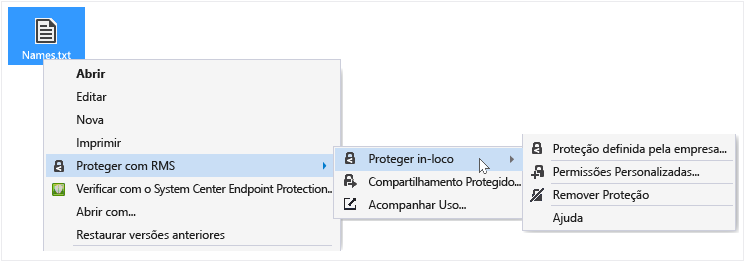
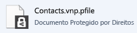

# Proteger um arquivo em um dispositivo (proteger in-loco) usando o aplicativo Rights Management sharing
Quando você protege um arquivo in-loco, ele substitui o arquivo original, desprotegido. Em seguida, você pode deixar o arquivo onde ele está, copiar para outra pasta ou dispositivo ou compartilhar a pasta em que ele se encontra e o arquivo continuará protegido. Você também pode anexar o arquivo protegido a uma mensagem de email, embora a maneira recomendada para compartilhar um arquivo protegido por email seja diretamente do Explorador de arquivos ou de um aplicativo do Office (consulte [Proteja arquivos que você compartilha por email usando o aplicativo de compartilhamento Rights Management](../Topic/Protect_a_file_that_you_share_by_email_by_using_the_Rights_Management_sharing_application.md)).

> [!TIP]
> Se você encontrar erros ao tentar proteger arquivos, consulte [Perguntas frequentes sobre o aplicativo de compartilhamento Microsoft Rights Management para Windows](http://go.microsoft.com/fwlink/?LinkId=303971).

## Para proteger um arquivo em um dispositivo (proteger in-loco)

1.  No Explorador de arquivos, selecione um arquivo para proteger. Com o botão direito do mouse, selecione **Proteger com RMS** e, em seguida, selecione **Proteger in-loco**. Por exemplo:

    

    > [!NOTE]
    > Se você não vir a opção **Proteger com RMS**, é provável que o aplicativo RMS sharing não esteja instalado no seu computador ou que o computador tenha de ser reiniciado para concluir a instalação. Para obter mais informações sobre como instalar o aplicativo RMS sharing, consulte [Baixar e instalar o aplicativo Rights Management sharing](../Topic/Download_and_install_the_Rights_Management_sharing_application.md).

2.  Execute um destes procedimentos:

    -   Selecione um modelo de política: essas são permissões predefinidas que normalmente restringem o acesso e o uso para as pessoas em sua organização. Por exemplo, se o nome da sua organização é “Contoso, Ltd”, você deverá encontrar **Contoso, Ltd - Somente Exibição Confidencial**. Se esta for a primeira vez que protege um arquivo neste computador, você primeiro precisa selecionar **Proteção definida pela empresa** para baixar os modelos.

        Da próxima vez que você clicar na opção **Proteger in loco**, terá até 10 modelos para escolher. Se houver mais de 10 modelos disponíveis e o que você quiser não for exibido, clique em **Proteção Definida pela Empresa** para baixar e ver todos os modelos.

        Quando seleciona um modelo de política, você também pode proteger vários arquivos e uma pasta. Quando você seleciona uma pasta, todos os arquivos nessa pasta serão automaticamente selecionados para proteção, mas novos arquivos criados nessa pasta não serão automaticamente protegidos.

    -   Selecione **Permissões personalizadas**: escolha esta opção se os modelos não fornecerem o nível de proteção que você precisa ou se você deseja definir explicitamente as opções de proteção por conta própria. Especifique as opções que você deseja para esse arquivo na [caixa de diálogo Adicionar proteção](http://technet.microsoft.com/library/dn574738.aspx) e, em seguida, clique em **Aplicar**.

3.  Você pode ver rapidamente uma caixa de diálogo para informar que o arquivo está sendo protegido e, em seguida, retorna o foco para o Explorador de arquivos. O(s) arquivo(s) selecionado(s) agora está(ão) protegido(s). Em alguns casos (quando a adição de proteção altera a extensão de nome de arquivo), o arquivo original no Explorador de arquivos é substituído por um novo arquivo com o ícone de bloqueio de proteção do Rights Management. Por exemplo:

    

Se posteriormente você precisar remover a proteção de um arquivo, consulte [Remover a proteção de um arquivo usando o aplicativo de compartilhamento Rights Management](../Topic/Remove_protection_from_a_file_by_using_the_Rights_Management_sharing_application.md).

## Exemplos e outras instruções
Para obter exemplos de como você pode usar o aplicativo Rights Management sharing e instruções, consulte as seguintes seções do guia de usuário do aplicativo Rights Management sharing:

-   [Exemplos de uso do aplicativo RMS sharing](../Topic/Rights_Management_sharing_application_user_guide.md#BKMK_SharingExamples)

-   [O que você deseja fazer?](../Topic/Rights_Management_sharing_application_user_guide.md#BKMK_SharingInstructions)

## Consulte também
[Guia do usuário do aplicativo de compartilhamento Rights Management](../Topic/Rights_Management_sharing_application_user_guide.md)

