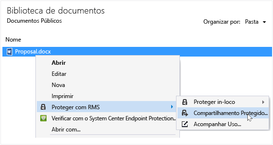
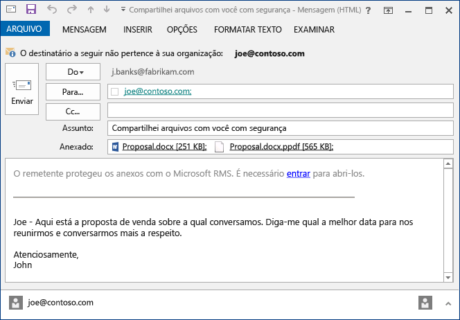

# Proteja arquivos que voc&#234; compartilha por email usando o aplicativo de compartilhamento Rights Management
Quando você protege um arquivo compartilhado por email, ele cria uma nova versão do arquivo original. O arquivo original permanece desprotegido e a nova versão é protegida e automaticamente anexada a um email que você envia.

Em alguns casos (para arquivos que são criados no Microsoft Word, Excel e PowerPoint), o aplicativo RMS sharing cria duas versões do arquivo que ele anexa à mensagem de email. A segunda versão do arquivo tem uma extensão de nome de arquivo **.ppdf** e é uma cópia de sombra de PDF do arquivo. Esta versão do arquivo garante que os destinatários sempre possam ler o arquivo, mesmo se não tiverem o mesmo aplicativo instalado que você usou para criá-lo. Isso costuma ocorrer quando as pessoas leem seus emails corporativos em dispositivos móveis e para exibir os anexos dos emails. Para abrir o arquivo, basta ter o aplicativo RMS sharing. Depois, ele podem ler o arquivo anexado, mas não poderão alterá-lo até abrir a outra versão do arquivo usando um aplicativo que tenha suporte ao RMS.

Se sua organização usa o Azure RMS, você pode manter o controle dos arquivos protegidos por compartilhamento:

-   Selecione uma opção para receber emails quando alguém tenta abrir esses anexos protegidos. Cada vez que o arquivo é acessado, você é notificado que alguém tentou abrir o arquivo e quando e se conseguiram acessá-lo (se foram autenticados com êxito) ou não.

-   Use o site de acompanhamento da documentação. Você ainda pode interromper o compartilhamento do arquivo, revogando o acesso a ele no site de rastreamento de documentos. Para obter mais informações, consulte [Rastreie e revogue seus documentos ao usar o aplicativo RMS sharing](../Topic/Track_and_revoke_your_documents_when_you_use_the_RMS_sharing_application.md).

## Usando o Outlook: Para proteger um arquivo compartilhado por email

1.  Crie sua mensagem de email e anexe o arquivo. Depois, na guia **Mensagem** no grupo do **RMS**, clique em **Compartilhamento Protegido**, e então clique em **Compartilhamento Protegido** novamente:

    

    Se você não vir esse botão, é provável que o aplicativo RMS sharing não esteja instalado no seu computador, a versão mais recente não esteja instalada, ou o computador deve ser reiniciado para concluir a instalação. Para obter mais informações sobre como instalar o aplicativo de compartilhamento, consulte [Baixar e instalar o aplicativo Rights Management sharing](../Topic/Download_and_install_the_Rights_Management_sharing_application.md).

2.  Especifique as opções desejadas para esse arquivo na [caixa de diálogo Compartilhamento protegido](http://technet.microsoft.com/library/dn574738.aspx) e, em seguida, clique em **Enviar agora**.

### Outras maneiras de proteger um arquivo que você compartilhar por email
Além de compartilhar um arquivo protegido usando o Outlook, use também estas alternativas:

-   No Explorador de Arquivos: Esse método funciona para todos os arquivos.

-   Em um aplicativo do Office: Esse método funciona para aplicativos compatíveis com o aplicativo RMS sharing usando o suplemento do Office para que você veja o grupo **RMS** na faixa de opções.

##### Usando o Explorador de Arquivos ou um aplicativo do Office: Para proteger um arquivo compartilhado por email

1.  Use uma das seguintes opções:

    -   Para o Explorador de Arquivos: Com o botão direito do mouse, selecione **Proteger com RMS** e, em seguida, selecione **Compartilhamento protegido**.

        

    -   Para o aplicativos do Office, Word, Excel e PowerPoint: Lembre-se de salvar o arquivo primeiro. Depois, na guia **Página Inicial** do grupo **RMS**, clique em **Compartilhamento protegido** e, em seguida, clique em **Compartilhamento protegido** novamente:

        

    Se você não vir essas opções, é provável que o aplicativo RMS sharing não esteja instalado no seu computador, a versão mais recente não esteja instalada, ou o computador deve ser reiniciado para concluir a instalação. Para obter mais informações sobre como instalar o aplicativo de compartilhamento, consulte [Baixar e instalar o aplicativo Rights Management sharing](../Topic/Download_and_install_the_Rights_Management_sharing_application.md).

2.  Especifique as opções desejadas para esse arquivo na [caixa de diálogo Compartilhamento protegido](http://technet.microsoft.com/library/dn574738.aspx) e, em seguida, clique em **Enviar**.

3.  Talvez você veja rapidamente uma caixa de diálogo informando que o arquivo está sendo protegido e uma mensagem de email criada para você informando aos destinatários que os anexos estão protegidos com o Microsoft RMS e é preciso se conectar  Ao clicar no link para entrar, serão exibidos links e instruções para garantir a abertura do anexo protegido.

    Exemplo:

    

    Você está pensando: [O que é o arquivo .ppdf criado automaticamente?](../Topic/Dialog_box_options_for_the_Rights_Management_sharing_application.md#BKMK_PPDF)

4.  Opcional: Você pode alterar qualquer coisa nesta mensagem de email. Por exemplo, você pode alterar ou acrescentar ao assunto ou o texto da mensagem.

    > [!WARNING]
    > Embora seja você possa adicionar ou remover pessoas desta mensagem de email, isso não altera as permissões para o anexo que você especificou na caixa de diálogo **Compartilhamento protegido**. Por exemplo, se você quiser alterar essas permissões, forneça permissões a uma nova permissões para abrir o arquivo, fechar a mensagem de email sem salvar ou enviá-la e retornar à etapa 1.

5.  Enviar a mensagem de email.

## Exemplos e outras instruções
Para obter exemplos de como você pode usar o aplicativo Rights Management sharing e instruções, consulte as seguintes seções do guia de usuário do aplicativo Rights Management sharing:

-   [Exemplos de uso do aplicativo RMS sharing](../Topic/Rights_Management_sharing_application_user_guide.md#BKMK_SharingExamples)

-   [O que você deseja fazer?](../Topic/Rights_Management_sharing_application_user_guide.md#BKMK_SharingInstructions)

## Consulte também
[Guia do usuário do aplicativo de compartilhamento Rights Management](../Topic/Rights_Management_sharing_application_user_guide.md)

