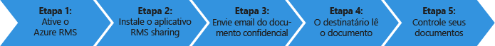
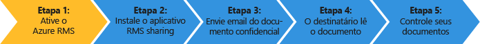
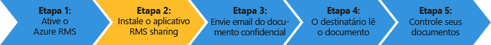
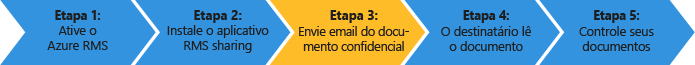
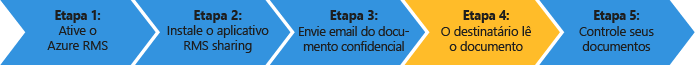
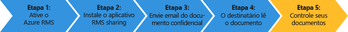

# Tutorial de in&#237;cio r&#225;pido para o gerenciamento de direitos Azure
Use este tutorial para testar rapidamente o Microsoft Azure Rights Management (também conhecido como Azure RMS) para sua organização em apenas 5 etapas que devem levar menos de 15 minutos. Você ativará o serviço, enviará um documento confidencial por email para alguém em outra organização com segurança e será capaz de controlar quando o documento for aberto. Quando o documento confidencial for enviado por email, será criptografado em trânsito e apenas poderá ser lido pela pessoa para a qual for enviado, usando as permissões definidas pelo remetente.

Este tutorial é destinado a administradores de TI e consultores, para ajudar a avaliar o Azure Rights Management como uma solução de proteção de informações para uma organização. Em um ambiente de produção as instruções para ativar o serviço devem ser realizadas por um administrador, e as instruções para enviar um documento, por usuários finais. Ambos os conjuntos de instruções estão incluídos neste tutorial, para demonstrar o cenário de envio de um documento confidencial para alguém em outra organização com segurança de ponta a ponta. Se você encontrar problemas para concluir este tutorial, envie um email para [AskIPTeam](mailto:askipteam@microsoft.com?subject=Having%20problems%20with%20the%20Quick%20Start%20tutorial) e iremos ajudá-lo.

Para concluir este tutorial, você precisará do seguinte:

-   Uma assinatura que ofereça suporte ao Azure Rights Management. Ela pode ser uma assinatura paga ou uma assinatura de avaliação. Se você quiser usar o controle de documentos, que é necessário para a etapa 5 deste tutorial, sua assinatura deve oferecer suporte para o controle de documentos. Para obter mais informações sobre as opções de assinatura e links para avaliações gratuitas, consulte a seção [Assinaturas de nuvem que suportam o Azure RMS](../Topic/Requirements_for_Azure_Rights_Management.md#BKMK_SupportedSubscriptions) no tópico [Requisitos para o Azure Rights Management](../Topic/Requirements_for_Azure_Rights_Management.md).

    Dica: Se precisar obter uma assinatura você deve fazer isso com antecedência, porque esse processo pode levar um tempo para ser concluído.

-   Uma conta de administrador para entrar no Centro de administração do Office 365 ou no Azure Classic Portal, para que você possa ativar o serviço Rights Management. Essa conta também deve ter um endereço de email e um serviço de email em atividade (por exemplo, Exchange Online ou Exchange Server).

-   Um computador executando o Windows (no mínimo, Windows 7 SP1) e que tenha instalado tanto o Office 2016, quanto o Office 2013 ou o Office 2010.

Vamos começar.

## Etapa 1: Ative o serviço Rights Management

Ainda que você tenha uma assinatura que ofereça suporte ao Azure Rights Management, o serviço estará desabilitado por padrão. Para ativá-lo, você pode usar o Centro de administração do Office 365 ou o Azure Classic Portal:

-   Se você tem uma assinatura do Office 365 que inclui o Azure Rights Management, ou uma assinatura do Office 365 que exclui o Azure Rights Management mas tem uma assinatura do Azure RMS Premium: Use o **centro de administração do Office 365**.

-   Se você não tiver uma assinatura do Office 365: **Use o Azure Classic Portal**.

#### Para ativar o Rights Management do centro de administração do Office 365

1.  Acesse o[portal do Office 365](https://portal.office.com/)e entre com sua conta corporativa ou de estudante.

2.  Se o centro de administração do Office 365 não for exibido automaticamente, selecione o ícone inicializador de aplicativos na parte superior esquerda e escolha **Admin**. A bloco **Admin** aparece somente para administradores do Office 365.

    > [!TIP]
    > Para obter ajuda do centro de administração, consulte[sobre o Centro de administração do Office 365 - Ajuda para Administradores](https://support.office.com/article/About-the-Office-365-admin-center-Admin-Help-58537702-d421-4d02-8141-e128e3703547).

3.  No painel esquerdo, expanda **CONFIGURAÇÕES DE SERVIÇO**.

4.  Clique em **Rights Management**.

5.  Na página **RIGHTS MANAGEMENT**, clique em **Gerenciar**.

6.  Na página de **gerenciamento de direitos**clique em**ativar**.

7.  Quando solicitado a responder **Deseja ativar o Rights Management?**, clique em **ativar**.

Agora você deve ver **Rights management está ativado** e a opção para desativar (pode ser necessário atualizar a página manualmente).

Por hora, não clique em **recursos avançados**. Isso levaria você até o Azure Classic Portal, onde você pode configurar modelos que não são necessários para este tutorial. Ao invés disso, você pode fechar o centro de administração do Office 365.

#### Para ativar o Rights Management no portal do Azure

1.  Vá para o [Azure Classic Portal](http://go.microsoft.com/fwlink/p/?LinkID=275081) e entre.

2.  No painel esquerdo, clique em**ACTIVE DIRECTORY**.

3.  Na página **active directory**, clique em **RIGHTS MANAGEMENT**.

4.  Selecione o diretório a gerenciar [!INCLUDE[aad_rightsmanagement_2](../Token/aad_rightsmanagement_2_md.md)], clique em **ATIVAR** e confirme sua ação.

O **STATUS do RIGHTS MANAGEMENT** agora deve exibir**Ativo** e a opção **ATIVAR** é substituída por**DESATIVAR**.

Embora você possa configurar outras opções de Rights Management no portal, isso não é necessário para este tutorial, então você pode fechar o Azure Classic Portal.

Isso é tudo o que você precisa fazer para a primeira etapa. Agora, o serviço está ativado, e todos os usuários em sua organização podem começar a proteger documentos importantes e confidenciais. Inicialmente, em um ambiente de produção, talvez seja melhor restringir quem possa fazer isso e optar por uma distribuição em fases. Mas isso não é necessário para este tutorial.

Embora não incluímos aqui, em uma implantação em produção provavelmente você decidirá por configurar modelos personalizados. Modelos facilitam que usuários apliquem rapidamente as configurações corretas quando precisam proteger arquivos. Quando você ativa o Rights Management, você obtém automaticamente 2 modelos padrão, e é provável que você decida complementá-los com seus próprios modelos personalizados em um ambiente de produção. Mas modelos não são necessários para este tutorial, então você está pronto para a próxima etapa.

|Se deseja obter mais informações|Informações adicionais|
|------------------------------------|--------------------------|
|Sobre a ativação do Rights Management e o controle de quem pode proteger arquivos e email quando o serviço for ativado   →|[Ativando o Azure Rights Management](../Topic/Activating_Azure_Rights_Management.md)|
|Sobre os modelos padrão e como criar modelos novos e personalizados   →|[Configurando modelos personalizados do Azure Rights Management](../Topic/Configuring_Custom_Templates_for_Azure_Rights_Management.md)|

## Etapa 2: Instale o aplicativo de compartilhamento do Rights Management

O aplicativo de compartilhamento do Rights Management (também conhecido como o "aplicativo RMS sharing") não é um requisito para o Azure Rights Management, mas é recomendável para todos os computadores e dispositivos móveis que oferecem suporte ao Azure Rights Management. O aplicativo RMS sharing se integra com aplicativos do Office por meio da instalação de um suplemento do Office para que os usuários possam proteger facilmente arquivos diretamente da faixa de opções. Ele também torna possível proteger todos os tipos de arquivos, aplicando proteção genérica para arquivos que não são ofereçam suporte nativo pelo Azure Rights Management, e um site para controle de documentos, em que usuários podem controlar e revogar os arquivos que tenham protegido. Usaremos o site de controle de documentos em breve, neste tutorial.

Esse aplicativo pode ser baixado gratuitamente e oferece uma instalação com script para ambientes de produção. Mas, para este tutorial, vamos realizar uma instalação local.

#### Para baixar e instalar o aplicativo de compartilhamento do Rights Management

1.  Acesse a [página do Microsoft Rights Management](http://go.microsoft.com/fwlink/?LinkId=303970) no site da Microsoft.

2.  Na seção **Computadores**, clique no ícone do **aplicativo RMS para Windows** e salve o arquivo **Setup.exe** para instalar o aplicativo de compartilhamento do Microsoft Rights Management.

3.  Para uma instalação local, você deve usar uma conta de administrador para executar o arquivo Setup.exe que foi baixado. Se aparecer uma solicitação para continuar, clique em**Sim**.

4.  Na página de **Instalação do Microsoft RMS**, clique em **Próximo** e aguarde a conclusão da instalação.

5.  Ao final da instalação, clique em**Reiniciar** caso seja solicitado que você reinicie o computador, ou clique em **Fechar** para concluir a instalação.

Agora, está tudo pronto para você começar a proteger arquivos que contêm informações que deseja compartilhar apenas com as pessoas que especificar.

|Se deseja obter mais informações|Informações adicionais|
|------------------------------------|--------------------------|
|Sobre uma instalação local do aplicativo de compartilhamento do Rights Management para Windows e instruções para o usuário   →|[Guia do usuário do aplicativo de compartilhamento Rights Management](http://technet.microsoft.com/library/dn339006.aspx)|
|Sobre a instalação por script do aplicativo de compartilhamento do Rights Management para Windows e outras informações técnicas   →|[Guia do administrador do aplicativo de compartilhamento Rights Management](http://technet.microsoft.com/library/dn339003.aspx)|
|Para compreender a diferença entre proteção nativa e proteção genérica   →|[Qual é a diferença entre proteção genérica e proteção interna (nativa)?](https://technet.microsoft.com/library/dn574738.aspx)|

## Etapa 3: Envie por email o documento que você deseja proteger

Para esta etapa, primeiro crie e salve um documento usando o Word, que representará o documento que você deseja proteger, e nomeie-o **Confidential.docx**. Para este tutorial, não importa qual o texto nele, mas algum texto deve ser escrito para que você possa confirmar se o destinatário autorizado conseguiu lê-lo. Por exemplo, você pode digitar: **Se você conseguiu ler este documento de seu anexo de email, o remetente compartilhou com êxito um arquivo que foi protegido com o Azure RMS.**

Assim, você estará pronto para compartilhar com segurança este documento por email.

#### Para compartilhar com segurança o seu documento por email

1.  Usando o Outlook, crie uma nova mensagem e anexe o arquivo que você acabou de criar.

2.  Na caixa **Para**, digite um ou mais endereços de email comerciais. Verifique se você especificou um endereço de email comercial como **janetm@contoso.com** ou **p.dover@fabrikam.com**, porque, atualmente, o Azure Rights Management não dá suporte a endereços de email pessoais que você possa usar em casa, do seu provedor de Internet. Não se preocupe se a pessoa para a qual você está enviando também tem o Azure Rights Management.

3.  Digite um assunto, como**Documento confidencial** e depois digite uma mensagem curta para o email, como **Leia este documento confidencial e não compartilhe com ninguém.**

4.  Depois, na guia **Mensagem** no grupo **RMS**, clique em**Compartilhamento protegido**, e então clique em **Compartilhamento protegido** novamente:

5.  Na caixa de diálogo **compartilhamento protegido**:

    1.  Selecione **Visualizador - Somente exibição**.

        Com isso, os destinatários poderão exibir o documento, mas não editá-lo ou imprimi-lo.

    2.  Selecione **Enviar um email para mim quando alguém tentar abrir esses documentos**.

        Você receberá uma notificação por email sempre que os destinatários tentarem abrir o anexo, e também se outra pessoa tentar abri-lo; por exemplo, se o destinatário encaminhar o email para um colega de trabalho. Nesta última hipótese, você verá que o acesso foi negado e, a partir dos detalhes do usuário, pode optar por enviar uma cópia do documento que essa pessoa possa abrir.

    3.  Selecione **Permitir que eu revogue instantaneamente o acesso a esses documentos**.

        Esta opção requer que os destinatários tenham uma conexão de Internet sempre que abrirem o anexo, mas possui o benefício de, se você revogar posteriormente o documento, não conseguirem abri-lo na próxima tentativa que fizerem. Se você não selecionar essa opção os destinatários poderão abri-lo mesmo sem uma conexão à Internet, mas a desvantagem é que, se você revogar posteriormente o documento, pode haver um atraso para a revogação entrar em vigor.

    4.  Clique em **Enviar agora**.

        O email com anexo é enviado para os endereços de email que você especificou. Além de sua mensagem de email, eles verão instruções de como ler o documento anexado protegido pelo Azure Rights Management.

Agora que você enviou o documento protegido está pronto para solicitar que os destinatários aguardem a chegada dele, e abram-no. Mas não feche o Outlook, pois usaremos ele novamente na etapa final, para controlar o anexo.

|Se deseja obter mais informações|Informações adicionais|
|------------------------------------|--------------------------|
|Instruções completas e métodos alternativos para proteger arquivos compartilhados por email   →|[Proteja um arquivo que você compartilha por email usando o aplicativo de compartilhamento do Rights Management](https://technet.microsoft.com/library/dn574735.aspx)|
|Sobre as opções da caixa de diálogo **compartilhamento protegido** →|[Opções da caixa de diálogo do aplicativo de compartilhamento do Rights Management](https://technet.microsoft.com/library/dn574738.aspx)|

## Etapa 4: Peça que seus destinatários abram o documento enviado por email

Os destinatários podem usar vários dispositivos para ler o documento protegido enviado como anexo de email. Os dispositivos incluem iPads, iPhones, telefones e tablets Android, computadores Mac, bem como computadores Windows.

Peça que eles leiam a mensagem de email que você enviou. Eles verão a mensagem de email e, antes disso, o seguinte texto:

**O remetente protegeu os anexos com Microsoft RMS. Você deve** [entrar](http://aka.ms/rms) **para abri-los.**

Ao clicarem no link, eles acessarão as instruções para instalação do aplicativo RMS sharing e, caso necessário, inscrição de uma conta gratuita. A conta gratuita concederá uma assinatura do RMS para indivíduos, que garante que os usuários autorizados sempre possam ler um documento protegido, mesmo se a organização deles não tiver o Azure RMS. Assim, eles estarão prontos para ler o anexo protegido usando as instruções a seguir.

#### Para exibir o documento protegido do anexo

1.  Como o Azure Rights Management protegeu um documento do Word, existem dois anexos na mensagem de email. Eles são, na verdade, duas versões do mesmo arquivo, mas com diferentes extensões de nome de arquivo. Abra a versão que tenha a extensão de nome de arquivo **.ppdf** (**Confidential.ppdf**).

    Se você tiver uma versão do [Office no seu dispositivo que oferece suporte ao Rights Management](https://technet.microsoft.com/library/dn655136.aspx), você pode abrir a outra versão do arquivo (**Confidential.docx**), para abri-lo no Word.

2.  Se for solicitado seu nome de usuário e senha, insira seu nome de usuário no mesmo formato do endereço de email usado para enviar o email e os anexos. Por exemplo, **janetm@contoso.com** ou **p.dover@fabrikam.com**. Para sua senha, digite a senha que você forneceu ao se inscrever para o RMS para indivíduos. Ou, se sua organização tiver o Azure RMS, digite sua senha de trabalho normal.

O documento será aberto, e você poderá ler o conteúdo. Por exemplo, pode ser que esteja escrito **Se você conseguiu ler este documento de seu anexo de email, o remetente compartilhou com êxito um arquivo que foi protegido com o Azure RMS.** Por ser somente leitura, o conteúdo não pode ser alterado.

Como uma etapa opcional, você pode pedir que seu destinatário encaminhe o email a outras pessoas que você não incluiu em seu email original. Mesmo que as outras pessoas trabalhem para uma organização que possui o Azure Rights Management ou inscrevam suas próprias assinaturas do RMS para indivíduos, não poderão abrir o anexo. Quando o nome de usuário for solicitado, será negado o acesso ao documento para elas.

Agora que o destinatário abriu o anexo e, opcionalmente, encaminhou o mesmo para outra pessoa, espere receber uma notificação por email relatando essa atividade. Como é muito fácil perder mensagens de email com o passar do tempo, uma maneira ainda melhor de controlar quem acessou o documento é usar o site de controle de documentos, abordado na etapa final.

|Se deseja obter mais informações|Informações adicionais|
|------------------------------------|--------------------------|
|Instruções completas para exibir os arquivos protegidos pelo Azure Rights Management   →|[Exiba e use os arquivos que foram protegidos pelo Rights Management](https://technet.microsoft.com/library/dn574741.aspx)|
|Sobre a assinatura gratuita do RMS para indivíduos   →|[RMS para pessoas físicas e Azure Rights Management](../Topic/RMS_for_Individuals_and_Azure_Rights_Management.md)|
|Sobre as duas versões do arquivo que você vê anexados à mensagem de email   →|[O que é o arquivo .ppdf, criado automaticamente?](https://technet.microsoft.com/library/dn574738.aspx)|

## Etapa 5: Controle o documento protegido

> [!NOTE]
> Para esta etapa, você deve ter uma assinatura que ofereça suporte ao controle de documentos. Para verificar se a sua assinatura inclui o controle de documentos, consulte [Comparação de ofertas de Serviços do Rights Management (RMS)](https://technet.microsoft.com/dn858608.aspx).

Esta etapa é opcional, mas muitas pessoas gostariam de saber se o anexo enviado foi aberto, quando e até mesmo de que lugar. Por exemplo:

-   Você está esperando uma resposta de alguém até uma determinada data, e, no site de rastreamento de documentos, pode ver que a pessoa ainda não abriu o documento, embora o prazo esteja se aproximando. Então você envia um email de acompanhamento, ou telefona para ela, como um lembrete pontual.

-   Ao ver que a pessoa abriu o documento, você pode fazer um contato de acompanhamento, perguntando se surgiu alguma dúvida ou se ela precisa de informações adicionais.

#### Para controlar o documento protegido

1.  Usando o Outlook, na guia **Home** do grupo **RMS**, clique em**Controlar o uso**.

2.  Se você vir a página **Proteger e compartilhar em seus próprios termos**, clique em **Entrar** e forneça seu nome de usuário e senha novamente.

3.  Na página **Seus documentos compartilhados**, você verá o documento anexado ao email, **Confidential.docx**. Por enquanto esse é o único arquivo exibido, mas, conforme você compartilhe outros documentos protegidos, a lista irá aumentando.

    Nessa página, você verá quando compartilhou o documento (quando você enviou o email com o anexo protegido), a data da última atividade e o nome do destinatário para o qual enviou o email. Clique no nome do documento para obter detalhes adicionais.

4.  Na nova página, que tem o nome do arquivo que você clicou, você verá os detalhes resumidos somente daquele documento, e uma lista com as outras opções disponíveis para o documento (**Lista**, **Linha do tempo**, **Mapa**, **Configurações**).

    Clique em cada opção para explorar diferentes maneiras de controlar o documento protegido. Ou, ainda na página **Resumo**, clique em **Abrir no Excel** para exportar as informações para uma planilha, ou clique em **Revogar o acesso** para não compartilhar mais o documento.

Você pode retornar a este site para controlar ainda mais a atividade do seu documento protegido, ou para revogar o acesso, caso necessário. Você ainda pode acessar o site do seu dispositivo móvel ou tablet, usando um navegador com este link: [controle de documentos](http://go.microsoft.com/fwlink/?LinkId=529562)

|Se deseja obter mais informações|Informações adicionais|
|------------------------------------|--------------------------|
|Instruções completas para controlar seus documentos   →|[Controlar e revogar seus documentos quando você usa o aplicativo RMS sharing](https://technet.microsoft.com/library/dn986611.aspx)|
|Vídeo de dois minutos que explica e demonstra o controle de documentos   →|[Controle e revogação de documentos no Azure RMS](http://channel9.msdn.com/Series/Information-Protection/Azure-RMS-Document-Tracking-and-Revocation)|
|Para solução de problemas e perguntas do cliente   →|[Perguntas Frequentes para o Controle de documentos](https://technet.microsoft.com/dn947488)|

## Próximas etapas
Neste tutorial você percorreu apenas uma hipótese de como o Azure RMS pode ajudar a proteger seus dados. Para ver outros usos comuns, consulte a seção [Azure RMS em ação](https://technet.microsoft.com/library/jj585026.aspx) do artigo [O que é o Azure Rights Management?](../Topic/What_is_Azure_Rights_Management_.md). Outras seções neste artigo também podem ser úteis, como o funcionamento do Azure RMS e os problemas de negócios que ele pode ajudar a solucionar.

Quando estiver pronto para iniciar a implantação do Azure RMS, consulte [Roteiro de implantação do Azure Rights Management](../Topic/Azure_Rights_Management_Deployment_Roadmap.md) para obter as etapas de implantação e links para as instruções.

## Consulte também
[Introdução ao Azure Rights Management](../Topic/Getting_Started_with_Azure_Rights_Management.md)

