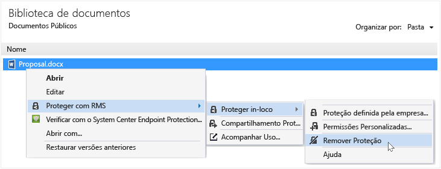

# Remover a prote&#231;&#227;o de um arquivo usando o aplicativo de compartilhamento Rights Management
Para remover a proteção de um arquivo (ou seja, desproteger um arquivo) que foi anteriormente protegido usando o aplicativo RMS sharing, use a opção **Remover Proteção** no Explorador de Arquivos.

> [!IMPORTANT]
> Você deve ser um proprietário do arquivo para remover a proteção.

### Para remover a proteção de um arquivo

1.  No Explorador de Arquivos, clique com botão direito do arquivo (por exemplo, Exemplo.ptxt), selecione **Proteger com o RMS**, clique em **Proteção no local**, e, em seguida, clique em **Remover proteção**:

    

    Você poderá receber uma solicitação de suas credenciais.

O arquivo original protegido é excluído (por exemplo, Exemplo.ptxt) e substituído por um arquivo com o mesmo nome, mas com a extensão de nome de arquivo desprotegido (por exemplo, Exemplo.txt).

## Exemplos e outras instruções
Para obter exemplos de como você pode usar o aplicativo Rights Management sharing e instruções, consulte as seguintes seções do guia de usuário do aplicativo Rights Management sharing:

-   [Exemplos de uso do aplicativo RMS sharing](../Topic/Rights_Management_sharing_application_user_guide.md#BKMK_SharingExamples)

-   [O que você deseja fazer?](../Topic/Rights_Management_sharing_application_user_guide.md#BKMK_SharingInstructions)

## Consulte também
[Guia do usuário do aplicativo de compartilhamento Rights Management](../Topic/Rights_Management_sharing_application_user_guide.md)

