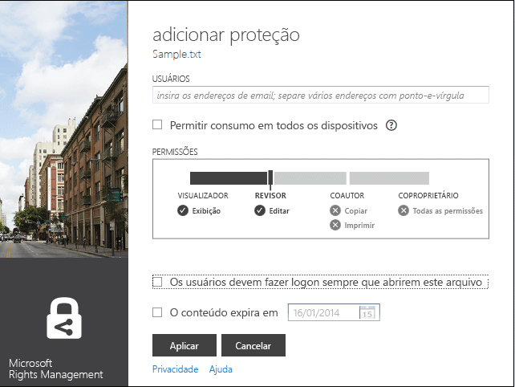
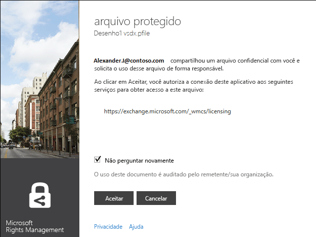
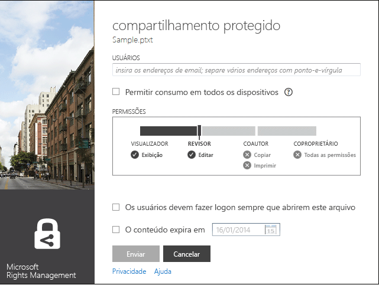
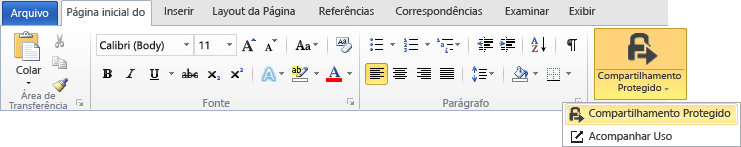
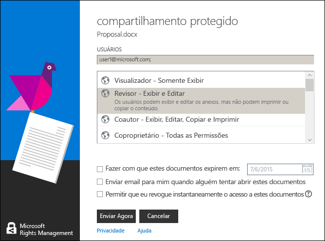

# Vers&#227;o 3 revisada: Guia do aplicativo de compartilhamento Microsoft Rights Management
Use este guia do aplicativo de compartilhamento RMS (Microsoft Rights Management) para Windows ajuda você a manter imagens e documentos importantes seguros de pessoas que não deveriam vê-los, mesmo se você enviá-los por email ou salvá-los em outro dispositivo. Similarmente, este aplicativo permite que você abra e use arquivos que outras pessoas protegeram usando a mesma tecnologia do Rights Management.

Este aplicativo de compartilhamento fornece essa proteção para seus arquivos das seguintes maneiras:

-   Ele adiciona a funcionalidade ao Explorador de Arquivos (também conhecido como Windows Explorer no Windows 7 e versões anteriores) para que quando você gerenciar arquivos em uma pasta, você possa facilmente proteger um único arquivo, proteger em massa de vários arquivos ou proteger todos os arquivos dentro de uma pasta.

-   Ele fornece proteção para todos os tipos de arquivo e tem um visualizador incorporado para tipos de arquivo de texto e imagem geralmente usados.

-   Ele adiciona o botão **Compartilhamento Protegido** na barra de ferramentas do Microsoft Office para o Word, PowerPoint e Excel.

Tudo o que você precisa é um computador que executa o Windows 7 ou o Windows 8 e uma conta de administrador local para instalar o aplicativo RMS sharing. Em seguida, baixe e instale esse aplicativo gratuito da Microsoft.

Se você tem perguntas que não forem respondidas por este guia, consulte [Perguntas Frequentes para o Aplicativo de Compartilhamento do Microsoft Rights Management para Windows](http://go.microsoft.com/fwlink/?LinkId=303971).

## Exemplos para usar o aplicativo RMS sharing
Aqui estão apenas alguns exemplos de como você pode usar o aplicativo de compartilhamento RMS para ajudar a proteger seus arquivos.

|Cenário|Solução usando o aplicativo RMS sharing|
|-----------|-------------------------------------------|
|**Desejo copiar com segurança um documento confidencial da empresa para outro dispositivo**<br /><br />Você está usando o PC para trabalhar em um documento estratégico confidencial da empresa e deseja copiá-lo para um pen drive para que você possa continuar trabalhando nele quando deixar o escritório e não tiver acesso à rede da empresa.|Você tem o aplicativo RMS sharing instalado em seu PC e no laptop. Você usa o Explorador de Arquivos em seu PC para proteger o arquivo usando um modelo, para que ele não possa ser acessado por pessoas fora da sua empresa. Você, em seguida, copia o arquivo de seu pen drive, conecta o pen drive ao laptop e continua trabalhando no documento. Se você perder o pen drive ou o seu laptop for roubado, ninguém fora da sua empresa poderá acessar o documento.|
|**Desejo compartilhar informações financeiras de maneira segura com alguém em quem eu confio que está fora da minha organização**<br /><br />Você trabalha com uma empresa parceira e deseja enviar um email com uma planilha do Excel que contém os valores de vendas projetados. Você deseja que eles possam visualizar as imagens, mas não alterá-las.|Você pode usar o botão **Compartilhamento Protegido** na faixa de opções no Excel, digite os endereços de email das duas pessoas que trabalham com você na empresa parceira, selecione **Visualizador** no controle deslizante e clique em **Enviar**.<br /><br />Quando o email chega na empresa parceira, somente os destinatários de email podem visualizar a planilha e eles não podem salvar, editar, imprimir ou encaminhá-la.|
|**Eu preciso enviar de maneira segura um diagrama de engenharia por email a alguém que usa um dispositivo iOS**<br /><br />Sua empresa usa um aplicativo de engenharia personalizado, e você deseja enviar por email um diagrama altamente confidencial para um colaborador, que você sabe que verifica regularmente os email em seu dispositivo iOS.|Você usa o Explorador de Arquivos para clicar com o botão direito do mouse no arquivo e selecionar **Compartilhamento Protegido**. O aplicativo de compartilhamento de RMS reconhece que a extensão do arquivo não é de um aplicativo que suporta nativamente RMS, de modo que, quando se atribui o arquivo a uma mensagem de email, ele o converte automaticamente em um arquivo protegido geneticamente e seleciona de forma automática a opção **Permitir consumo em todos os dispositivos**.<br /><br />O destinatário recebe um email em seu dispositivo iOS, clica no link do email que informa como baixar o aplicativo RMS sharing, instala a versão para dispositivos iOS e, em seguida, vê o diagrama.|
|**Minha empresa não usa o Rights Management, mas recebi uma mensagem de email com um anexo que está protegido pelo RMS**<br /><br />O remetente de email é alguém em quem você confia porque você fez negócios com ele no passado, e você suspeita que ele pode estar enviando informações sobre uma nova oportunidade de negócios potenciais.|Você clica no link do email que informa como baixar o aplicativo RMS sharing para seu computador, instala-o e, em seguida, inscreve-se no RMS como pessoa. A Microsoft confirma que a sua organização não tem uma assinatura para o Office 365, envia a você um email para completar o processo de inscrição gratuita e você entra com sua nova conta. Em seguida, você pode abrir o anexo de email para saber mais sobre a nova oportunidade de negócios.|

## <a name="BKMK_Install"></a>Como baixar e instalar o aplicativo RMS sharing
> [!IMPORTANT]
> Você deve ter uma conta de administrador local para instalar o aplicativo RMS sharing. Se você não fizer o login como um administrador local, é possível usar a opção **Executar como administrador** quando você executar Setup.exe na etapa 3.

Para instalar o aplicativo RMS sharing, siga estas etapas:

1.  Acesse a página [Microsoft Rights Management](http://go.microsoft.com/fwlink/?LinkId=303970) no site da Microsoft.

2.  Na seção **Computadores**, clique no link para o **Aplicativo RMS para Windows** e salve o pacote de instalação do aplicativo de compartilhamento Microsoft Rights Management em seu computador.

3.  Clique duas vezes no arquivo compactado que foi baixado e clique duas vezes em **setup.exe**. Se você for solicitado a continuar, clique em **Sim**.

4.  Na página **Configurar Microsoft RMS**, clique em **Avançar** e aguarde a instalação para concluir.

5.  Quando a instalação terminar, clique em **Reiniciar** para reiniciar o computador e concluir a instalação. Ou clique em **Fechar** e reinicie o computador depois de concluir a instalação.

Agora você está pronto para começar a proteger seus arquivos ou ler arquivos que outras pessoas protegeram.

## <a name="BKMK_UsingMSRMSApp"></a>O que você deseja fazer?
Use as instruções a seguir para ajudá-lo a trabalhar com arquivos protegidos.

### <a name="BKMK_CreatePTXT"></a>Criar um arquivo de texto protegido
Você pode converter um arquivo de texto normal (.txt) em um arquivo protegido com uma extensão de arquivo .ptxt.

##### Para criar um arquivo de texto protegido (.ptxt)

1.  No Explorador de Arquivos, clique com o botão direito do mouse em uma pasta, clique em **Novo** e depois em **Documento de Texto**.

2.  Renomeie o arquivo (por exemplo, Sample.txt).

3.  Clique duas vezes no arquivo para abri-lo no Bloco de Notas.

4.  No Bloco de Notas, adicione algumas linhas de texto ao arquivo e salve-o. Você pode usar o seguinte como o texto de exemplo.

    ```
    This is a sample text file.
    This is a sample text file.
    This is a sample text file.
    This is a sample text file. 
    This is a sample text file.
    This is a sample text file.
    ```

5.  Clique com o botão direito do mouse no arquivo, depois em **Proteção in-loco** e selecione um modelo na lista. Se esta for a primeira vez que você usa o aplicativo de compartilhamento RMS, primeiro, você precisa selecionar **Proteção da Empresa**, que baixa os modelos para a sua organização.

6.  Na tela **Aplicativo de compartilhamento Microsoft Rights Management**, confirme a política que você deseja aplicar, clique em **Aplicar**, e depois que o arquivo estiver protegido, clique em **Fechar**.

### <a name="BKMK_ViewPTXT"></a>Exibir um arquivo de texto protegido (.ptxt) ou um arquivo de imagem protegido
Para exibir um arquivo de texto protegido (.ptxt) no Explorador de Arquivos, clique duas vezes no arquivo (por exemplo, Sample.ptxt). Credenciais podem ser solicitadas. Quando o arquivo for aberto, você verá a política de proteção do arquivo na parte superior do arquivo.

Você pode exibir e abrir imagens protegidas da mesma maneira.

### <a name="BKMK_CreatePFILE"></a>Criar um arquivo protegido genérico
Use o formato de arquivo de proteção genérica (.pfile) para oferecer um nível genérico de proteção para tipos de arquivo que não são diretamente compatíveis com o aplicativo RMS sharing ou outros aplicativos que oferecem proteção interna do tipo RMS. Você pode usar a página [Microsoft Rights Management](http://go.microsoft.com/fwlink/?LinkId=303970) no site da Microsoft para verificar rapidamente quais aplicativos suportam RMS proteção integrada.

Por exemplo, como o Microsoft Visio atualmente não dá suporte à proteção interna para RMS, você pode usar a proteção genérica para arquivos .vsd criados com o Microsoft Visio.

> [!TIP]
> Qual é a diferença entre proteção (nativa) interna e proteção genérica?
> 
> -   Ao proteger um arquivo de forma genérica, as pessoas não autorizadas não poderão abrir o arquivo. Porém, depois que pessoas autorizadas abrem o arquivo, elas podem encaminhá-lo desprotegido para outras pessoas ou salvá-lo em um local que outras pessoas podem acessar. No entanto, eles veem uma mensagem na parte superior do arquivo que informa quais permissões eles têm para o arquivo e são solicitados a aceitá-las, mas essa proteção não pode ser imposta. Além disso, ao proteger um arquivo de forma genérica, você não pode restringir as permissões além da autorização. Por exemplo, se você usar permissões personalizadas, o controle deslizante no aplicativo de compartilhamento RMS selecionará automaticamente **COPROPRIETÁRIO** e você não poderá mudar isso para permissões mais restritivas, como **VISUALIZADOR** ou **COAUTOR**.
> -   Em comparação, quando você usa a proteção interna do RMS com aplicativos que deem suporte a isso (por exemplo, arquivos do Office), a proteção aplica-se ao arquivo mesmo se o arquivo for enviado para outra pessoa ou salvo em outro local. E, quando você protege esses arquivos, poderá usar permissões restritivas como somente leitura ou a permissão para editar, mas não imprimir ou copiar. Por exemplo, se você usar permissões personalizadas, o controle deslizante no aplicativo de compartilhamento RMS selecionará automaticamente **REVISOR** para as permissões, que você pode, então, mudar para ser mais ou menos restritivas.

##### Exemplo: Para criar um arquivo protegido genérico (.pfile) de um arquivo de desenho (.vsd) do Visio

1.  No Explorador de Arquivos, clique com o botão direito do mouse em uma pasta, clique em **Novo** e depois em **Documento de Nova Visualização**.

2.  Renomeie o arquivo (por exemplo, Sample.vsd).

3.  Clique duas vezes no arquivo para abri-lo no Visio.

4.  No Visio, adicione elementos ao desenho e, em seguida, salve e feche o arquivo.

5.  Clique com o botão direito do mouse no arquivo, depois em **Proteção in-loco** e selecione um modelo de política na lista. Se esta for a primeira vez que você usa o aplicativo de compartilhamento RMS, primeiro, você precisa selecionar **Proteção da Empresa**, que baixa os modelos para a sua organização.

6.  Na tela **Aplicativo de compartilhamento Microsoft Rights Management**, selecione a política que deseja aplicar e clique em **Aplicar**.

7.  Uma mensagem informa que o arquivo protegido foi salvo como um arquivo .pfile (por exemplo, Sample.vsd.pfile). O arquivo original é excluído.

### <a name="BKMK_ViewPFILE"></a>Exibir um arquivo protegido genérico (.pfile)
Para visualizar um arquivo genérico protegido (.pfile), no Explorador de Arquivos, clique duas vezes no arquivo protegido genérico (.pfile) (por exemplo, Sample.vsd.pfile) e clique em **Abrir**.

### <a name="BKMK_Unprotect"></a>Remover a proteção de um arquivo
Para remover a proteção de um arquivo (ou seja, desproteger um arquivo) que anteriormente foi protegido, use a opção **Remover Proteção**:

1.  Clique com o botão direito do mouse no arquivo (por exemplo, Sample.ptxt), depois em **Proteção in-loco** e, então, em **Remover Proteção**. Credenciais podem ser solicitadas.

2.  O arquivo protegido original é excluído (por exemplo, Sample.ptxt) e substituído por um arquivo que tem o mesmo nome, mas com a extensão de nome de arquivo não protegida (por exemplo, Sample.txt).

### <a name="BKMK_ProtectCustom"></a>Proteger um arquivo com suas próprias permissões personalizadas
A maneira mais fácil proteger um arquivo é usar os modelos, mas você também pode especificar suas próprias permissões. Isso é chamado de proteção de autoria do usuário e é útil nas seguintes situações:

-   Você deseja limitar o acesso de arquivos a apenas uma lista específica de usuários individuais que são identificados por seus endereços de email.

-   Você deseja limitar o uso de arquivos para somente direitos específicos, como direitos somente leitura a um documento.

Para proteger um arquivo com permissões de autoria do usuário, clique com o botão direito do mouse no arquivo, depois em **Proteção in-loco** e, em seguida, clique em **Permissões personalizadas**. Você verá a tela a seguir:



Digite os endereços de email dos usuários, use o controle deslizante para selecionar permissões para o arquivo e clique em **Aplicar**.

### <a name="BKMK_UserDefined"></a>Usar arquivos de proteção personalizada
A maioria dos arquivos protegidos que você abre foi protegida aplicando modelos. No entanto, os usuários também podem proteger arquivos usando suas próprias permissões personalizadas. Isso é chamado de proteção de autoria do usuário.

Para formatos de arquivo de texto e imagem, esse nível de proteção requer que todos os aplicativos que você usa para editar, salvar ou restringir esses arquivos tenham sido projetados para dar suporte à proteção do RMS e que eles implementem as APIs de proteção que são fornecidas no AD RMS SDK.

Quando você exibir um arquivo de texto protegido com proteção de autoria do usuário, perceberá uma pequena diferença na permissões conforme elas são exibidas para o arquivo, como mostrado no exemplo a seguir.

Para arquivos protegidos usando o formato de arquivo de proteção genérica (.pfile), os direitos específicos ou as permissões que foram especificadas pelo usuário serão exibidos na tela de confirmação em vez do nome do modelo que foi usado para proteger o arquivo, como mostrado na imagem a seguir.



### <a name="BKMK_ShareProtected"></a>Proteger conteúdo para compartilhar por email
Para proteger o conteúdo que você deseja compartilhar usando uma mensagem de email, clique com o botão direito do mouse no arquivo e clique em **Compartilhamento Protegido**. Você verá a tela a seguir:



Digite os endereços de email a partir da lista de usuários, use o controle deslizante para selecionar permissões para o arquivo e clique em **Enviar**. Em seguida, o Outlook cria uma mensagem de email para os destinatários com uma mensagem curta que você pode alterar e anexa o arquivo protegido anexado. O arquivo original não está protegido.

Para permitir que as pessoas vejam os arquivos protegidos em dispositivos não Windows, clique em **Permitir consumo em todos os dispositivos**. Os usuários podem ter de baixar o aplicativo RMS sharing para seu dispositivo, e há um link para fazer isso no email.

### <a name="BKMK_Multiple"></a>Aplicar proteção a vários arquivos e pastas
Você não precisa aplicar a proteção a arquivos um por vez ao usar o Explorador de Arquivos. Em vez disso, você pode selecionar vários arquivos ou todos os arquivos em uma pasta se esses arquivos já não estiverem protegidos.

##### Para proteger vários arquivos ou todos os arquivos em uma pasta selecionada

1.  No Explorador de Arquivos, selecione vários arquivos ou selecione uma pasta que contém os arquivos a serem protegidos.

2.  Clique com o botão direito do mouse nos arquivos ou na pasta selecionada, depois em **Proteção in-loco** e selecione um modelo na lista. Se esta for a primeira vez que você usa o aplicativo de compartilhamento RMS, primeiro, você precisa selecionar **Proteção da Empresa**, que baixa os modelos para a sua organização.

3.  Na tela **Aplicativo de compartilhamento Microsoft Rights Management**, confirme que os arquivos foram protegidos.

> [!TIP]
> Se você encontrar quaisquer erros, consulte [Perguntas Frequentes sobre o Aplicativo de Compartilhamento Microsoft Rights Management para Windows](http://go.microsoft.com/fwlink/?LinkId=303971).

### <a name="BKMK_OfficeToolbar"></a>Usar o suplemento da barra de ferramentas Office
Você pode proteger e compartilhar arquivos no Word, PowerPoint e Excel diretamente de dentro do Microsoft Office usando o suplemento da faixa de opções do Office para o aplicativo de compartilhamento Microsoft Rights Management.

No grupo **Proteção**, clique em **Compartilhamento Protegido** para iniciar o aplicativo de compartilhamento do Microsoft Rights Management.



### <a name="BKMK_AccessKeys"></a>Usar atalhos do teclado
Pressione a tecla **Alt** para ver as teclas de acesso disponíveis e, em seguida, pressione **Alt** + a tecla de acesso para selecionar uma opção.

Por exemplo, na caixa de diálogo **Compartilhamento Protegido**, pressione **Alt** para ver as chaves de acesso e, em seguida, pressione **Alt + u** para marca a caixa de seleção **Os usuários devem fazer login sempre que abrirem este arquivo**.



## Consulte também
[Download do aplicativo de compartilhamento Microsoft Rights Management](http://go.microsoft.com/fwlink/?LinkId=303970)
 [Perguntas Frequentes do aplicativo de compartilhamento Microsoft Rights Management para Windows](http://go.microsoft.com/fwlink/?LinkId=303971)

