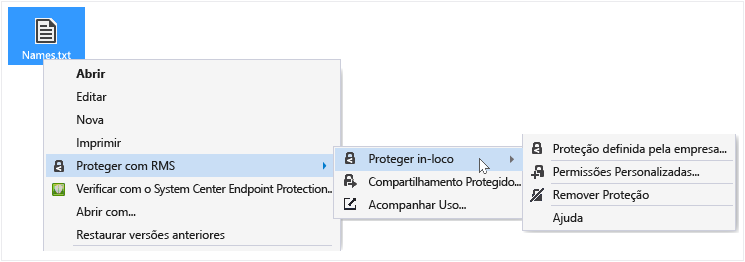
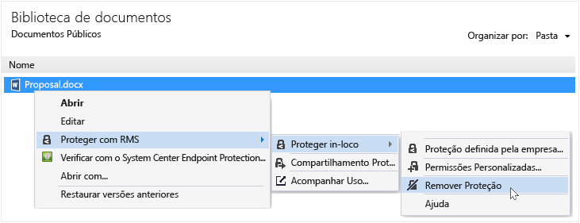

# Guia do usu&#225;rio do aplicativo de compartilhamento Rights Management - revis&#227;o para um &#250;nico t&#243;pico
O aplicativo de compartilhamento RMS (Microsoft Rights Management) para Windows ajuda você a manter imagens e documentos importantes seguros de pessoas que não deveriam vê-los, mesmo se você enviá-los por email ou salvá-los em outro dispositivo. Você também pode usar esse aplicativo para abrir e usar arquivos que outras pessoas protegeram usando a mesma tecnologia do Rights Management.

Tudo o que você precisa é um computador que executa pelo menos o Windows 7 e uma conta de administrador local para instalar o aplicativo de compartilhamento RMS. Em seguida, [baixe e instale](http://go.microsoft.com/fwlink/?LinkId=303970) esse aplicativo gratuito da Microsoft.

Se você tem perguntas que não forem respondidas por este guia, consulte [Perguntas Frequentes para o Aplicativo de Compartilhamento do Microsoft Rights Management para Windows](http://go.microsoft.com/fwlink/?LinkId=303971).

Aqui estão alguns exemplos de como você pode usar o aplicativo de compartilhamento para ajudar a proteger seus arquivos.

|Desejo...|Como fazer isso|
|-------------|-------------------|
|**...compartilhar com segurança informações financeiras com alguém em quem eu confio e que está fora da minha organização**  Você trabalha com uma empresa parceira e deseja enviar um email com uma planilha do Excel que contém os valores de vendas projetados. Você deseja que eles possam visualizar as imagens, mas não alterá-las.|Você pode usar o botão Compartilhamento Protegido na faixa de opções no Excel, digite os endereços de email das duas pessoas que trabalham com você na empresa parceira, selecione Visualizador no controle deslizante e clique em Enviar.  Quando o email chega na empresa parceira, somente os destinatários de email podem visualizar a planilha e eles não podem salvar, editar, imprimir ou encaminhá-la.  Detalhes: Consulte **Proteger um arquivo que você compartilhar por email** na seção [O que você deseja fazer?](../Topic/Rights_Management_sharing_application_user_guide_-_revision_for_single_topic.md#BKMK_UsingMSRMSApp) desse guia.|
|**... enviar com segurança um documento por email a alguém que usa um dispositivo iOS**  Você deseja enviar por email um documento do Word altamente confidencial para um colaborador, que você sabe que verifica regularmente emails em seu dispositivo iOS.|Você usa o Explorador de Arquivos para clicar com o botão direito do mouse no arquivo e selecionar Compartilhamento Protegido. No aplicativo de compartilhamento RMS, você seleciona a opção Permitir consumo em todos os dispositivos e enviar o arquivo como um anexo ao seu colega de trabalho.  O destinatário recebe um email em seu dispositivo iOS, clica no link do email que informa a ele como baixar o aplicativo de compartilhamento, instala a versão para dispositivos iOS e, em seguida, exibe o documento.  Detalhes: Consulte **Proteger um arquivo que você compartilhar por email** na seção [O que você deseja fazer?](../Topic/Rights_Management_sharing_application_user_guide_-_revision_for_single_topic.md#BKMK_UsingMSRMSApp) desse guia.|
|**...ler um anexo recebido em uma mensagem de email com um anexo de arquivo compartilhado com segurança, mas não é possível lê-lo porque minha empresa não usa o Rights Management**  O remetente de email é alguém em quem você confia porque você fez negócios com ele no passado, e você suspeita que ele pode estar enviando informações sobre uma nova oportunidade de negócios potenciais.|Você segue as instruções no email e clica no link para se inscrever no Microsoft Rights Management. A Microsoft confirma que a sua organização não tem uma assinatura para o Office 365, envia a você um email para completar o processo de inscrição gratuita e você entra com sua nova conta. Você clica no segundo link no email para instalar o aplicativo de compartilhamento Rights Management e, em seguida, pode abrir o anexo de email para saber mais sobre a nova oportunidade de negócios.  Detalhes: Consulte **Exibir e usar os arquivos que foram protegidos pelo Rights Management** na seção [O que você deseja fazer?](../Topic/Rights_Management_sharing_application_user_guide_-_revision_for_single_topic.md#BKMK_UsingMSRMSApp) desse guia.|
|**...proteger arquivos confidenciais da empresa em meu laptop para que eles não possam ser acessados por pessoas fora da minha empresa**  Você viaja muito e usa seu laptop para acessar e atualizar arquivos em uma pasta que deve ser protegida contra acesso não autorizado.|Você tem o aplicativo de compartilhamento RMS instalado em seu laptop. Você usa o Explorador de Arquivos para proteger os arquivos usando um modelo, que protege rapidamente os arquivos. Se o seu laptop for roubado, você poderá ficar despreocupado, sabendo que ninguém fora da sua empresa poderá acessar esses documentos.  Detalhes: Consulte **Proteger um arquivo em um dispositivo (proteger in-loco)** na seção [O que você deseja fazer?](../Topic/Rights_Management_sharing_application_user_guide_-_revision_for_single_topic.md#BKMK_UsingMSRMSApp) desse guia.|

## O que você deseja fazer?
Use as instruções a seguir para ajudá-lo a trabalhar com arquivos protegidos.

### Baixar e instalar o aplicativo de compartilhamento Rights Management

1.  Acesse a página [Microsoft Rights Management](http://go.microsoft.com/fwlink/?LinkId=303970) no site da Microsoft.

2.  Na seção **Computadores**, clique no link para o **Aplicativo RMS para Windows** e salve o pacote de instalação do aplicativo de compartilhamento Microsoft Rights Management em seu computador.

3.  Clique duas vezes no arquivo compactado que foi baixado e clique duas vezes em **setup.exe**. Se você for solicitado a continuar, clique em **Sim**.

    > [!TIP]
    > Pode ser necessário se deslocar até o fim da lista na pasta atual para ver **setup.exe**.

4.  Na página **Configurar Microsoft RMS**, clique em **Avançar** e aguarde a instalação para concluir.

5.  Quando a instalação terminar, clique em **Reiniciar** para reiniciar o computador e concluir a instalação. Ou clique em **Fechar** e reinicie o computador depois de concluir a instalação.

Agora você está pronto para começar a proteger seus arquivos ou ler arquivos que outras pessoas protegeram.

#### Mais informações
Você deve ter uma conta de administrador local para instalar o aplicativo de compartilhamento. Se você não fizer o login como um administrador local, é possível usar a opção **Executar como administrador** quando você executar Setup.exe na etapa 3.

### Proteger um arquivo em um dispositivo (proteção in-loco)

1.  No Explorador de Arquivos, selecione um arquivo, uma pasta ou vários arquivos a serem protegidos. Clique com o botão direito do mouse e selecione **Proteção in-loco**. Por exemplo:

    

    > [!NOTE]
    > Se você não vir a opção **Proteção in-loco**, é provável que o aplicativo de compartilhamento RMS não esteja instalado em seu computador, ou que o seu computador deva ser reiniciado para concluir a instalação. Para mais informações sobre como instalar o aplicativo de compartilhamento, consulte as instruções em **Baixe e instale o aplicativo de compartilhamento do Rights Management** na seção [O que você deseja fazer?](../Topic/Rights_Management_sharing_application_user_guide_-_revision_for_single_topic.md#BKMK_UsingMSRMSApp) desse guia.

2.  Realize um dos seguintes procedimentos:

    -   Selecione um modelo de política: Essas são as permissões predefinidas que restringem o acesso e uso para as pessoas em sua organização. Se esta for a primeira vez que você possui um arquivo protegido no computador, primeiro você precisará selecionar **Proteção definida pela empresa** para fazer o download dos modelos. O nome dos modelos começa com o nome da empresa e, em seguida, um nome descritivo da permissão. Por exemplo: **Contoso - modo de exibição confidencial**

    -   Selecione **Permissões personalizadas**: Escolha esta opção se os modelos não fornecem o nível de proteção que você precisa. Por exemplo, você deseja conceder acesso a pessoas fora da sua organização, ou você deseja definir explicitamente as opções de proteção sozinho. Especifique as opções que você deseja para este arquivo na caixa de diálogo **Adicionar proteção** e depois clique em **Aplicar**.

        > [!NOTE]
        > Para obter mais informações sobre as opções dessa caixa de diálogo, consulte as instruções **Especificar as opções na caixa de diálogo do Rights Management** na seção [O que você deseja fazer?](../Topic/Rights_Management_sharing_application_user_guide_-_revision_for_single_topic.md#BKMK_UsingMSRMSApp) desse guia.

3.  Você pode ver rapidamente uma caixa de diálogo que informa você se o arquivo está sendo protegido e, em seguida, retorna ao Explorador de Arquivos. O arquivo selecionado ou arquivos estão protegidos. Em alguns casos (quando a adição de proteção altera a extensão de nome de arquivo), o arquivo original no Explorador de Arquivos é substituído por um novo arquivo com o ícone de bloqueio de proteção Rights Management. Por exemplo:

    

Se mais tarde você precisar remover a proteção de um arquivo, consulte as instruções em **Remover a proteção de um arquivo** na seção [O que você deseja fazer?](../Topic/Rights_Management_sharing_application_user_guide_-_revision_for_single_topic.md#BKMK_UsingMSRMSApp) desse guia.

#### Mais informações
Quando você protege um arquivo in-loco, ele substitui o arquivo original, não protegido. Em seguida, você pode deixar o arquivo onde está, copiá-lo para outro dispositivo ou pasta ou compartilhar a pasta em que ele está e o arquivo permanecerá protegido. Você também pode anexar o arquivo protegido a uma mensagem de email, embora a maneira recomendada de compartilhar um arquivo protegido por email seja diretamente do Explorador de Arquivos ou um aplicativo do Office (consulte **Proteger um arquivo que você compartilha por email** na seção [O que você deseja fazer?](../Topic/Rights_Management_sharing_application_user_guide_-_revision_for_single_topic.md#BKMK_UsingMSRMSApp) desse guia).

Você pode usar a mesma técnica para proteger vários arquivos ao mesmo tempo, ou em uma pasta. Quando você protege uma pasta, todos os arquivos nesta pasta serão automaticamente selecionados para proteção, mas novos arquivos criados nessa pasta não serão automaticamente protegidos.

Se você encontrar quaisquer erros ao tentar proteger os arquivos, consulte [Perguntas Frequentes sobre o Aplicativo de Compartilhamento Microsoft Rights Management para Windows](http://go.microsoft.com/fwlink/?LinkId=303971).

### Proteger um arquivo que você compartilha por email

1.  Use uma das seguintes opções:

    -   Para o Explorador de Arquivos: Clique com o botão direito do mouse no arquivo e selecione **Compartilhamento Protegido**:

        

    -   Para aplicativos do Office: Certifique-se de que você salvou o arquivo. Em seguida, no grupo **Proteção**, clique em **Compartilhamento Protegido**.

        

    > [!NOTE]
    > Se você não vir essas opções para o compartilhamento da proteção, é provável que o aplicativo de compartilhamento não está instalado em seu computador ou seu computador deve ser reiniciado para concluir a instalação. Para mais informações sobre como instalar o aplicativo de compartilhamento, consulte as instruções em **Baixe e instale o aplicativo de compartilhamento do Rights Management** na seção [O que você deseja fazer?](../Topic/Rights_Management_sharing_application_user_guide_-_revision_for_single_topic.md#BKMK_UsingMSRMSApp) desse guia.

2.  Especifique as opções que você deseja para este arquivo na caixa de diálogo **Compartilhamento Protegido** e depois clique em **Enviar**.

    

    > [!NOTE]
    > Para obter mais informações sobre as opções dessa caixa de diálogo, consulte as instruções **Especificar as opções na caixa de diálogo do Rights Management** na seção [O que você deseja fazer?](../Topic/Rights_Management_sharing_application_user_guide_-_revision_for_single_topic.md#BKMK_UsingMSRMSApp) desse guia.

3.  Você verá rapidamente uma caixa de diálogo que informará que o arquivo está protegido e, então, verá uma mensagem de email criada para você que possui o assunto **Compartilhei arquivo(s) com você de maneira segura**. Nesta mensagem de email, o arquivo que você selecionou está anexado e protegido e o texto no email contém links para o seguinte:

    -   RMS para as pessoas

    -   O aplicativo de compartilhamento RMS

    -   Este guia do usuário

    Exemplo:

    

4.  Opcional: Você pode alterar tudo o que deseja nesta mensagem de email. Por exemplo, você pode adicionar ou alterar o assunto ou o texto da mensagem.

    > [!WARNING]
    > Embora você possa adicionar ou remover pessoas desta mensagem de email, isso não muda as permissões para o anexo que você especificou na caixa de diálogo **Compartilhamento Protegido**. Se desejar alterar essas permissões, por exemplo, forneça uma nova permissão de pessoa para abrir o arquivo, feche a mensagem de email sem salvar ou enviá-la e retorne à etapa 1.

5.  Envie a mensagem de email.

#### Mais informações
Quando você protege um arquivo que você compartilha por email, ele cria uma nova versão do arquivo original. O arquivo original permanece desprotegido e a nova versão é protegida e automaticamente anexada a um email que você, em seguida, envia.

A mensagem de email tem um assunto padrão e texto padrão que podem ser alterados antes do envio.

Há duas maneiras para proteger um arquivo que você compartilha por email:

-   Do Explorador de Arquivos: Esse método funciona para todos os arquivos.

-   Em um aplicativo do Office: Este método funciona para os aplicativos que o aplicativo de compartilhamento Rights Management oferece suporte usando o complemento do Office para que você veja o grupo **Proteção** na faixa de opções.

> [!NOTE]
> Nesta versão do aplicativo de compartilhamento Rights Management, não há nenhum suplemento para Outlook que permita que você proteja arquivos e mensagens de email diretamente do aplicativo do Outlook. Em vez disso, use o procedimento nesta seção.

### Ver e usar os arquivos que foram protegidos pelo Rights Management

#### Para ver um arquivo protegido
Usando o Explorador de Arquivos ou a mensagem de email que contém o anexo, clique duas vezes no arquivo protegido e, se solicitado, insira suas credenciais. Como o arquivo é aberto depende de como ele foi protegido.

-   Se o arquivo foi protegido de forma genérica (ele tem uma extensão de arquivo .pfile):

    Você verá uma caixa de diálogo **Arquivo protegido** no aplicativo compartilhado que lhe diz quem protegeu o arquivo e se você pode honrar as permissões do coproprietário. Você é informado que, quando você abre o arquivo, esta ação é auditada.

    

    Clique em **Abrir** para ler o arquivo.

-   Se o arquivo foi protegido nativamente (ele não tem uma extensão de arquivo .pfile):

    O arquivo é aberto usando o aplicativo que está associado com a extensão de nome do arquivo original e uma faixa de restrição é exibida na parte superior do arquivo. A faixa pode exibir as permissões que são aplicadas ao arquivo, ou ela pode fornecer um link para exibi-las. Por exemplo, você pode ver o seguinte, onde deve clicar em **No momento, a permissão está restrita** para ver as permissões reais que são aplicadas ao arquivo e às pessoas que podem acessá-lo:

    

    Esse arquivo também é auditado e permanece auditado desde que esteja protegido.

##### Mais informações
Antes que você possa exibir o arquivo protegido, o RMS deve primeiro confirmar que você está autorizado a ver o arquivo, o que é feito ao verificar seu nome de usuário e senha. Em alguns casos, isso pode ser em cache e você não verá um aviso solicitando suas credenciais. Em outros casos, você será solicitado a fornecer suas credenciais.

Se sua organização não usar o Windows Azure Rights Management (Windows Azure RMS) ou AD RMS, você pode solicitar uma conta gratuita que aceitará suas credenciais para que você possa abrir arquivos protegidos usando o RMS. Para se candidatar a esta conta, clique no link para se candidatar a [RMS para indivíduos](http://go.microsoft.com/fwlink/?LinkId=309469).

#### Para usar arquivos que foram protegidos (por exemplo, editar e imprimir o arquivo)
Se o arquivo protegido tem uma extensão de arquivo .pfile:

-   Salve o arquivo aberto e atribua uma nova extensão de nome de arquivo que está associada com o aplicativo que você deseja usar.

    Por exemplo, se um arquivo foi protegido usando o nome de arquivo document.vsdx.pfile, exiba o arquivo e, no Explorador de Arquivos, salve o arquivo como document.vsdx.

    O novo arquivo não estará mais protegido. Se você quiser protegê-lo, você deve fazer isso manualmente. Para obter instruções, consulte **Como proteger um arquivo em um dispositivo (proteção in-loco) usando o aplicativo de compartilhamento Rights Management** na seção [O que você deseja fazer?](../Topic/Rights_Management_sharing_application_user_guide_-_revision_for_single_topic.md#BKMK_UsingMSRMSApp) desse guia.

Se o arquivo protegido originalmente não tem uma extensão .pfile:

-   Você não pode fazer nada diferente do que ver o arquivo, a menos que você tenha um aplicativo que reconheça o Rights Management. Esses aplicativos são chamados aplicativos esclarecedores do Rights Management. Aplicativos do Office 2013 e do Office 2010 (como Word, Excel, PowerPoint e Outlook) são exemplos de aplicativos esclarecedores do Rights Management. Mas aplicativos que não são da Microsoft, como outras empresas de software e seus próprios aplicativos de linha de negócios, também podem ser esclarecidos para o Rights Management.

    Os aplicativos que são esclarecedores do Rights Management sabem como abrir arquivos que foram protegidos por outros aplicativos esclarecedores do Rights Management. Eles também persistirem na proteção que é aplicada a eles, mesmo se você editar o arquivo ou salvá-lo em outro nome de arquivo ou outro local. Esses aplicativos permitem que você use o arquivo de acordo com as permissões que são aplicadas no momento no arquivo, de forma que se você tem permissões para usar o arquivo, você pode fazer isso. Por exemplo, se o arquivo foi protegido como somente leitura, você não poderá fazer alterações ou imprimir o arquivo.

### Remover a proteção de um arquivo
No Explorador de Arquivos, clique com o botão direito do mouse no arquivo (por exemplo, Sample.ptxt), depois em **Proteção in-loco** e, então, em **Remover Proteção**:

Credenciais podem ser solicitadas.

#### Mais informações
O arquivo protegido original é excluído (por exemplo, Sample.ptxt) e substituído por um arquivo que tem o mesmo nome, mas com a extensão de nome de arquivo não protegida (por exemplo, Sample.txt).

Para remover a proteção de um arquivo (ou seja, desproteger um arquivo) que anteriormente foi protegido usando o aplicativo de compartilhamento RMS, use a opção **Remover Proteção** do Explorador de Arquivos.

> [!IMPORTANT]
> Você deve ser um proprietário do arquivo para remover a proteção.

### Usar atalhos do teclado no aplicativo de compartilhamento Rights Management
Pressione a tecla **Alt** para ver as teclas de acesso disponíveis e, em seguida, pressione **Alt** + a tecla de acesso para selecionar uma opção.

#### Mais informações
Por exemplo, na caixa de diálogo **Compartilhamento Protegido**, pressione **Alt** para ver as chaves de acesso e, em seguida, pressione **Alt + u** para marcar a caixa de seleção **Os usuários devem fazer login sempre que abrirem este arquivo**.

### Especificar nas instruções da caixa de diálogo Rights Management

|Opção|Descrição|
|---------|-------------|
|**USUÁRIOS**|Digite os endereços de email das pessoas que você deseja que consigam abrir o arquivo. Use o ponto e vírgula para vários endereços. Eles podem ser endereços de email de dentro ou fora da sua organização.  Por exemplo: janetm@contoso.com; pdover@fabricom.com|
|**Permitir consumo em todos os dispositivos**|Ao escolher esta opção que permite aos usuários abrir o arquivo em dispositivos móveis, como um iPad, as permissões são automaticamente ajustadas para **COPROPRIETÁRIO** (todas as permissões) para que a proteção genérica seja usada para proteger o arquivo.|
|**PERMISSÕES**|Mova o controle deslizante até a permissão que você deseja para este arquivo.  Em alguns casos, as permissões são definidas automaticamente para COPROPRIETÁRIO e não podem ser alteradas. Isso acontece se você selecionar **Permitir consumo em todos os dispositivos**. E também acontece se você estiver protegendo um arquivo que não pode ser protegido nativamente pelo RMS e, portanto, deve ser protegido de forma genérica. O aplicativo de compartilhamento faz essa determinação com base na extensão de nome de arquivo. **Tip:** Você pode usar a página [Microsoft Rights Management](http://go.microsoft.com/fwlink/?LinkId=303970) no site da Microsoft para verificar rapidamente quais aplicativos suportam RMS proteção integrada.|
|**Os usuários devem fazer logon sempre que abrirem este arquivo**|Selecione esta opção quando você precisar de mais segurança para um arquivo porque ele requer que os usuários especificados sempre sejam autenticados, sempre que forem acessar o arquivo. Para fazer isso, se as credenciais não estão armazenadas em cache, serão solicitados o nome de usuário e a senha. No entanto, essa configuração exige que esses usuários sempre tenham acesso à Internet para abrir o arquivo, e estar preparado para desbloquear um arquivo e aguardar o processo de autenticação concluir pode ser frustrante.|
|**O conteúdo expira em**|Selecione esta opção apenas para arquivos com detecção de hora que os usuários que você selecionou não devem ser capazes de abrir após uma data especificada. Você ainda será capaz de abrir o arquivo original.|

#### Mais informações
Use a tabela para ajudá-lo a especificar as opções na caixa de diálogo **adicionar proteção** do aplicativo de compartilhamento RMS ou a caixa de diálogo **Compartilhamento Protegido**. Você verá esta caixa de diálogo quando proteger um arquivo in-loco e escolher permissões personalizadas ou proteger um arquivo para compartilhar.

Para obter mais informações sobre como proteger um arquivo in-loco e proteger um arquivo para compartilhar, consulte a seção [O que você deseja fazer?](../Topic/Rights_Management_sharing_application_user_guide_-_revision_for_single_topic.md#BKMK_UsingMSRMSApp) desse guia.

## Consulte também
[Guia do administrador do aplicativo de compartilhamento Rights Management](../Topic/Rights_Management_sharing_application_administrator_guide.md)
 [Download do aplicativo de compartilhamento Microsoft Rights Management](http://go.microsoft.com/fwlink/?LinkId=303970)
 [Perguntas Frequentes do aplicativo de compartilhamento Microsoft Rights Management para Windows](http://go.microsoft.com/fwlink/?LinkId=303971)

