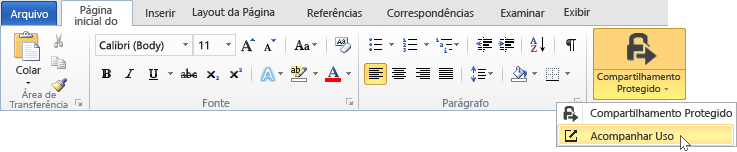
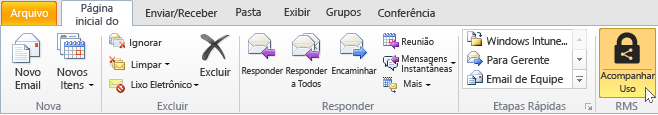
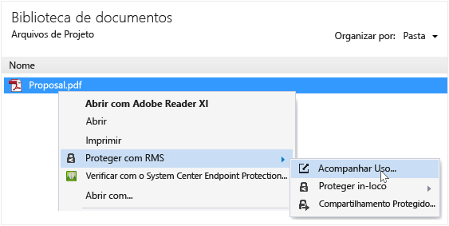
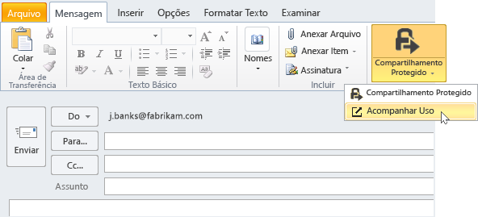

# Rastreie e revogue seus documentos ao usar o aplicativo RMS sharing
Depois de ter protegido seus documentos usando o aplicativo RMS sharing, se sua organização usar o Azure Rights Management e não o Active Directory Rights Management Services, será possível acompanhar quantas pessoas estão usando seus documentos protegidos. Se necessário, você também pode revogar acesso a estes documentos quando quiser parar de compartilhá-los. Para fazer isso, use o **site de acompanhamento de documentos**, que pode ser acessado em computadores Windows, Mac e até mesmo em tablets e telefones.

> [!TIP]
> Vídeo de dois minutos: [Revogação e rastreamento de documentos no Azure RMS](http://channel9.msdn.com/Series/Information-Protection/Azure-RMS-Document-Tracking-and-Revocation)

Ao acessar esse site, basta conectar para acompanhar seus documentos. Levando em conta que sua organização tem uma [assinatura que dá suporte a acompanhamento e revogação de documento](https://technet.microsoft.com/dn858608.aspx) e que você tenha sido atribuído a uma licença para esta assinatura, você poderá, então, ver quem tentou abrir os arquivos protegidos e se obteve êxito (se eles foram autenticados com êxito) ou não. Cada vez que tentaram acessar o documento e sua localização na ocasião. Além disso:

-   Se você precisar interromper o compartilhamento de um documento: Clique em **Revogar acesso**, observe o período de tempo em que o documento continuará disponível e decida se quer informar às pessoas que você está revogando o acesso ao documento antes compartilhado e forneça uma mensagem personalizada.

-   Se quiser exportar para o Excel: Clique em **Abrir no Excel**, de modo que você possa modificar os dados e criar seus próprios modos de exibição e gráficos.

-   Se quiser configurar notificações por email: Clique em **Configurações** e selecione como e se deseja enviar um email quando o documento for acessado.

-   Se você tiver dúvidas ou quiser fazer comentários sobre o site de rastreamento de documentos: Clique no ícone Ajuda para acessar as [Perguntas frequentes sobre o rastreamento de documentos](http://go.microsoft.com/fwlink/?LinkId=523977).

## Usando o Office para acessar o site de rastreamento de documentos

-   Para o aplicativos do Office, Word, Excel e PowerPoint: Na guia **Página Inicial**, no grupo **RMS**, clique em **Compartilhamento protegido** e em **Acompanhar Uso**.

    

-   Para o Outlook: Na guia **Página Inicial**, no grupo  **RMS**, clique em **Acompanhar Uso**:

    

Se você não vir essas opções para o RMS, é provável que o aplicativo RMS sharing não esteja instalado no seu computador, a versão mais recente não esteja instalada ou o computador deve ser reiniciado para concluir a instalação. Para obter mais informações sobre como instalar o aplicativo de compartilhamento, consulte [Baixar e instalar o aplicativo Rights Management sharing](../Topic/Download_and_install_the_Rights_Management_sharing_application.md).

### Outras maneiras de rastrear e revogar seus documentos
Além de controlar seus documentos em computadores Windows usando aplicativos do Office, você também pode usar estas alternativas:

-   **Usando um navegador da Web**: Esse método funciona para todos os arquivos compatíveis.

-   **Utilizando o Explorador de Arquivos**: Esse método funciona para computadores Windows.

-   **Usando uma mensagem de email do Outlook**: Esse método funciona para computadores Windows.

##### Usando um navegador da Web para acessar o site de rastreamento de documentos

-   Usando um navegador com suporte, vá para o [site de rastreamento de documentos](http://go.microsoft.com/fwlink/?LinkId=529562).

    Navegadores compatíveis: É recomendável usar o Internet Explorer, no mínimo a versão 10, mas você pode usar qualquer um dos seguintes navegadores para usar o site de rastreamento de documentos:

    -   Internet Explorer: No mínimo a versão 10

    -   Internet Explorer 9 com no mínimo MS12-037: Atualização de segurança cumulativa para o Internet Explorer: 12 de junho de 2012

    -   Mozilla Firefox: No mínimo a versão 12

    -   Apple Safari 5: No mínimo a versão 5

    -   Google Chrome: No mínimo a versão 18

##### Usando o Explorador de Arquivos para acessar o site de rastreamento de documentos

-   Clique no arquivo com o botão direito do mouse, selecione **Proteger com RMS** e, em seguida, selecione **Acompanhar Uso**:

    

##### Usando uma mensagem de email do Outlook para acessar o site de rastreamento de documentos

-   Em uma mensagem de email, na guia **Mensagem**, no grupo **RMS**, clique em **Compartilhamento protegido** e em **Acompanhar Uso**:

    

## Exemplos e outras instruções
Para obter exemplos de como você pode usar o aplicativo Rights Management sharing e instruções, consulte as seguintes seções do guia de usuário do aplicativo Rights Management sharing:

-   [Exemplos de uso do aplicativo RMS sharing](../Topic/Rights_Management_sharing_application_user_guide.md#BKMK_SharingExamples)

-   [O que você deseja fazer?](../Topic/Rights_Management_sharing_application_user_guide.md#BKMK_SharingInstructions)

## Consulte também
[Guia do usuário do aplicativo de compartilhamento Rights Management](../Topic/Rights_Management_sharing_application_user_guide.md)

