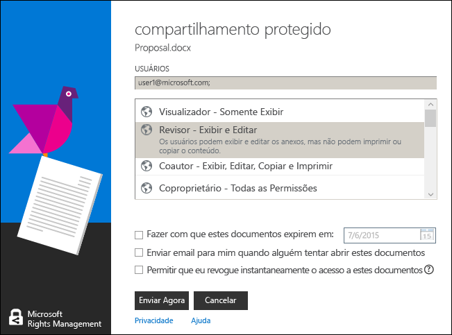

# Use atalhos do teclado no aplicativo de compartilhamento Rights Management para Windows
Ao usar o aplicativo RMS sharing, pressione a tecla **Alt** para ver as chaves de acesso disponível e pressione **Alt** + a chave de acesso para selecionar uma opção.

Por exemplo, na caixa de diálogo **Compartilhamento protegido**, pressione **Alt** para ver as chaves de acesso e **Alt + m** para marcar a caixa de seleção **Enviar email quando alguém tentar abrir estes documentos**.

## Exemplos e outras instruções
Para obter exemplos de como você pode usar o aplicativo Rights Management sharing e instruções, consulte as seguintes seções do guia de usuário do aplicativo Rights Management sharing:

-   [Exemplos de uso do aplicativo RMS sharing](../Topic/Rights_Management_sharing_application_user_guide.md#BKMK_SharingExamples)

-   [O que você deseja fazer?](../Topic/Rights_Management_sharing_application_user_guide.md#BKMK_SharingInstructions)

## Consulte também
[Guia do usuário do aplicativo de compartilhamento Rights Management](../Topic/Rights_Management_sharing_application_user_guide.md)

