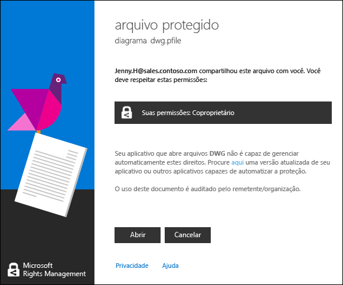

# Exiba e use os arquivos que foram protegidos pelo Rights Management
Quando o [aplicativo de compartilhamento RMS (Rights Management) é instalado em seu computador](https://technet.microsoft.com/library/dn574734%28v=ws.10%29.aspx), um arquivo protegido é exibido clicando duas vezes nele. O arquivo pode ser um anexo em uma mensagem de email ou você pode visualizá-lo ao usar o Explorador de arquivos.

> [!NOTE]
> Antes de exibir o arquivo protegido, o RMS primeiro deve confirmar que você está autorizado a visualizar o arquivo, o que é feito através da verificação de seu nome de usuário e senha. Em alguns casos, isto pode estar em cache e você não verá um prompt solicitando suas credenciais. Em outros casos, será solicitado que você forneça suas credenciais.
> 
> Se a sua organização não usa o Azure Rights Management (Azure RMS) ou o AD RMS, você pode se registrar para obter uma conta gratuita que aceitará as suas credenciais para abrir arquivos protegidos por meio do RMS:
> 
> -   Para se registrar para esta conta, clique no link de registro do [RMS para pessoas físicas](http://go.microsoft.com/fwlink/?LinkId=309469).
> 
>     Ao se registrar, use seu endereço de email da empresa em vez de um endereço de email pessoal. Se você estiver se registrando porque recebeu por email um anexo protegido, use o mesmo endereço de email no qual a mensagem foi recebida.
> -   Para obter mais informações, consulte [RMS para pessoas físicas e Microsoft Azure Rights Management](http://technet.microsoft.com/library/dn592127.aspx).

## Para exibir um arquivo protegido
Usando o Explorador de arquivos ou a mensagem de email que contém o anexo, clique duas vezes no arquivo protegido e insira suas credenciais se solicitado.

Se você vir duas versões do arquivo, mas com extensões de nome de arquivo diferentes, abra o arquivo com uma extensão .ppdf somente se o outro arquivo não abrir. Se você não conseguir abrir a versão .ppdf, primeiro instale o [aplicativo RMS sharing](http://technet.microsoft.com/library/dn574734.aspx) que sabe como abrir arquivos que possuem uma extensão de nome de arquivo .ppdf.

> [!NOTE]
> Para obter mais informações, consulte "[O que é o arquivo .ppdf criado automaticamente?](../Topic/Dialog_box_options_for_the_Rights_Management_sharing_application.md#BKMK_PPDF)".

A forma como o arquivo é aberto depende de como ele foi protegido, o que pode ser confirmado ao examinar a extensão de nome de arquivo. Em cada caso, a abertura do arquivo pode ser auditada e permanecer auditada desde que ele esteja protegido. Além disso, se o arquivo foi enviado como anexo de email, o remetente pode ser notificado por email toda vez que abrir o arquivo.

|Extensão de nome de arquivo e proteção|Mais informações|
|------------------------------------------|--------------------|
|O arquivo tem uma extensão de nome de arquivo **.pfile**.  O arquivo foi protegido genericamente.|Ao abrir o arquivo, você verá uma caixa de diálogo de **arquivo protegido** no aplicativo de compartilhamento que o informa sobre quem protegeu o arquivo e que você deve cumprir as permissões do coproprietário. Clique em **Abrir** para ler o arquivo.  |
|O arquivo tem uma extensão de nome de arquivo **.ppdf** ou é um arquivo de texto ou imagem protegido (como **.ptxt** ou **.pjpg**).  O arquivo foi protegido nativamente como uma cópia de somente leitura.|O arquivo é aberto usando o visualizador que é instalado com o aplicativo RMS sharing. Esse arquivo é de somente leitura, mesmo se você o salvar em outro local ou o renomear.|
|Outras extensões de nome de arquivo.  O arquivo foi protegido nativamente.|O arquivo é aberto usando o aplicativo que está associado à extensão de nome de arquivo original e uma faixa de restrição é exibida na parte superior do arquivo. A faixa pode exibir as permissões aplicadas ao arquivo ou pode fornecer um link para exibi-los. Por exemplo, ao clicar em **A permissão está restrita atualmente** para ver as permissões reais que são aplicadas ao arquivo e às pessoas que podem acessá-lo, você poderá ver o seguinte:  |
Para obter uma lista completa de extensões de nome de arquivo que dê suporte ao Rights Management, veja [Tipos de arquivo com suporte e extensões de nome de arquivo](../Topic/Rights_Management_sharing_application_administrator_guide.md#BKMK_SupportFileTypes) em uma das seções em [Guia do administrador do aplicativo de compartilhamento Rights Management](../Topic/Rights_Management_sharing_application_administrator_guide.md). Se sua extensão de nome de arquivo não estiver listada, use uma pesquisa na Web para ver se ela é uma extensão de nome de arquivo com suporte de outro aplicativo.

> [!NOTE]
> Se, depois de confirmar que o arquivo é protegido pelo Rights Management, e ele não abrir, baixe e use a [ferramenta Analisador RMS](https://www.microsoft.com/en-us/download/details.aspx?id=46437). Siga as instruções na ferramenta para verificar problemas no seu computador que podem impedir a abertura de um documento protegido.

## Para usar arquivos que foram protegidos (por exemplo, editar e imprimir o arquivo)
Se, depois de abrir o arquivo protegido, você quiser fazer mais do que apenas lê-lo (por exemplo, editar, copiar e imprimir):

|Extensão de nome de arquivo|Instruções|
|-------------------------------|--------------|
|O arquivo tem uma extensão de nome de arquivo **.pfile**.|Salve o arquivo aberto e atribua uma nova extensão de nome de arquivo que está associada ao aplicativo que você deseja usar.  Por exemplo, se um arquivo foi protegido usando o nome de arquivo document.vsdx.pfile, visualize o arquivo e, no Explorador de arquivos, salve o arquivo como document.vsdx.  O novo arquivo não está mais protegido. Se desejar protegê-lo, você deve fazê-lo manualmente. Para obter instruções, consulte [Proteger um arquivo em um dispositivo &#40;proteger in-loco&#41; usando o aplicativo Rights Management sharing](../Topic/Protect_a_file_on_a_device__protect_in-place__by_using_the_Rights_Management_sharing_application.md).|
|O arquivo tem uma extensão de nome de arquivo **.ppdf** ou é um arquivo de texto ou imagem protegido (como **.ptxt** ou **.pjpg**).|Só é possível visualizar o arquivo e, se você o renomear ou mover, a proteção permanece com o arquivo.|
|Outras extensões de nome de arquivo.|O dispositivo deve ter um aplicativo que compreenda o Rights Management para usar esses arquivos. Esses aplicativos são denominados aplicativos habilitados para RMS. Os aplicativos do Office 2016, Office 2013 e Office 2010 (como Word, Excel, PowerPoint e Outlook) são exemplos de aplicativos que foram habilitados para o Rights Management. Porém, os aplicativos que não são provenientes da Microsoft, como outras empresas de software e seus próprios aplicativos de linha de negócios, podem também ser habilitados para o Rights Management.  Os aplicativos que são habilitados para o Rights Management sabem como abrir arquivos que foram protegidos por outros aplicativos habilitados para o Rights Management. Eles também mantêm a proteção que é aplicada a eles, mesmo se você editar ou salvar o arquivo em outro nome de arquivo ou em outro local. Esses aplicativos permitem usar o arquivo de acordo com as permissões que são aplicadas a ele e, assim, se você tiver permissões para usar o arquivo, poderá fazê-lo. Por exemplo, você poderá editar o arquivo, mas não imprimi-lo.|

## Exemplos e outras instruções
Para obter exemplos de como você pode usar o aplicativo Rights Management sharing e instruções, consulte as seguintes seções do guia de usuário do aplicativo Rights Management sharing:

-   [Exemplos de uso do aplicativo RMS sharing](../Topic/Rights_Management_sharing_application_user_guide.md#BKMK_SharingExamples)

-   [O que você deseja fazer?](../Topic/Rights_Management_sharing_application_user_guide.md#BKMK_SharingInstructions)

## Consulte também
[Guia do usuário do aplicativo de compartilhamento Rights Management](../Topic/Rights_Management_sharing_application_user_guide.md)

