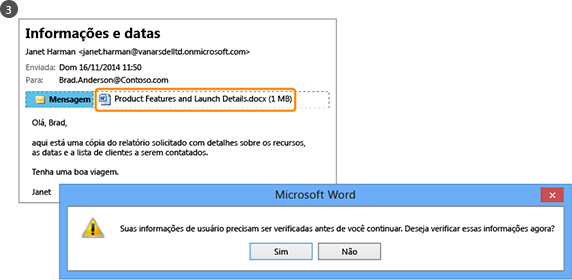
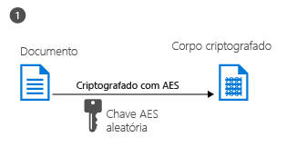

# O que &#233; o Azure Rights Management?
O Azure Rights Management (Azure RMS) é uma solução de proteção de informações para as organizações que desejam proteger seus dados no ambiente de trabalho desafiador de hoje.

Estes desafios incluem a necessidade de estar conectado à Internet, com os usuários levando seus dispositivos pessoais para o trabalho, acessando os dados da empresa em trânsito e em casa e compartilhando informações confidenciais com parceiros comerciais importantes. Como parte de seu trabalho diário, os usuários compartilham informações usando email, sites de compartilhamento de arquivos e serviços de nuvem. Nesses casos, os controles de segurança (como listas de controle de acesso e permissões NTFS) e os firewalls tradicionais têm uma eficácia limitada se você deseja proteger os dados da sua empresa e, ao mesmo tempo, dar autonomia aos usuários para que trabalhem de forma eficiente.

Em comparação, o Azure Rights Management (Azure RMS) pode proteger as informações confidenciais da sua empresa em todos esses cenários. Ele usa criptografia, identidade e diretivas de autorização para ajudar a proteger seus arquivos e e-mail, e funciona em vários dispositivos — PCs, tablets e telefones. Informações podem ser protegidas tanto na sua organização e fora da organização pois essa proteção permanece com os dados, mesmo quando ele sai dos limites da organização. Como exemplo, os funcionários podem enviar um documento por email para uma empresa parceira ou salvar um documento em sua unidade em nuvem. A proteção permanente que o Azure RMS oferece ajuda não só a proteger os dados da empresa, mas pode ser legalmente obrigatória para fins de conformidade, divulgação judicial ou simplesmente para manter práticas adequadas de gerenciamento de informações.

Porém, é muito importante que as pessoas autorizadas e os serviços (como pesquisa e indexação) possam continuar lendo e inspecionando os dados protegidos pelo Azure RMS, uma tarefa difícil com outras soluções de proteção de informações que usam a criptografia ponto a ponto. Essa capacidade às vezes é chamada de "raciocínio sobre dados" e é um elemento crucial para manter o controle dos dados da sua organização.

A imagem a seguir mostra como o Azure RMS funciona como uma solução de gerenciamento de direitos para o Office 365, bem como para servidores e serviços locais. Além disso, ele oferece suporte a dispositivos de usuário final populares que executam o Windows, o Mac OS, o iOS, o Android e o Windows Phone.

> [!TIP]
> Neste ponto, você pode considerar os recursos adicionais úteis:
> 
> -   Vídeo de dois minutos: [O que é o Microsoft Azure Rights Management](http://technet.microsoft.com/dn833005.aspx)
> -   Tutorial de cinco etapas: [Tutorial de início rápido para o gerenciamento de direitos Azure](../Topic/Quick_Start_Tutorial_for_Azure_Rights_Management.md)
> -   Requisitos do Azure RMS, incluindo opções de assinatura para compra ou avaliação: [Requisitos para o Azure Rights Management](../Topic/Requirements_for_Azure_Rights_Management.md)

Use as seções a seguir para saber mais sobre os requisitos do Azure RMS.

-   [Quais problemas o Azure RMS resolve?](../Topic/What_is_Azure_Rights_Management_.md#BKMK_RMSrequirements)

    -   [Requisitos de segurança, conformidade e regulamentos](../Topic/What_is_Azure_Rights_Management_.md#BKMK_RMScompliance)

-   [O Azure RMS em ação: O que administradores e usuários veem](../Topic/What_is_Azure_Rights_Management_.md#BKMK_RMSpictures)

    -   [Ativando e configurando o Rights Management](../Topic/What_is_Azure_Rights_Management_.md#BKMK_Example_ManagementPortal)

    -   [Protege arquivos automaticamente em servidores de arquivos que executam o Windows Server e a Infraestrutura de Classificação de Arquivos](../Topic/What_is_Azure_Rights_Management_.md#BKMK_Example_FCI)

    -   [Protege automaticamente emails com o Exchange Online e políticas de prevenção de perda de dados](../Topic/What_is_Azure_Rights_Management_.md#BKMK_Example_DLP)

    -   [Protegendo automaticamente os arquivos com SharePoint Online e bibliotecas protegidas](../Topic/What_is_Azure_Rights_Management_.md#BKMK_Example_SharePoint)

    -   [Os usuários compartilham com segurança anexos com usuários móveis](../Topic/What_is_Azure_Rights_Management_.md#BKMK_Example_SharingApp)

-   [Como funciona o Azure RMS? De modo subjacente](../Topic/What_is_Azure_Rights_Management_.md#BKMK_HowRMSworks)

    -   [Controles criptográficos utilizados pelo Azure RMS: Algoritmos e comprimentos de chave](../Topic/What_is_Azure_Rights_Management_.md#BKMK_RMScrytographics)

    -   [Passo a passo de como funciona o Azure RMS: Primeiro uso, proteção de conteúdo, consumo de conteúdo](../Topic/What_is_Azure_Rights_Management_.md#BKMK_Walthrough)

-   [Próximas etapas](../Topic/What_is_Azure_Rights_Management_.md#BKMK_NextSteps)

## Quais problemas o Azure RMS resolve?
Use a tabela a seguir para identificar os requisitos ou problemas empresariais que sua organização pode ter e como o Azure RMS pode solucioná-los.

|Requisito ou problema|Resolvido pelo Azure RMS|
|-------------------------|----------------------------|
|Proteger todos os tipos de arquivos|√ Na implementação anterior do Rights Management, só era possível proteger arquivos do Office usando a proteção nativa. Agora, [proteção genérica](https://technet.microsoft.com/library/dn574738%28v=ws.10%29.aspx) significa que todos os tipos de arquivo têm suporte.|
|Proteger arquivos em qualquer lugar|√ Quando um arquivo é salvo em um local ([proteção in-loco](https://technet.microsoft.com/library/dn574733%28v=ws.10%29.aspx)), ela permanece com o arquivo, mesmo se ele for copiado para o armazenamento que não está sob o controle da TI, como um serviço de armazenamento de nuvem.|
|Compartilhar arquivos por email com segurança|√ Quando um arquivo é compartilhado por email ([compartilhamento protegido](https://technet.microsoft.com/library/dn574735%28v=ws.10%29.aspx)), o arquivo é protegido como um anexo a uma mensagem de email, com instruções de como abrir o anexo protegido. O texto do email não é criptografado, então o destinatário sempre pode ler essas instruções. No entanto, como o documento anexo é protegido, somente usuários autorizados podem abri-lo, mesmo que o email ou o documento seja encaminhado para outras pessoas.|
|Auditoria e monitoramento|√ Você pode [auditar e monitorar o uso](https://technet.microsoft.com/library/dn529121.aspx)dos seus arquivos protegidos, mesmo depois que eles saírem dos limites da organização.  Por exemplo, você trabalha para a Contoso, Ltd. Você está trabalhando em um projeto conjunto com 3 pessoas da Fabrikam, Inc. Você envia um e-mail para essas 3 pessoas um documento que proteger e restringir a somente leitura. A auditoria do Azure RMS pode fornecer as seguintes informações:  -   Se as pessoas da Fabrikam que você especificou abriram o documento e quando o fizeram. -   Se outras pessoas que você não especificou tentaram (e não conseguiram) abrir o documento: talvez porque ele foi encaminhado ou salvo em um local compartilhado ao qual outras pessoas têm acesso. -   Se alguma das pessoas especificadas tentaram (e não conseguiram) imprimir ou alterar o documento.|
|Suporte a todos os dispositivos mais usados e não apenas a computadores Windows|√ [Os dispositivos com suporte](https://technet.microsoft.com/library/dn655136.aspx) incluem:  -   Computadores e celulares Windows -   Computadores Mac -   Tablets e celulares iOS -   Tablets e celulares Android|
|Suporte à colaboração entre empresas|√ Como o Azure RMS é um serviço de nuvem, você não precisa configurar relações de confiança com outras organizações explicitamente para poder compartilhar conteúdo protegido com elas. Se elas já tiverem um Office 365 ou um diretório do AD do Azure, a colaboração entre organizações terá suporte automaticamente. Se eles não fizerem, os usuários poderão se inscrever na assinatura do [RMS para pessoas físicas](https://technet.microsoft.com/library/dn592127.aspx) gratuita.|
|Suporte a serviços locais, bem como ao Office 365|√ Além de funcionar [perfeitamente com o Office 365](https://technet.microsoft.com/library/jj585004.aspx), você também pode usar o Azure RMS com os seguintes serviços locais, quando você implanta o[conector RMS](https://technet.microsoft.com/library/dn375964.aspx):  -   Exchange Server -   SharePoint Server -   Windows Server executando a Infraestrutura de Classificação de Arquivos|
|Ativação fácil|√ [Ativar o serviço do Rights Management](https://technet.microsoft.com/library/jj658941.aspx) para os usuários requer apenas alguns cliques no Portal clássico do Azure.|
|Escalabilidade para toda a sua organização, conforme necessário|√ Como o Azure RMS é executado como um serviço de nuvem com a elasticidade do Azure para escalabilidade vertical ou expansão, não é necessário provisionar ou implantar servidores locais adicionais.|
|Capacidade de criar políticas simples e flexíveis|√ [Os modelos personalizados de políticas de direitos](https://technet.microsoft.com/library/dn642472.aspx) oferecem uma solução rápida e fácil que permite aos administradores aplicar políticas, além de permitir que os usuários atribuam o nível correto de proteção a cada documento e restrinjam o acesso somente a pessoas dentro da organização.  Por exemplo, para que um documento de estratégia pertinente a toda a empresa seja compartilhado com todos os funcionários, você pode aplicar uma política somente leitura a todos os funcionários internos. Já para um documento confidencial, como um relatório financeiro, pode restringir o acesso somente aos diretores da empresa.|
|Amplo suporte a aplicativos|√ O Azure RMS tem sólida integração com os aplicativos e serviços do Microsoft Office e amplia o suporte a outros aplicativos usando o aplicativo de compartilhamento do RSM.  √  [O SDK do Microsoft Rights Management](https://msdn.microsoft.com/library/hh552972%28v=vs.85%29.aspx) oferece aos seus fornecedores de software e desenvolvedores internos com APIs para programar aplicativos personalizados compatíveis com o Azure RMS.  Para obter mais informações, consulte [Como os aplicativos dão suporte ao Azure Rights Management](../Topic/How_Applications_Support_Azure_Rights_Management.md).|
|A TI deve manter o controle dos dados|√ Organizações podem optar por gerenciar sua própria chave de locatário e usar a solução “[traga a sua própria chave](https://technet.microsoft.com/library/dn440580.aspx)” (BYOK) e armazenem a chave de locatário em Módulos de Segurança de Hardware (HSM).  √ Oferecerem suporte para auditoria e[log de uso](https://technet.microsoft.com/library/dn529121.aspx) para que você possa analisar ideias de negócios, monitorar o abuso, e (se você tiver um vazamento de informação) executar a análise forense.  √ Acesso delegado usando o [recurso de superusuário](https://technet.microsoft.com/library/mt147272.aspx) garante que a TI possa sempre acessoar o conteúdo protegido, mesmo se um documento foi protegido por um funcionário que deixou a organização. Por outro lado, as soluções de criptografia ponto a ponto apresentam o risco de perda de acesso aos dados da empresa.  √ Sincronizar [somente os atributos do diretório que o Azure RMS precisa](https://azure.microsoft.com/documentation/articles/active-directory-aadconnectsync-attributes-synchronized/) para dar suporte a uma identidade comum para suas contas do Active Directory locais, usando uma [ferramenta de sincronização de diretório](https://azure.microsoft.com/documentation/articles/active-directory-aadconnect-get-started-tools-comparison/), como Azure AD Connect.  √ Habilite o logon único sem replicar senhas para a nuvem, usando o AD FS.  √ Organizações sempre têm a opção de parar de usar o Azure RMS sem perder o acesso ao conteúdo anteriormente protegido pelo Azure RMS. Para obter informações sobre como encerrar opções, consulte [Encerramento e desativação do Azure Rights Management](../Topic/Decommissioning_and_Deactivating_Azure_Rights_Management.md). Além disso, as organizações que implantaram o Active Directory Rights Management Services (AD RMS) podem [migrar para o Azure RMS](https://technet.microsoft.com/library/dn858447.aspx) sem perder o acesso aos dados anteriormente protegidos pelo AD RMS.|
> [!TIP]
> Se você tem familiaridade com a versão local do Rights Management, o Active Directory Rights Management Services (AD RMS), talvez tenha interesse na tabela de comparação disponível em [Comparando o Azure Rights Management e o AD RMS](../Topic/Comparing_Azure_Rights_Management_and_AD_RMS.md).

### Requisitos de segurança, conformidade e regulamentos
O Azure RMS oferece suporte aos seguintes requisitos de segurança, conformidade e regulamentos:

√ Uso de criptografia padrão do setor e suporte ao FIPS 140-2. Para obter mais informações, consulte a seção [Controles criptográficos utilizados pelo Azure RMS: Algoritmos e comprimentos de chave](../Topic/What_is_Azure_Rights_Management_.md#BKMK_RMScrytographics) neste tópico.

√ Suporte a HSMs (Módulos de Segurança de Hardware) da Thales para armazenar sua chave de locatário nos data centers do Microsoft Azure. O Azure RMS usa ambientes de segurança separados para os data centers na América do Norte, na EMEA (Europa, Oriente Médio e África) e na Ásia, garantindo que suas chaves só possam ser usadas na sua região.

√ Certificado para:

-   ISO/IEC 27001:2013 (inclui [ISO/IEC 27018](http://azure.microsoft.com/blog/2015/02/16/azure-first-cloud-computing-platform-to-conform-to-isoiec-27018-only-international-set-of-privacy-controls-in-the-cloud/))

-   Atestados SSAE 16/ISAE 3402 do SOC 2

-   BAA do HIPAA

-   Cláusula de modelo da UE

-   FedRAMP como parte do Active Directory do Azure na certificação do Office 365, ATO da agência FedRAMP emitido pelo HSS

-   PCI DSS nível 1

Para obter mais informações sobre essas certificações externas, consulte o [Azure Trust Center](http://azure.microsoft.com/support/trust-center/compliance/).

## O Azure RMS em ação: O que administradores e usuários veem
As imagens nesta seção mostram alguns exemplos comuns de como administradores e usuários veem e podem usar o Azure RMS para ajudar a proteger informações confidenciais.

> [!NOTE]
> Em todos esses exemplos em que o Azure RMS protege os dados, o proprietário do conteúdo continua com acesso completo aos dados (arquivo ou email), mesmo que a proteção aplicada conceda permissões a um grupo do qual o proprietário não era um membro, ou mesmo se a proteção aplicada inclua uma data de validade.
> 
> Da mesma forma, a TI sempre pode acessar os dados protegidos sem restrições, usando o recurso de superusuário do gerenciamento de direitos que concede acesso delegado a usuários autorizados ou serviços que você especificar. Além disso, a TI pode controlar e monitorar o uso de dados que foi protegido — por exemplo, quem está acessando os dados e quando.

Para outras capturas de tela e vídeos que mostram o RMS em ação, consulte o [portal dos serviços do Microsoft Rights Management](http://www.microsoft.com/rms), o [Blog da equipe do Microsoft Rights Management (RMS)](http://blogs.technet.com/b/rms) e [curadoria de conteúdo para o Azure RMS no site Curah!](http://curah.microsoft.com/Search?query="Azure%20RMS").

### Ativando e configurando o Rights Management
Embora você possa usar o Windows PowerShell para ativar e configurar o Azure RMS, é mais fácil no portal de gerenciamento. Assim que o serviço é ativado, você tem dois modelos padrão que os administradores e os usuários podem selecionar para aplicar rapidamente e facilmente a proteção de informações nos arquivos. Mas você também pode criar seus próprios modelos personalizados para opções adicionais e configurações.

|||
|-|-|
|  [Panorama](http://technet.microsoft.com/98d53a12-3b19-4622-bb1e-75ef56df5438) (por padrão, na mesma janela do navegador)|Você pode usar o Centro de administração do Office 365 (primeira imagem) ou o Portal clássico do Azure (segunda imagem) para ativar o RMS.  Basta um clique para ativar e outro clique para confirmar; assim a proteção de informações está habilitada para administradores e usuários em sua organização.|
|  [Panorama](http://technet.microsoft.com/596e4fec-124c-41b1-8efd-63d5179193fb) (por padrão, na mesma janela do navegador)|Após a ativação, dois modelos de política de direitos ficam automaticamente disponíveis para sua organização. Um modelo é somente leitura (chamado **Confidential View Only**), o outro é para acesso de leitura e modificação (**Confidential**).  Quando esses modelos são aplicados aos arquivos ou emails, eles restringem o acesso a usuários em sua organização. Essa é uma maneira muito fácil e rápida de ajudar a impedir que os dados da empresa vazem para pessoas fora da sua organização. **Tip:** Você pode reconhecer facilmente esses modelos padrão, pois eles são automaticamente precedidos pelo nome da sua organização. Em nosso exemplo, **VanArsdel, Ltd**. Se não quiser que os usuários vejam esses modelos ou se quiser criar seus próprios modelos, será possível fazer isso no Portal clássico do Azure. Como mostra a imagem, um assistente o guiará durante o processo de criação de modelo personalizado.|
|  [Panorama](http://technet.microsoft.com/f5df80e5-efc9-4c0f-91be-060225977356) (por padrão, na mesma janela do navegador)|O acesso offline, as configurações de expiração e se pode publicar o modelo imediatamente (torná-lo visível em aplicativos que suportam o gerenciamento de direitos) são algumas das definições de configuração disponíveis se você optar por criar seus próprios modelos.|
|  [Panorama](http://technet.microsoft.com/597a3402-fd5a-4bcf-b5e6-5c983dbde697) (por padrão, na mesma janela do navegador)|Como resultado da publicação desses modelos, os usuários podem selecioná-las agora em aplicativos como Microsoft Word e o Explorador de Arquivos:  -   Um usuário pode escolher o modelo padrão, **VanArsdel, Ltd – Confidencial**. Em seguida, somente os funcionários da organização VanArsdel podem abrir e usar este documento, mesmo que enviado por email posteriormente para alguém fora da organização ou salvo em um local público. -   Um usuário pode escolher o modelo personalizado criado pelo administrador, **Vendas e Marketing – Somente leitura e impressão**. Assim, o arquivo não é somente protegido das pessoas fora da organização, mas ele também é restrito aos funcionários do departamento de Vendas e Marketing. Além disso, esses funcionários não possuem direitos totais para o documento, somente leitura e impressão. Por exemplo, eles não podem modificá-lo ou copiá-lo.|
Para obter mais informações, consulte [Ativando o Azure Rights Management](../Topic/Activating_Azure_Rights_Management.md) e [Configurando modelos personalizados do Azure Rights Management](../Topic/Configuring_Custom_Templates_for_Azure_Rights_Management.md).

Para ajudar os usuários a proteger arquivos importantes da empresa, consulte [Ajudar aos usuários a proteger os arquivos usando o Azure Rights Management](../Topic/Helping_Users_to_Protect_Files_by_Using_Azure_Rights_Management.md).

Em seguida, veja alguns exemplos de como os administradores podem aplicar os modelos para configurar automaticamente a proteção de informações para arquivos e emails.

### Protege arquivos automaticamente em servidores de arquivos que executam o Windows Server e a Infraestrutura de Classificação de Arquivos
Este exemplo mostra como você pode usar o Azure RMS para proteger automaticamente os arquivos em servidores de arquivos que executam pelo menos o Windows Server 2012 e que estão configurados para usar a infraestrutura de classificação de arquivos.

Há várias maneiras de aplicar os valores de classificação aos arquivos. Por exemplo, você pode inspecionar o conteúdo dos arquivos e portanto aplicar classificações internas como confidencialidade e informações de identificação pessoal. No entanto, neste exemplo, um administrador cria uma classificação personalizada do **Marketing**que é aplicada automaticamente a todos os documentos do usuário que foram salvos na pasta **Promoções de Marketing**. Embora essa pasta seja protegida com permissões NTFS que restringem o acesso aos membros do grupo Marketing, o administrador sabe que essas permissões podem ser perdidas se alguém desse grupo se mudar ou enviar os arquivos por email. Em seguida, as informações nos arquivos podem ser acessadas por usuários não autorizados.

|||
|-|-|
|  [Panorama](http://technet.microsoft.com/cf18c56b-c301-4640-8d9e-9e677e494091) (por padrão, na mesma janela do navegador)|Os administradores instalam e configuram o conector do Rights Management (RMS), que atua como um retransmissor entre servidores locais e o Azure RMS.|
|  [Panorama](http://technet.microsoft.com/ba3e247d-ea5e-4009-8eac-74f70270ece0) (por padrão, na mesma janela do navegador)|No servidor de arquivos, o administrador configura as regras de classificação e tarefas para que todos os arquivos do usuário na pasta **Promoções de Marketing** sejam automaticamente classificadas como **Marketing**e protegidas com criptografia RMS.  Ela seleciona o modelo de RMS personalizado que foi criado no primeiro exemplo, que restringe o acesso a membros dos departamentos de Vendas e de Marketing: **Vendas e Marketing – Somente Leitura e Impressão**.  Como resultado, todos os documentos nessa pasta são automaticamente configurados com a classificação de Marketing e protegidos pelo modelo RMS Vendas e Marketing.|
|  [Panorama](http://technet.microsoft.com/ad666594-68df-4289-835a-235b2af9bf4b) (por padrão, na mesma janela do navegador)|Como o RMS ajuda a evitar o vazamento de dados às pessoas que não devem ter acesso a informações confidenciais:  -   Janet, de Marketing, envia email de um relatório confidencial da pasta Promoções de Marketing. Esse relatório contém as características do novo produto e os planos de propaganda, e isso é solicitado por um colega de trabalho que está viajando atualmente a negócios. No entanto, Janet por engano envia por email para a pessoa errada — ela nem notou que selecionou acidentalmente um destinatário com um nome semelhante, em outra empresa.     O destinatário não pode ler o relatório confidencial porque ele não é um membro do grupo de Vendas e Marketing.|
Para obter mais informações, consulte [Implantando o conector do Azure Rights Management](../Topic/Deploying_the_Azure_Rights_Management_Connector.md).

### Protege automaticamente emails com o Exchange Online e políticas de prevenção de perda de dados
O exemplo anterior mostrou como você poderia proteger automaticamente os arquivos que contêm informações confidenciais, mas e se as informações não estiverem em um arquivo, mas sim em uma mensagem de email? É aí em que as políticas de prevenção de perda de dados (DLP) do Exchange Online entram em ação, seja solicitando aos usuários que apliquem a proteção de informações (usando as Dicas de política) ou aplicando-a automaticamente (usando regras de transporte).

Nesse exemplo, o administrador configura uma política para ajudar a manter a organização em conformidade com nos regulamentos dos EUA para proteção de dados de informações de identificação pessoal, mas as regras também podem ser configuradas para outras regulamentações de conformidade ou regras personalizadas que você definir.

|||
|-|-|
|  [Panorama](http://technet.microsoft.com/58461319-3981-4b7f-a195-956a1778e907) (por padrão, na mesma janela do navegador)|O modelo do Exchange denominado **U.S. Dados de Informações de Identificação Pessoal (PII)** são usados pelo administrador para criar e configurar uma nova política DLP. Esse modelo procura informações como números de previdência social e números da carteira de motorista nas mensagens de email.  As regras são configuradas para que as mensagens de email que contêm essas informações e enviadas fora da organização automaticamente tenham proteção de direitos aplicada usando um modelo de RMS que restringe o acesso apenas aos funcionários da empresa.  Aqui, a regra está configurada para usar um dos modelos padrão, **VanArsdel, Ltd – Confidencial**, do nosso primeiro exemplo. Mas você também pode ver como a escolha de modelos inclui quaisquer modelos personalizados que você criou e uma opção **Não Encaminhar** que é específica para o Exchange.|
|  [Panorama](http://technet.microsoft.com/bfb0762d-06fb-42e4-beff-eb391f4bedf0) (por padrão, na mesma janela do navegador)|O gerente de contratação escreve uma mensagem de email contendo o número de previdência social de um funcionário contratado recentemente. Ele envia essa mensagem de email para Sherrie no departamento de Recursos Humanos.|
|  [Panorama](http://technet.microsoft.com/59e3b68e-4bed-4962-bb1e-e82d82f8000a) (por padrão, na mesma janela do navegador)|Se essa mensagem de email for enviada ou encaminhada para alguém fora da organização, a regra DLP aplicará automaticamente a proteção de direitos.  O email é criptografado quando ele sai da infra-estrutura da organização, para que o número de previdência social na mensagem de email não possa ser lido em trânsito ou na caixa de entrada do destinatário. O destinatário não poderá ler a mensagem, a menos que ele seja um funcionário VanArsdel.|
Para obter mais informações, consulte as seções a seguir:

-   [Exchange Online e Exchange Server](../Topic/How_Applications_Support_Azure_Rights_Management.md#BKMK_ExchangeIntro) no tópico [Como os aplicativos dão suporte ao Azure Rights Management](../Topic/How_Applications_Support_Azure_Rights_Management.md).

-   [Exchange Online: Configuração do IRM](../Topic/Configuring_Applications_for_Azure_Rights_Management.md#BKMK_ExchangeOnline) no tópico [Configurando aplicativos do Azure Rights Management](../Topic/Configuring_Applications_for_Azure_Rights_Management.md).

### Protegendo automaticamente os arquivos com SharePoint Online e bibliotecas protegidas
Isso mostra como você pode proteger facilmente documentos quando usa o SharePoint Online e as bibliotecas protegidas.

Nesse exemplo, o administrador do SharePoint para Contoso criou uma biblioteca para cada departamento que eles usam para armazenar centralmente e consultar os documentos para controle de versão e edição. Por exemplo, há uma biblioteca para Vendas, uma para Marketing, uma para Recursos Humanos e assim por diante. Quando um novo documento for carregado ou criado em uma dessas bibliotecas protegidas, esse documento herda a proteção da biblioteca (sem necessidade de selecionar um modelo de política de direitos) e esse documento é protegido automaticamente e permanece protegido, mesmo que ele seja movido para fora da biblioteca do SharePoint.

|||
|-|-|
|  [Panorama](http://technet.microsoft.com/2fc90989-9289-4431-9e6a-07740b7f6e5a) (por padrão, na mesma janela do navegador)|O administrador ativa Information Rights Management para o site do SharePoint.|
|  [Panorama](http://technet.microsoft.com/a18f2e99-5ac4-4103-a88c-527846374091) (por padrão, na mesma janela do navegador)|Em seguida, ela permite o gerenciamento de direitos para uma biblioteca. Embora existam opções adicionais, essa configuração simples geralmente é tudo o que é necessário.  Agora, quando os documentos são baixados desta biblioteca, eles são automaticamente protegidos pelo Rights Management, herdando a proteção que está configurada para a biblioteca.|
|  [Panorama](http://technet.microsoft.com/0ebd6806-0190-441e-84db-72ac4b97e4a2) (por padrão, na mesma janela do navegador)|Quando alguém do departamento de vendas verifica esse relatório de vendas a partir da biblioteca, eles podem ver claramente a partir da faixa de informações na parte superior que se trata de um documento protegido com acesso restrito.  O documento permanece protegido, mesmo se o usuário o renomear, salvá-lo em outro local ou compartilhá-lo por email. Não importa qual arquivo é nomeado, onde ele está armazenado ou se ele é compartilhado por email, somente os membros do departamento de vendas podem lê-lo.|
Para obter mais informações, consulte as seções a seguir:

-   [SharePoint Online e SharePoint Server](../Topic/How_Applications_Support_Azure_Rights_Management.md#BKMK_SharePointIntro) no tópico [Como os aplicativos dão suporte ao Azure Rights Management](../Topic/How_Applications_Support_Azure_Rights_Management.md).

-   [SharePoint Online e OneDrive para a empresa: Configuração do IRM](../Topic/Configuring_Applications_for_Azure_Rights_Management.md#BKMK_SharePointOnline) no tópico [Configurando aplicativos do Azure Rights Management](../Topic/Configuring_Applications_for_Azure_Rights_Management.md).

### Os usuários compartilham com segurança anexos com usuários móveis
Os exemplos anteriores mostraram como os administradores podem aplicar automaticamente a proteção de informações para dados confidenciais. Mas haverá algumas ocasiões em que os usuários talvez precisem aplicar essa proteção sozinhos. Por exemplo, eles estão colaborando com parceiros em outra organização, eles precisam de permissões personalizadas ou configurações que não são definidas nos modelos ou em situações ad hoc que não estão cobertas pelos exemplos anteriores. Nessas situações, os usuários podem aplicar os modelos de RMS sozinhos ou configurar permissões personalizadas.

Este exemplo mostra como os usuários podem facilmente compartilhar um documento com alguém que está colaborando com outra empresa, mas ainda poderá proteger o documento e ter certeza de que o destinatário possa lê-lo, mesmo de um dispositivo móvel popular. Esse cenário usa o aplicativo de compartilhamento Rights Management, que pode ser automaticamente implantado em computadores com Windows em sua organização. Ou, os usuários podem instalá-lo sozinhos.

Neste exemplo, Alice da Contoso, envia email de um documento confidencial do Word para Bob, na Fabrikam. Ele lê o documento em seu iPad, mas poderia lê-lo facilmente em um iPhone, um tablet Android ou telefone, um computador Mac, um Windows phone ou computador.

|||
|-|-|
|  [Panorama](http://technet.microsoft.com/feeef78d-3c2e-432b-817d-d06f784be226) (por padrão, na mesma janela do navegador)|No seu PC com Windows, Alice cria uma mensagem de email padrão e anexa um documento.  Ela clica em **Compartilhamento protegido** na faixa de opções, que carrega a caixa de diálogo **compartilhamento protegido** no aplicativo de RMS sharing.  Alice quer restringir Bob à visualização e edição do documento, e não deseja que ele copie ou imprima; assim, ela seleciona **REVISOR - Ver e Editar**. Ela também quer receber um e-mail quando alguém tentar abrir o documento e tem a capacidade de revogar o documento mais tarde, se necessário e sabe que a revogação entrará em vigor imediatamente.|
|  [Panorama](http://technet.microsoft.com/e748fd78-8bba-4168-96cf-f96def078283) (por padrão, na mesma janela do navegador)|Bob vê o email em seu iPad.  Além de mensagens e anexos de Alice, há instruções que ele segue para inscrever-se e instalar o aplicativo de compartilhamento do RMS no seu iPad.|
|  [Panorama](http://technet.microsoft.com/7dba5ff9-a61d-4a83-8adc-d6ffb0e85df6) (por padrão, na mesma janela do navegador)|Bob agora pode abrir o anexo. Primeiro, é solicitado que efetue logon para confirmar que ele é o destinatário pretendido.  Quando Bob exibe o documento, ele também vê as informações de acesso restrito que informam que ele pode exibir e editar o documento, mas não copiar ou imprimir.|
|  [Panorama](http://technet.microsoft.com/9f642a2e-58ad-44ab-9f81-f890d15380f9) (por padrão, na mesma janela do navegador)|Alice recebe uma mensagem de email informando que Bob abriu o documento com êxito que ela enviou e quando ele acessou o documento.  Se Bob encaminhar seu email com o anexo ou salvá-lo onde outros usuários possam acessá-lo ou isso será interceptado na rede, outras pessoas não poderão ler o documento.|
Para obter mais informações, consulte [Proteger um arquivo que você compartilha por email](https://technet.microsoft.com/library/dn574735.aspx) e [Exibir e usar arquivos que foram protegidos](https://technet.microsoft.com/library/dn574741.aspx) do [guia de usuário de aplicativo de compartilhamento Rights Management](https://technet.microsoft.com/library/dn339006.aspx).

Além disso, o [Tutorial de início rápido para o gerenciamento de direitos Azure](../Topic/Quick_Start_Tutorial_for_Azure_Rights_Management.md) inclui instruções passo a passo para esse cenário.

Agora você viu alguns exemplos do que o Azure RMS pode fazer, você pode estar interessado em saber como ele faz isso. Para obter informações técnicas sobre como funciona o Azure RMS, consulte a próxima seção.

## Como funciona o Azure RMS? De modo subjacente
Uma coisa importante a entender sobre como o Azure RMS funciona é que o serviço do Rights Management (e Microsoft) não vê ou armazena seus dados como parte do processo de proteção de informações. As informações que você protege nunca são enviadas ou armazenadas no Azure, a menos que as armazene explicitamente no Azure ou utilize outro serviço de nuvem que as armazene no Azure. O Azure RMS simplesmente transforma os dados em um documento ilegível para qualquer outra pessoa que não sejam os usuários e serviços autorizados:

-   Os dados são criptografados no nível do aplicativo e incluem uma política que define o uso autorizado para esse documento.

-   Quando um documento protegido é utilizado por um usuário legítimo ou é processado por um serviço autorizado, os dados no documento são decifrados e os direitos que são definidos na política são aplicados.

Em um nível alto, você pode ver como esse processo funciona na seguinte imagem. Um documento contendo a fórmula secreta é protegido e depois aberto com sucesso por um usuário ou serviço autorizado. O documento é protegido por uma chave de conteúdo (a chave verde nesta imagem). Ela é única para cada documento e é colocada no cabeçalho do arquivo onde é protegido por sua chave raiz de locatário RMS (a chave vermelha nesta imagem). A chave de locatário pode ser gerada e gerenciada pela Microsoft, ou você pode gerar e gerenciar a sua própria chave de locatário.

Durante o processo de proteção quando o Azure RMS está criptografando e descriptografando, autorizando e impondo restrições, a fórmula secreta nunca é enviada para o Azure.

Para obter uma descrição detalhada do que está acontecendo, consulte a seção [Passo a passo de como funciona o Azure RMS: Primeiro uso, proteção de conteúdo, consumo de conteúdo](../Topic/What_is_Azure_Rights_Management_.md#BKMK_Walthrough) neste tópico.

Para obter mais detalhes técnicos sobre os algoritmos e comprimentos de chave que o Azure RMS usa, consulte a próxima seção.

### Controles criptográficos utilizados pelo Azure RMS: Algoritmos e comprimentos de chave
Mesmo que você não precise conhecer como o RMS funciona, podem ser-lhe colocadas perguntas sobre os controlos criptográficos que ele usa, para se certificar de que a proteção de segurança é padrão da indústria.

|||
|-|-|
|Método de proteção de documentação:|Algoritmo: AES  Comprimento da chave: 128 bits e 256 bits 1|
|Método de proteção da chave:|Algoritmo: RSA  Comprimento da chave: 2048 bits|
|Assinatura do certificado:|Algoritmo: SHA-256|
1 256 bits é usado pelo aplicativo de compartilhamento do Rights Management para proteção genérica e nativa quando o arquivo tem uma extensão do nome do arquivo .ppdf ou é um arquivo de texto ou de imagem protegido (como .ptxt ou .pjpg).

### Passo a passo de como funciona o Azure RMS: Primeiro uso, proteção de conteúdo, consumo de conteúdo
Para entender mais detalhadamente como o Azure RMS funciona, vamos caminhar através de um fluxo normal após o [serviço do Azure RMS ser ativado](https://technet.microsoft.com/library/jj658941.aspx) e quando um usuário utiliza o RMS da primeira vez em seu computador Windows (um processo por vezes conhecido como **inicializar o ambiente de usuário** ou bootstrapping), **protege o conteúdo** (um documento ou e-mail) e, em seguida, **consome** (abre e usa) o conteúdo que foi protegido por alguém.

Após o ambiente do usuário ser inicializado, o usuário pode, então, proteger documentos ou consumir documentos protegidos nesse computador.

> [!NOTE]
> Se este usuário se desloca para outro computador Windows, ou outro usuário usa esse mesmo computador Windows, o processo de inicialização é repetido.

#### Inicializar o ambiente do usuário
Antes que um usuário possa proteger o conteúdo ou consumir conteúdo protegido em um computador Windows, o ambiente do usuário deve estar preparado no dispositivo. Este é um processo de uma única vez e acontece automaticamente, sem intervenção do usuário quando um usuário tenta proteger ou consumir conteúdo protegido:

|||
|-|-|
||O cliente RMS no computador se conecta pela primeira vez ao Azure RMS e autentica o usuário usando a sua conta Azure Active Directory.  Quando a conta do usuário é federada com o Azure Active Directory, essa autenticação é automática e o usuário não é solicitado a fornecer credenciais.|

|||
|-|-|
||Depois que o usuário é autenticado, a conexão é automaticamente redirecionada para o locatário RMS da organização, que emite certificados que permitem ao usuário autenticar o Azure RMS para consumir conteúdo protegido e proteger conteúdo offline.  Uma cópia do certificado do usuário é armazenada no Azure RMS para que, se o usuário se desloca para outro dispositivo, os certificados são criados usando as mesmas chaves.|

#### Proteção de conteúdo
Quando um usuário protege um documento, o cliente RMS realiza as seguintes ações em um documento não protegido:

|||
|-|-|
||O cliente RMS cria uma chave aleatória (a chave de conteúdo) e criptografa o documento usando essa chave com o algoritmo de criptografia simétrica AES.|

|||
|-|-|
||O cliente RMS cria um certificado que inclui uma política para o documento, seja com base em um modelo ou especificando direitos específicos para o documento. Esta política inclui os direitos para diferentes usuários ou grupos e outras restrições, como uma data de expiração.  O cliente RMS então usa a chave da organização que foi obtida quando o ambiente de usuário foi inicializado e usa essa chave para criptografar a política e a chave de conteúdo simétrica. O cliente RMS também assina a política com o certificado do usuário que foi obtido quando o ambiente de usuário foi inicializado.|

|||
|-|-|
||Finalmente, o cliente RM incorpora a política para um arquivo com o corpo do documento criptografado anteriormente, que em conjunto forma um documento protegido.  Este documento pode ser armazenado ou compartilhado em qualquer lugar, usando qualquer método e a política sempre fica com o documento criptografado.|

#### Consumo de conteúdo
Quando um usuário quer consumir um documento protegido, o cliente RMS começa por solicitar o acesso ao serviço Azure RMS:

|||
|-|-|
||O usuário autenticado envia a política de documentos e os certificados do usuário para o Azure RMS. O serviço descriptografa e avalia a política, e cria uma lista de direitos (se houver) que o usuário tem para o documento.|

|||
|-|-|
||O serviço então extrai a chave de conteúdo AES da política descriptografada. Esta chave é então criptografada com a chave RSA pública do usuário que foi obtida com o pedido.  A chave de conteúdo recriptografada é então incorporada em uma licença de uso criptografada com a lista de direitos do usuário, que é então devolvida ao cliente RMS.|

|||
|-|-|
||Finalmente, o cliente RMS leva a licença de uso criptografada e descriptografa-a com sua própria chave privada do usuário. Isso permite que o cliente RMS descriptografe o corpo do documento, uma vez que é necessário e renderiza-o na tela.  O cliente também descriptografa a lista de direitos e passa-a para o aplicativo, que impõe esses direitos na interface do usuário do aplicativo.|

#### Variações
As orientações anteriores cobrem os cenários normais, mas existem algumas variações:

-   **Dispositivos móveis**: Quando dispositivos móveis protegem ou consomem arquivos com o Azure RMS, os fluxos de processo são muito mais simples. Os dispositivos móveis não passam primeiro pelo processo de inicialização do usuário pois, em vez disso, cada transação (para proteger ou consumir conteúdo) é independente. Tal como acontece com os computadores Windows, os dispositivos móveis se conectam ao serviço do Azure RMS e autenticam. Para proteger o conteúdo, os dispositivos móveis apresentam uma política e o Azure RMS envia-lhes uma licença de publicação e de chave simétrica para proteger o documento. Para consumir o conteúdo, quando os dispositivos móveis se conectam ao serviço do Azure RMS e autenticam, eles enviam a política de documentos ao Azure RMS e solicitam uma licença de uso para consumir o documento. Em resposta, o Azure RMS envia as chaves e restrições necessárias para os dispositivos móveis. Ambos os processos usam TLS para proteger a troca de chaves e outras comunicações.

-   **Conector RMS**: Quando o Azure RMS é utilizado com o conector RMS, os fluxos de processo permanecem os mesmos. A única diferença é que os conectores agem como uma retransmissão entre os serviços no local (como o Exchange Server e SharePoint Server) e o Azure RMS. O conector em si não realiza quaisquer operações, como a inicialização do ambiente do usuário, ou criptografia ou descriptografia. Ele simplesmente retransmite a comunicação que geralmente iria para um servidor AD RMS, manipulando a tradução entre os protocolos que são usados em cada lado. Este cenário permite que você use o Azure RMS com serviços no local.

-   **Proteção genérica (.pfile)**: Quando o Azure RMS protege genericamente um arquivo, o fluxo é basicamente o mesmo para a proteção de conteúdo, exceto que o cliente RMS cria uma política que concede todos os direitos. Quando o arquivo é consumido, ele é descriptografado antes de ser passado para o aplicativo de destino. Este cenário permite proteger todos os arquivos, mesmo que eles não suportem nativamente o RMS.

-   **PDF Protegido (.ppdf)**: Quando o Azure RMS protege nativamente um arquivo do Office, ele também cria uma cópia desse arquivo e protege-o da mesma forma. A única diferença é que a cópia do arquivo está em formato de arquivo PPDF, que o aplicativo de compartilhamento do RMS sabe abrir apenas para visualização. Este cenário permite-lhe enviar anexos protegidos por email, sabendo que o destinatário em um dispositivo móvel sempre será capaz de lê-los, mesmo que o dispositivo móvel não tenha um aplicativo que suporte nativamente arquivos do Office protegidos.

## Próximas etapas
Para saber mais sobre o Azure RMS, use os outros tópicos na seção [Introdução ao Azure Rights Management](../Topic/Getting_Started_with_Azure_Rights_Management.md), como [Como os aplicativos dão suporte ao Azure Rights Management](../Topic/How_Applications_Support_Azure_Rights_Management.md) para saber como integrar seus aplicativos existentes com o Azure RMS para fornecer uma solução de proteção de informações. Reveja [Terminologia do Azure Rights Management](../Topic/Terminology_for_Azure_Rights_Management.md) para que você fique familiarizado com os termos que você pode se deparar com que você está configurando e usando o Azure RMS e certifique-se também de verificar [Requisitos para o Azure Rights Management](../Topic/Requirements_for_Azure_Rights_Management.md) antes de iniciar a implantação. Se você quiser começar logo e experimentar você mesmo, use o [Tutorial de início rápido para o gerenciamento de direitos Azure](../Topic/Quick_Start_Tutorial_for_Azure_Rights_Management.md).

Quando estiver pronto para iniciar a implantação do Azure RMS para a sua organização, consulte [Roteiro de implantação do Azure Rights Management](../Topic/Azure_Rights_Management_Deployment_Roadmap.md) para obter as etapas de implantação e links para as instruções.

> [!TIP]
> Para obter ajuda e informações adicionais, use os recursos e links disponíveis em [Informações e suporte para o Azure Rights Management](../Topic/Information_and_Support_for_Azure_Rights_Management.md).

## Consulte também
[Introdução ao Azure Rights Management](../Topic/Getting_Started_with_Azure_Rights_Management.md)

